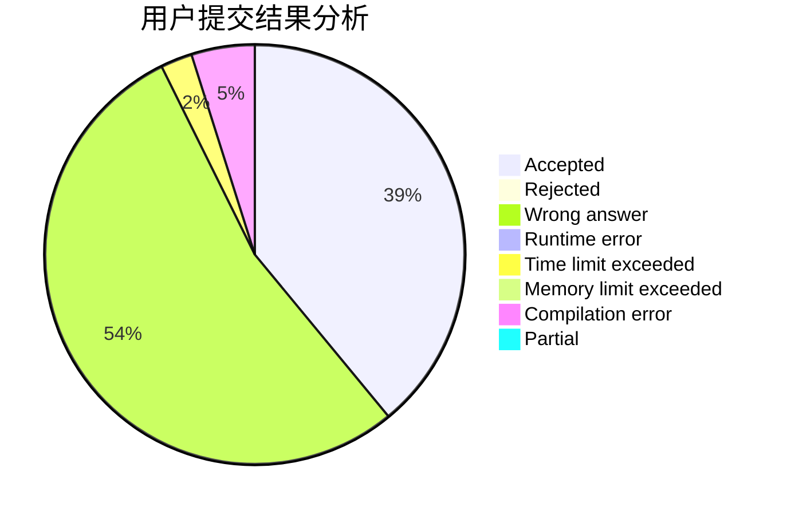
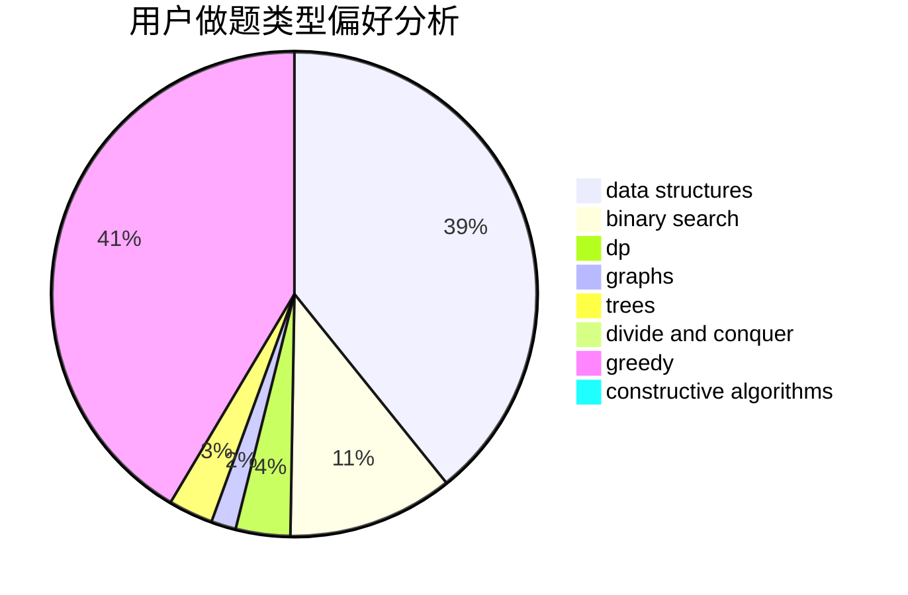
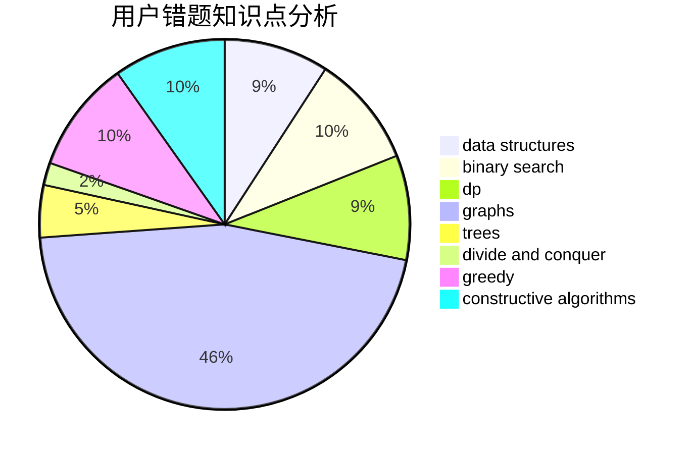

# Sunshine_HJian

<!-- tabs:start -->

#### **用户提交结果分析**

#### **用户做题类型偏好分析**

#### **用户错题知识点分析**

<!-- tabs:end -->
# 推荐题目
[843A](https://codeforces.com/contest/843/problem/A)		dfs and similar,
                        dsu,
                        implementation,
                        math,
                        sortings		  
[25A](https://codeforces.com/contest/25/problem/A)		brute force		  
[846A](https://codeforces.com/contest/846/problem/A)		brute force,
                        implementation		  
[936A](https://codeforces.com/contest/936/problem/A)		binary search,
                        implementation,
                        math		  
[1062E](https://codeforces.com/contest/1062/problem/E)		binary search,
                        data structures,
                        dfs and similar,
                        greedy,
                        trees		  
[1033B](https://codeforces.com/contest/1033/problem/B)		math,
                        number theory		  
[922D](https://codeforces.com/contest/922/problem/D)		greedy,
                        sortings		  
[1140D](https://codeforces.com/contest/1140/problem/D)		dp,
                        greedy,
                        math		  
[700B](https://codeforces.com/contest/700/problem/B)		dfs and similar,
                        dp,
                        graphs,
                        trees		  
[1366E](https://codeforces.com/contest/1366/problem/E)		binary search,
                        brute force,
                        combinatorics,
                        constructive algorithms,
                        dp,
                        two pointers		  
