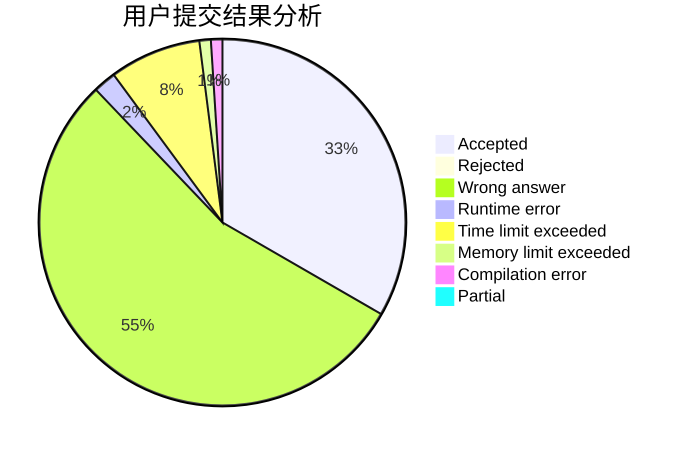
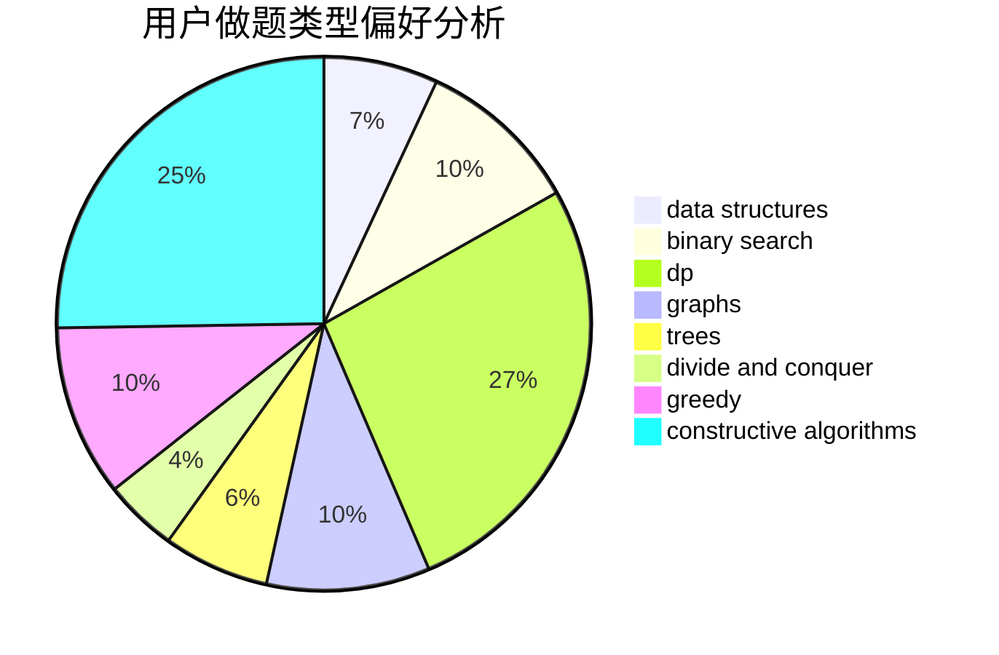
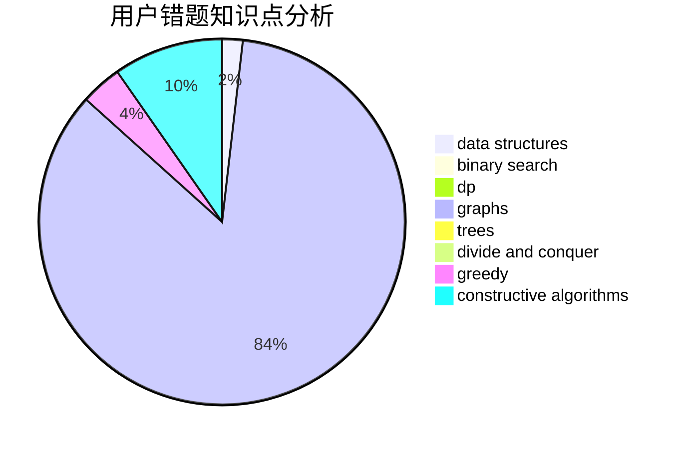

# Sunshine_Hu

<!-- tabs:start -->

#### **用户提交结果分析**

#### **用户做题类型偏好分析**

#### **用户错题知识点分析**

<!-- tabs:end -->
# 推荐题目
[1409D](https://codeforces.com/contest/1409/problem/D)		greedy,
                        math		  
[1067B](https://codeforces.com/contest/1067/problem/B)		dfs and similar,
                        graphs,
                        shortest paths		  
[1030G](https://codeforces.com/contest/1030/problem/G)		number theory		  
[1217B](https://codeforces.com/contest/1217/problem/B)		greedy,
                        math		  
[11521](https://codeforces.com/contest/1152/problem/1)		dsu,graphs,sortings,trees		  
[936B](https://codeforces.com/contest/936/problem/B)		dfs and similar,
                        dp,
                        games,
                        graphs		  
[678F](https://codeforces.com/contest/678/problem/F)		data structures,
                        divide and conquer,
                        geometry		  
[1246F](https://codeforces.com/contest/1246/problem/F)		nan		  
[1113A](https://codeforces.com/contest/1113/problem/A)		dp,
                        greedy,
                        math		  
[67B](https://codeforces.com/contest/67/problem/B)		greedy		  
