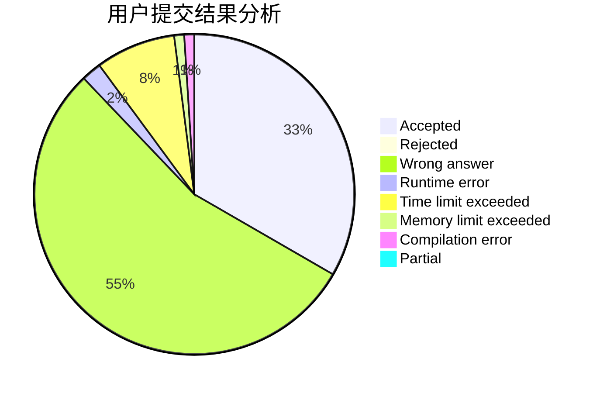
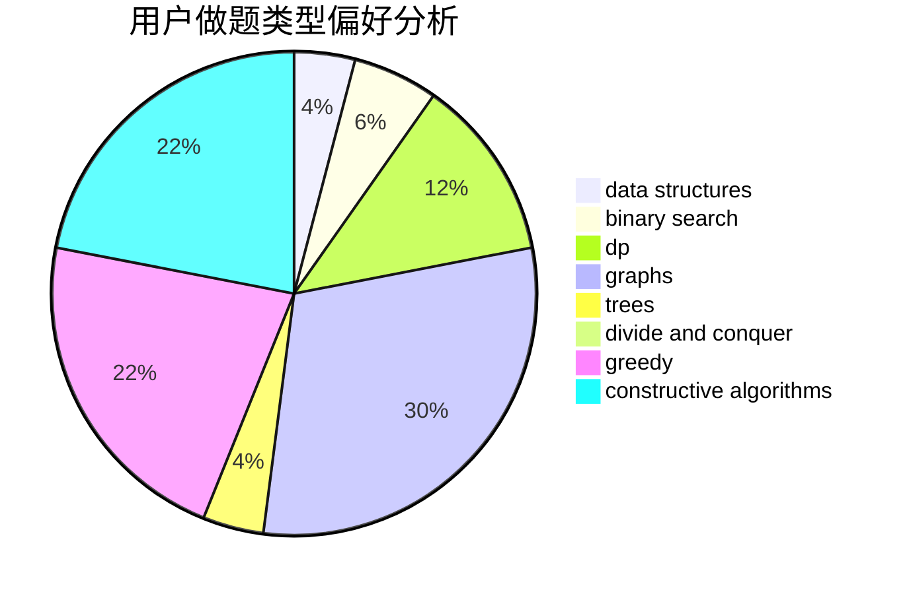
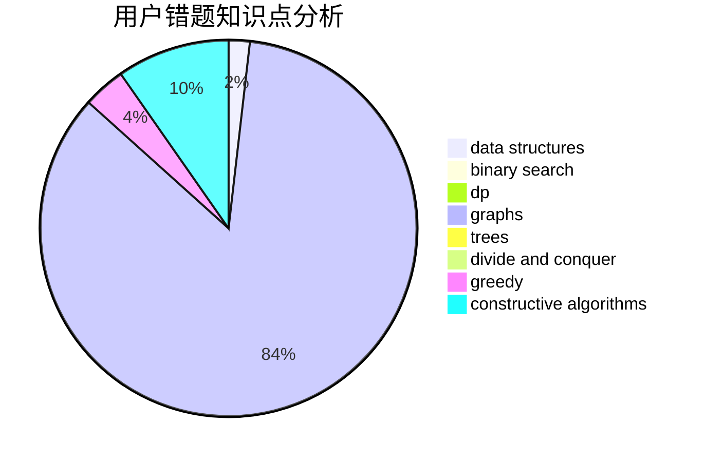

# Sunshine_Hu

<!-- tabs:start -->

#### **用户提交结果分析**

#### **用户做题类型偏好分析**

#### **用户错题知识点分析**

<!-- tabs:end -->
# 推荐题目
[13D](https://codeforces.com/contest/13/problem/D)		dp,
                        geometry		  
[1066E](https://codeforces.com/contest/1066/problem/E)		data structures,
                        implementation,
                        math		  
[1030C](https://codeforces.com/contest/1030/problem/C)		implementation		  
[1211B](https://codeforces.com/contest/1211/problem/B)		*special problem,
                        implementation		  
[114D](https://codeforces.com/contest/114/problem/D)		dsu,graphs,sortings,trees		  
[916B](https://codeforces.com/contest/916/problem/B)		bitmasks,
                        greedy,
                        math		  
[656F](https://codeforces.com/contest/656/problem/F)		*special problem		  
[1241B](https://codeforces.com/contest/1241/problem/B)		dsu,graphs,sortings,trees		  
[1111B](https://codeforces.com/contest/1111/problem/B)		brute force,
                        implementation,
                        math		  
[659G](https://codeforces.com/contest/659/problem/G)		combinatorics,
                        dp,
                        number theory		  
