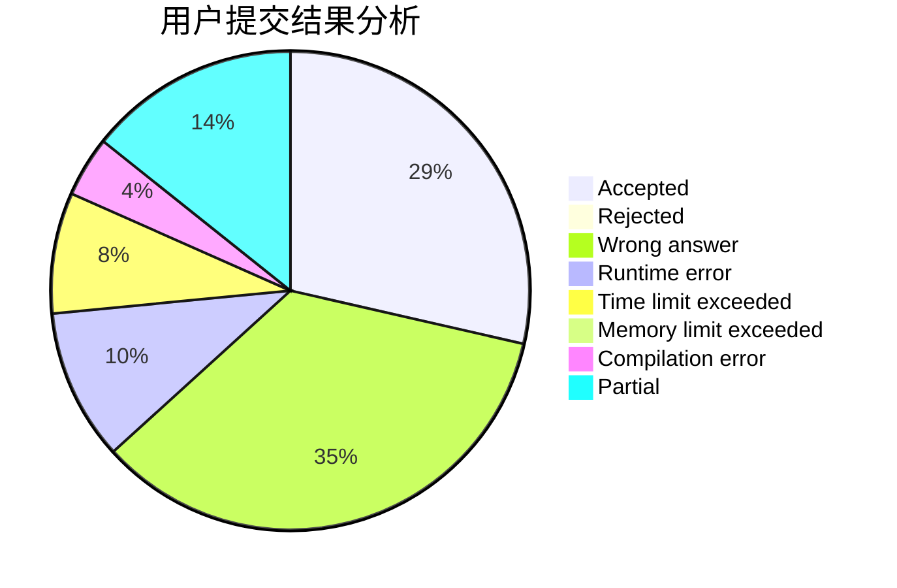
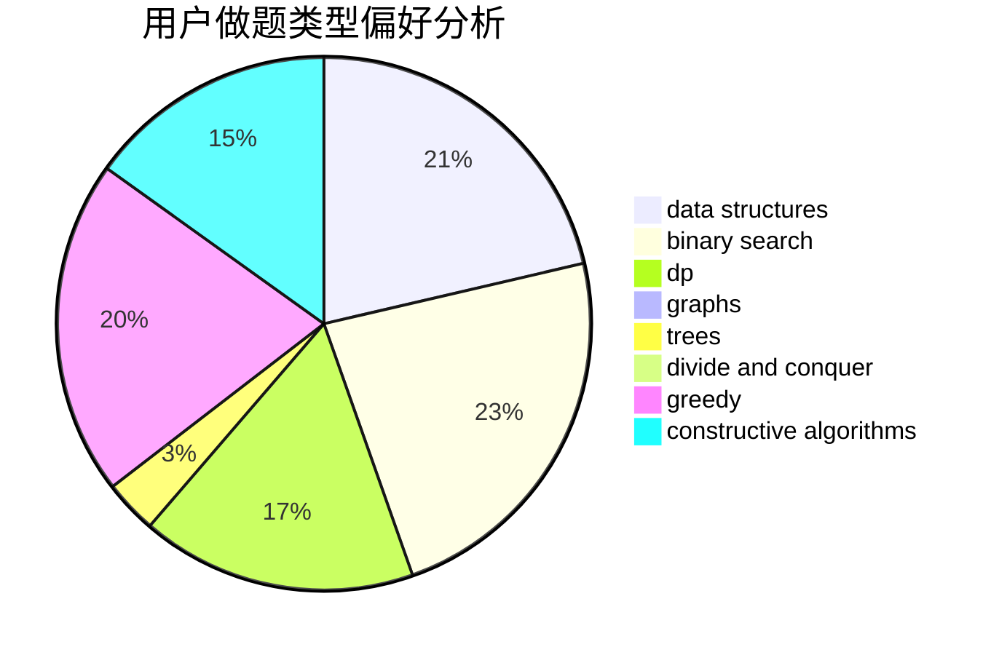

# Sunward_z

<!-- tabs:start -->

#### **用户提交结果分析**

#### **用户做题类型偏好分析**

#### **用户错题知识点分析**

<!-- tabs:end -->
# 推荐题目
[1238B](https://codeforces.com/contest/1238/problem/B)		greedy,
                        sortings		  
[1090B](https://codeforces.com/contest/1090/problem/B)		nan		  
[512A](https://codeforces.com/contest/512/problem/A)		dsu,graphs,sortings,trees		  
[286B](https://codeforces.com/contest/286/problem/B)		implementation		  
[295E](https://codeforces.com/contest/295/problem/E)		data structures		  
[550D](https://codeforces.com/contest/550/problem/D)		constructive algorithms,
                        graphs,
                        implementation		  
[1197B](https://codeforces.com/contest/1197/problem/B)		greedy,
                        implementation		  
[248E](https://codeforces.com/contest/248/problem/E)		dp,
                        math,
                        probabilities		  
[1313B](https://codeforces.com/contest/1313/problem/B)		constructive algorithms,
                        greedy,
                        implementation,
                        math		  
[868E](https://codeforces.com/contest/868/problem/E)		dp,
                        graphs,
                        trees		  
