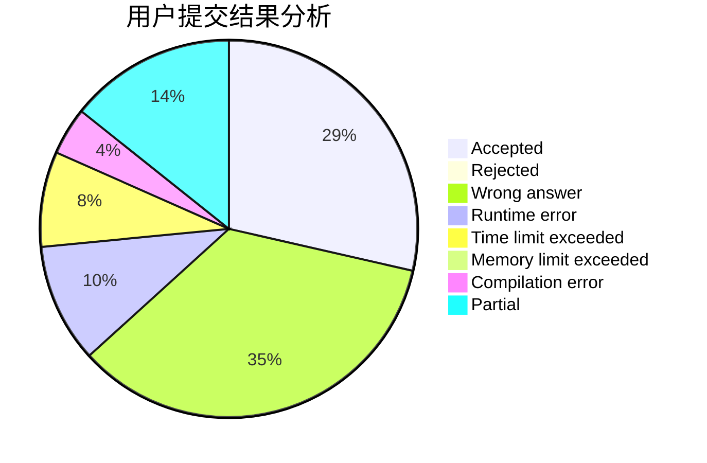
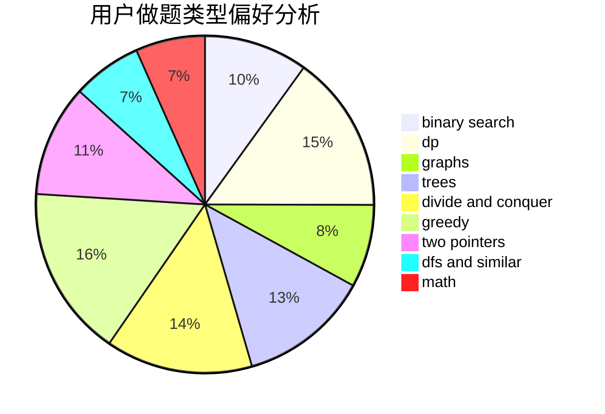

# Sunward_z

<!-- tabs:start -->

#### **用户提交结果分析**

#### **用户做题类型偏好分析**

<!-- tabs:end -->
# 推荐题目
[1243A](https://codeforces.com/contest/1243/problem/A)
[1090M](https://codeforces.com/contest/1090/problem/M)
[535A](https://codeforces.com/contest/535/problem/A)
[300C](https://codeforces.com/contest/300/problem/C)
[312C](https://codeforces.com/contest/312/problem/C)
[575H](https://codeforces.com/contest/575/problem/H)
[1200D](https://codeforces.com/contest/1200/problem/D)
[268B](https://codeforces.com/contest/268/problem/B)
[1322E](https://codeforces.com/contest/1322/problem/E)
[888A](https://codeforces.com/contest/888/problem/A)
