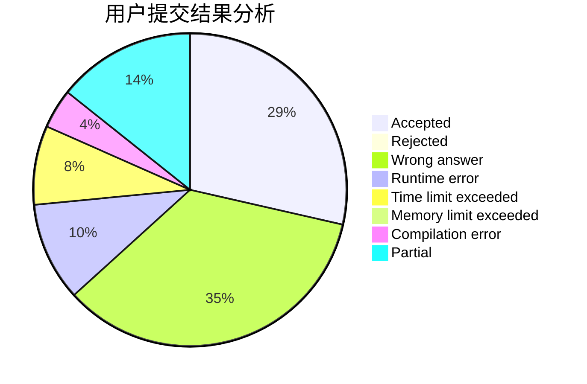
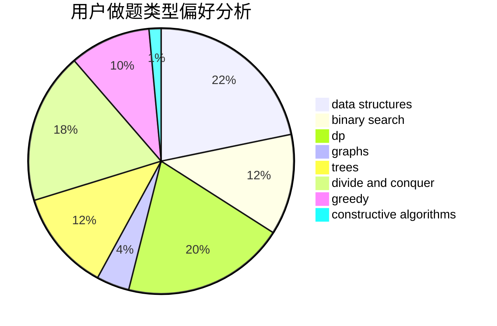

# Sunward_z

<!-- tabs:start -->

#### **用户提交结果分析**

#### **用户做题类型偏好分析**

#### **用户错题知识点分析**

<!-- tabs:end -->
# 推荐题目
[1243A](https://codeforces.com/contest/1243/problem/A)		implementation		  
[1090M](https://codeforces.com/contest/1090/problem/M)		implementation		  
[535A](https://codeforces.com/contest/535/problem/A)		brute force,
                        implementation		  
[300C](https://codeforces.com/contest/300/problem/C)		brute force,
                        combinatorics		  
[312C](https://codeforces.com/contest/312/problem/C)		dsu,graphs,sortings,trees		  
[575H](https://codeforces.com/contest/575/problem/H)		combinatorics,
                        number theory		  
[1200D](https://codeforces.com/contest/1200/problem/D)		brute force,
                        data structures,
                        dp,
                        implementation,
                        two pointers		  
[268B](https://codeforces.com/contest/268/problem/B)		implementation,
                        math		  
[1322E](https://codeforces.com/contest/1322/problem/E)		data structures		  
[888A](https://codeforces.com/contest/888/problem/A)		brute force,
                        implementation		  
