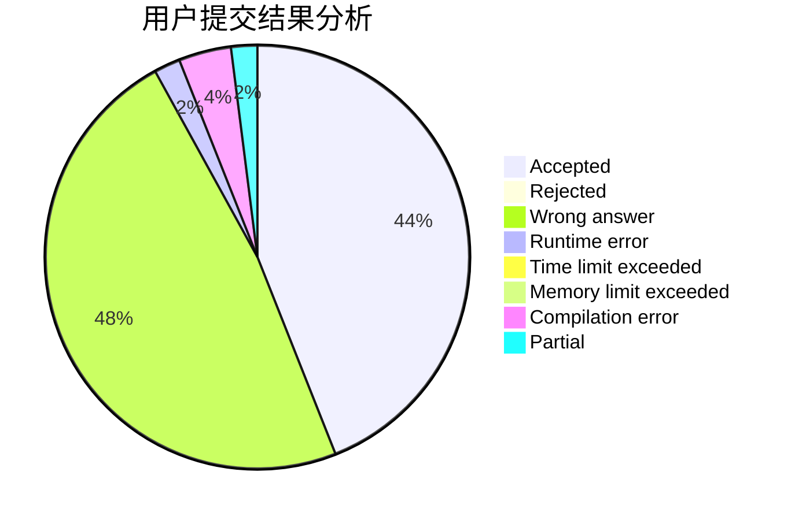
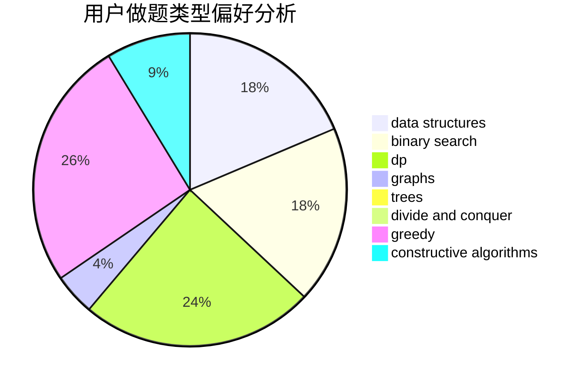

# SuperCGK
<!-- tabs:start -->
#### **用户提交结果分析**

#### **用户做题类型偏好分析**

#### **用户错题知识点分析**

<!-- tabs:end -->
# 推荐题目
[Sorting the Coins](http://codeforces.com/problemset/problem/875/B)		dsu,
                        implementation,
                        sortings,
                        two pointers		  
[Kana and Dragon Quest game](http://codeforces.com/problemset/problem/1337/B)		greedy,
                        implementation,
                        math		  
[Don't fear, DravDe is kind](http://codeforces.com/problemset/problem/28/D)		binary search,
                        data structures,
                        dp,
                        hashing		  
[Minutes Before the New Year](http://codeforces.com/problemset/problem/1283/A)		math		  
[Flag of Berland](http://codeforces.com/problemset/problem/837/B)		brute force,
                        implementation		  
[Equalize Prices Again](https://codeforces.com/contest/1432/problem/C)		math		  
[Magic Gems](http://codeforces.com/problemset/problem/1117/D)		dp,
                        math,
                        matrices		  
[Voltage Keepsake](https://codeforces.com/contest/800/problem/A)		binary search,
                        math		  
[DZY Loves Chessboard](http://codeforces.com/problemset/problem/445/A)		dfs and similar,
                        implementation		  
[Drinks](http://codeforces.com/problemset/problem/200/B)		implementation,
                        math		  
<!-- tabs:start -->
#### **data structures**
[Sorting the Coins](http://codeforces.com/problemset/problem/28/D)		binary search,
                        data structures,
                        dp,
                        hashing		  
[Kana and Dragon Quest game](http://codeforces.com/problemset/problem/1251/E2)		binary search,
                        data structures,
                        greedy		  
[Don't fear, DravDe is kind](http://codeforces.com/problemset/problem/837/G)		data structures		  
[Minutes Before the New Year](http://codeforces.com/problemset/problem/1303/G)		data structures,
                        divide and conquer,
                        geometry,
                        trees		  
[Flag of Berland](http://codeforces.com/problemset/problem/1252/G)		data structures		  
[Equalize Prices Again](http://codeforces.com/problemset/problem/1209/G2)		data structures		  
[Magic Gems](http://codeforces.com/problemset/problem/1286/E)		data structures,
                        strings		  
[Voltage Keepsake](http://codeforces.com/problemset/problem/862/E)		binary search,
                        data structures,
                        sortings		  
[DZY Loves Chessboard](http://codeforces.com/problemset/problem/1495/F)		constructive algorithms,
                        data structures,
                        dp,
                        graphs,
                        trees		  
[Drinks](http://codeforces.com/problemset/problem/1492/C)		binary search,
                        data structures,
                        dp,
                        greedy,
                        two pointers		  
#### **binary search**
[Sorting the Coins](http://codeforces.com/problemset/problem/28/D)		binary search,
                        data structures,
                        dp,
                        hashing		  
[Kana and Dragon Quest game](https://codeforces.com/contest/800/problem/A)		binary search,
                        math		  
[Don't fear, DravDe is kind](http://codeforces.com/problemset/problem/847/E)		binary search,
                        dp		  
[Minutes Before the New Year](http://codeforces.com/problemset/problem/309/C)		binary search,
                        bitmasks,
                        greedy		  
[Flag of Berland](http://codeforces.com/problemset/problem/1251/E2)		binary search,
                        data structures,
                        greedy		  
[Equalize Prices Again](http://codeforces.com/problemset/problem/232/A)		binary search,
                        constructive algorithms,
                        graphs,
                        greedy		  
[Magic Gems](http://codeforces.com/problemset/problem/862/E)		binary search,
                        data structures,
                        sortings		  
[Voltage Keepsake](http://codeforces.com/problemset/problem/1462/E1)		binary search,
                        combinatorics,
                        math,
                        sortings,
                        two pointers		  
[DZY Loves Chessboard](http://codeforces.com/problemset/problem/1492/C)		binary search,
                        data structures,
                        dp,
                        greedy,
                        two pointers		  
[Drinks](http://codeforces.com/problemset/problem/1463/D)		binary search,
                        constructive algorithms,
                        greedy,
                        two pointers		  
#### **dp**
[Sorting the Coins](http://codeforces.com/problemset/problem/28/D)		binary search,
                        data structures,
                        dp,
                        hashing		  
[Kana and Dragon Quest game](http://codeforces.com/problemset/problem/1117/D)		dp,
                        math,
                        matrices		  
[Don't fear, DravDe is kind](http://codeforces.com/problemset/problem/847/E)		binary search,
                        dp		  
[Minutes Before the New Year](http://codeforces.com/problemset/problem/377/E)		dp,
                        geometry		  
[Flag of Berland](https://codeforces.com/contest/284/problem/E)		dp		  
[Equalize Prices Again](http://codeforces.com/problemset/problem/1081/C)		combinatorics,
                        dp,
                        math		  
[Magic Gems](http://codeforces.com/problemset/problem/958/C2)		dp		  
[Voltage Keepsake](http://codeforces.com/problemset/problem/283/B)		dfs and similar,
                        dp,
                        graphs		  
[DZY Loves Chessboard](http://codeforces.com/problemset/problem/258/B)		brute force,
                        combinatorics,
                        dp		  
[Drinks](http://codeforces.com/problemset/problem/1286/A)		dp,
                        greedy,
                        sortings		  
#### **graph**
[Sorting the Coins](http://codeforces.com/problemset/problem/283/B)		dfs and similar,
                        dp,
                        graphs		  
[Kana and Dragon Quest game](http://codeforces.com/problemset/problem/232/A)		binary search,
                        constructive algorithms,
                        graphs,
                        greedy		  
[Don't fear, DravDe is kind](http://codeforces.com/problemset/problem/380/B)		graphs,
                        implementation		  
[Minutes Before the New Year](http://codeforces.com/problemset/problem/1498/E)		brute force,
                        graphs,
                        greedy,
                        interactive,
                        sortings		  
[Flag of Berland](http://codeforces.com/problemset/problem/1495/F)		constructive algorithms,
                        data structures,
                        dp,
                        graphs,
                        trees		  
[Equalize Prices Again](http://codeforces.com/problemset/problem/1487/C)		brute force,
                        constructive algorithms,
                        dfs and similar,
                        graphs,
                        greedy,
                        implementation,
                        math		  
[Magic Gems](http://codeforces.com/problemset/problem/1437/C)		dp,
                        flows,
                        graph matchings,
                        greedy,
                        math,
                        sortings		  
[Voltage Keepsake](http://codeforces.com/problemset/problem/1470/D)		constructive algorithms,
                        dfs and similar,
                        graph matchings,
                        graphs,
                        greedy		  
[DZY Loves Chessboard](http://codeforces.com/problemset/problem/1476/C)		dp,
                        graphs,
                        greedy		  
[Drinks](http://codeforces.com/problemset/problem/1304/D)		constructive algorithms,
                        graphs,
                        greedy,
                        two pointers		  
#### **trees**
[Sorting the Coins](http://codeforces.com/problemset/problem/1303/G)		data structures,
                        divide and conquer,
                        geometry,
                        trees		  
[Kana and Dragon Quest game](http://codeforces.com/problemset/problem/1495/F)		constructive algorithms,
                        data structures,
                        dp,
                        graphs,
                        trees		  
[Don't fear, DravDe is kind](http://codeforces.com/problemset/problem/1388/C)		dfs and similar,
                        greedy,
                        math,
                        trees		  
[Minutes Before the New Year](http://codeforces.com/problemset/problem/1479/D)		binary search,
                        bitmasks,
                        brute force,
                        data structures,
                        probabilities,
                        trees		  
[Flag of Berland](http://codeforces.com/problemset/problem/1511/C)		brute force,
                        data structures,
                        implementation,
                        trees		  
[Equalize Prices Again](http://codeforces.com/problemset/problem/1499/F)		combinatorics,
                        dfs and similar,
                        dp,
                        trees		  
[Magic Gems](http://codeforces.com/problemset/problem/1491/E)		brute force,
                        dfs and similar,
                        divide and conquer,
                        number theory,
                        trees		  
[Voltage Keepsake](http://codeforces.com/problemset/problem/1466/D)		data structures,
                        greedy,
                        sortings,
                        trees		  
[DZY Loves Chessboard](http://codeforces.com/problemset/problem/1495/D)		combinatorics,
                        dfs and similar,
                        graphs,
                        math,
                        shortest paths,
                        trees		  
[Drinks](http://codeforces.com/problemset/problem/1303/G)		data structures,
                        divide and conquer,
                        geometry,
                        trees		  
#### **divide and conquer**
[Sorting the Coins](http://codeforces.com/problemset/problem/1303/G)		data structures,
                        divide and conquer,
                        geometry,
                        trees		  
[Kana and Dragon Quest game](http://codeforces.com/problemset/problem/1461/D)		binary search,
                        brute force,
                        data structures,
                        divide and conquer,
                        implementation,
                        sortings		  
[Don't fear, DravDe is kind](http://codeforces.com/problemset/problem/1466/G)		combinatorics,
                        divide and conquer,
                        hashing,
                        math,
                        string suffix structures,
                        strings		  
[Minutes Before the New Year](http://codeforces.com/problemset/problem/1490/D)		dfs and similar,
                        divide and conquer,
                        implementation		  
[Flag of Berland](https://codeforces.com/contest/1483/problem/C)		data structures,
                        divide and conquer,
                        dp		  
[Equalize Prices Again](http://codeforces.com/problemset/problem/1491/E)		brute force,
                        dfs and similar,
                        divide and conquer,
                        number theory,
                        trees		  
[Magic Gems](http://codeforces.com/problemset/problem/1303/G)		data structures,
                        divide and conquer,
                        geometry,
                        trees		  
[Voltage Keepsake](http://codeforces.com/problemset/problem/1494/D)		constructive algorithms,
                        data structures,
                        dfs and similar,
                        divide and conquer,
                        dsu,
                        greedy,
                        sortings,
                        trees		  
[DZY Loves Chessboard](http://codeforces.com/problemset/problem/1482/E)		data structures,
                        divide and conquer,
                        dp		  
[Drinks](http://codeforces.com/problemset/problem/566/C)		dfs and similar,
                        divide and conquer,
                        trees		  
#### **greedy**
[Sorting the Coins](http://codeforces.com/problemset/problem/1337/B)		greedy,
                        implementation,
                        math		  
[Kana and Dragon Quest game](http://codeforces.com/problemset/problem/309/C)		binary search,
                        bitmasks,
                        greedy		  
[Don't fear, DravDe is kind](http://codeforces.com/problemset/problem/1251/E2)		binary search,
                        data structures,
                        greedy		  
[Minutes Before the New Year](https://codeforces.com/contest/1099/problem/E)		brute force,
                        constructive algorithms,
                        greedy,
                        math		  
[Flag of Berland](http://codeforces.com/problemset/problem/246/C)		brute force,
                        constructive algorithms,
                        greedy		  
[Equalize Prices Again](http://codeforces.com/problemset/problem/232/A)		binary search,
                        constructive algorithms,
                        graphs,
                        greedy		  
[Magic Gems](http://codeforces.com/problemset/problem/337/A)		greedy		  
[Voltage Keepsake](http://codeforces.com/problemset/problem/1286/A)		dp,
                        greedy,
                        sortings		  
[DZY Loves Chessboard](http://codeforces.com/problemset/problem/1498/E)		brute force,
                        graphs,
                        greedy,
                        interactive,
                        sortings		  
[Drinks](http://codeforces.com/problemset/problem/1419/A)		games,
                        greedy,
                        implementation		  
#### **constructive algorithms**
[Sorting the Coins](https://codeforces.com/contest/1099/problem/E)		brute force,
                        constructive algorithms,
                        greedy,
                        math		  
[Kana and Dragon Quest game](http://codeforces.com/problemset/problem/246/C)		brute force,
                        constructive algorithms,
                        greedy		  
[Don't fear, DravDe is kind](http://codeforces.com/problemset/problem/232/A)		binary search,
                        constructive algorithms,
                        graphs,
                        greedy		  
[Minutes Before the New Year](http://codeforces.com/problemset/problem/303/A)		constructive algorithms,
                        implementation,
                        math		  
[Flag of Berland](http://codeforces.com/problemset/problem/1495/F)		constructive algorithms,
                        data structures,
                        dp,
                        graphs,
                        trees		  
[Equalize Prices Again](http://codeforces.com/problemset/problem/1493/A)		constructive algorithms,
                        greedy		  
[Magic Gems](http://codeforces.com/problemset/problem/1463/D)		binary search,
                        constructive algorithms,
                        greedy,
                        two pointers		  
[Voltage Keepsake](https://codeforces.com/contest/1456/problem/B)		bitmasks,
                        brute force,
                        constructive algorithms		  
[DZY Loves Chessboard](http://codeforces.com/problemset/problem/1492/D)		bitmasks,
                        constructive algorithms,
                        greedy,
                        math		  
[Drinks](https://codeforces.com/contest/1504/problem/D)		constructive algorithms,
                        games,
                        interactive		  
#### **sortings**
[Sorting the Coins](http://codeforces.com/problemset/problem/875/B)		dsu,
                        implementation,
                        sortings,
                        two pointers		  
[Kana and Dragon Quest game](http://codeforces.com/problemset/problem/1286/A)		dp,
                        greedy,
                        sortings		  
[Don't fear, DravDe is kind](http://codeforces.com/problemset/problem/811/B)		implementation,
                        sortings		  
[Minutes Before the New Year](http://codeforces.com/problemset/problem/1498/E)		brute force,
                        graphs,
                        greedy,
                        interactive,
                        sortings		  
[Flag of Berland](http://codeforces.com/problemset/problem/862/E)		binary search,
                        data structures,
                        sortings		  
[Equalize Prices Again](http://codeforces.com/problemset/problem/1462/E1)		binary search,
                        combinatorics,
                        math,
                        sortings,
                        two pointers		  
[Magic Gems](http://codeforces.com/problemset/problem/1445/A)		greedy,
                        sortings		  
[Voltage Keepsake](https://codeforces.com/contest/1496/problem/C)		geometry,
                        greedy,
                        math,
                        sortings		  
[DZY Loves Chessboard](http://codeforces.com/problemset/problem/1495/A)		geometry,
                        greedy,
                        math,
                        sortings		  
[Drinks](http://codeforces.com/problemset/problem/1497/A)		brute force,
                        data structures,
                        greedy,
                        sortings		  
<!-- tabs:end -->
