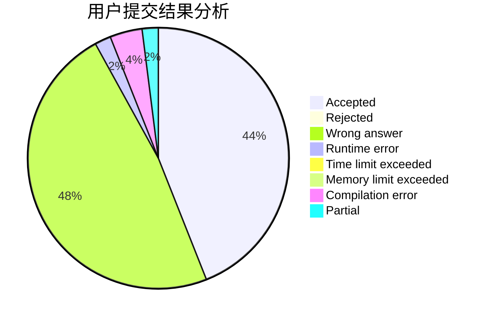
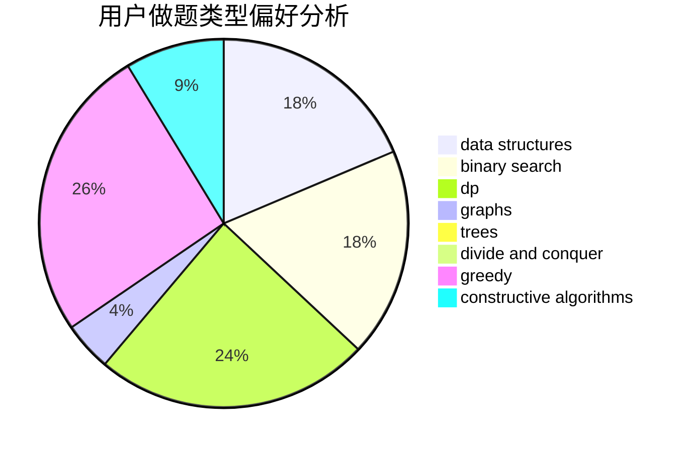

# SuperCGK

<!-- tabs:start -->

#### **用户提交结果分析**

#### **用户做题类型偏好分析**

#### **用户错题知识点分析**

<!-- tabs:end -->
# 推荐题目
[28D](https://codeforces.com/contest/28/problem/D)		binary search,
                        data structures,
                        dp,
                        hashing		  
[1432C](https://codeforces.com/contest/1432/problem/C)		dsu,graphs,sortings,trees		  
[1117D](https://codeforces.com/contest/1117/problem/D)		dp,
                        math,
                        matrices		  
[1303G](https://codeforces.com/contest/1303/problem/G)		data structures,
                        divide and conquer,
                        geometry,
                        trees		  
[445A](https://codeforces.com/contest/445/problem/A)		dfs and similar,
                        implementation		  
[875B](https://codeforces.com/contest/875/problem/B)		dsu,
                        implementation,
                        sortings,
                        two pointers		  
[1283A](https://codeforces.com/contest/1283/problem/A)		math		  
[377E](https://codeforces.com/contest/377/problem/E)		dp,
                        geometry		  
[933B](https://codeforces.com/contest/933/problem/B)		math		  
[1162D](https://codeforces.com/contest/1162/problem/D)		dsu,graphs,sortings,trees		  
