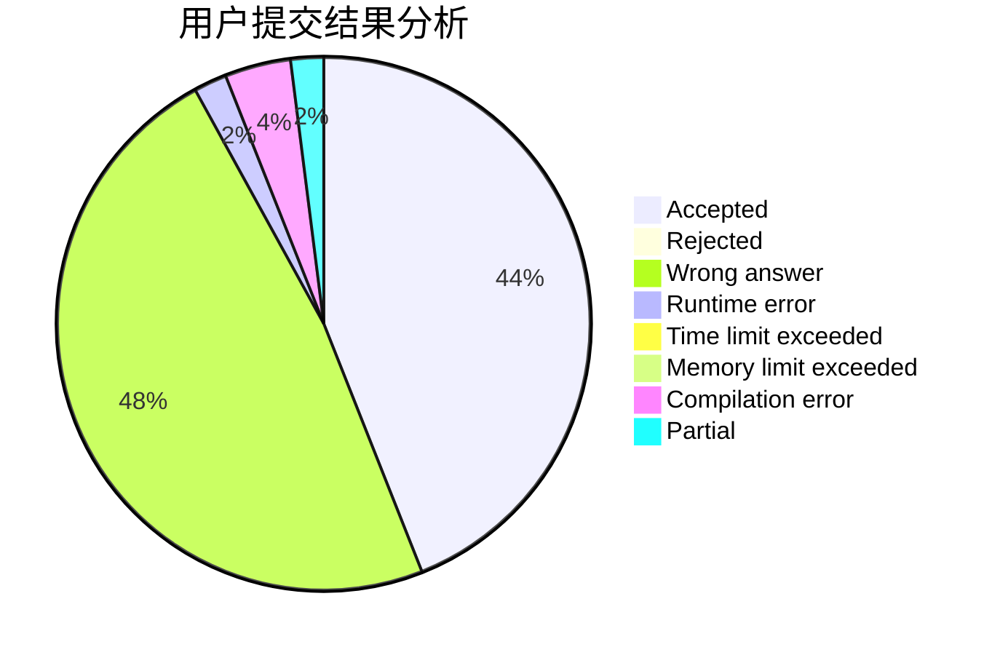
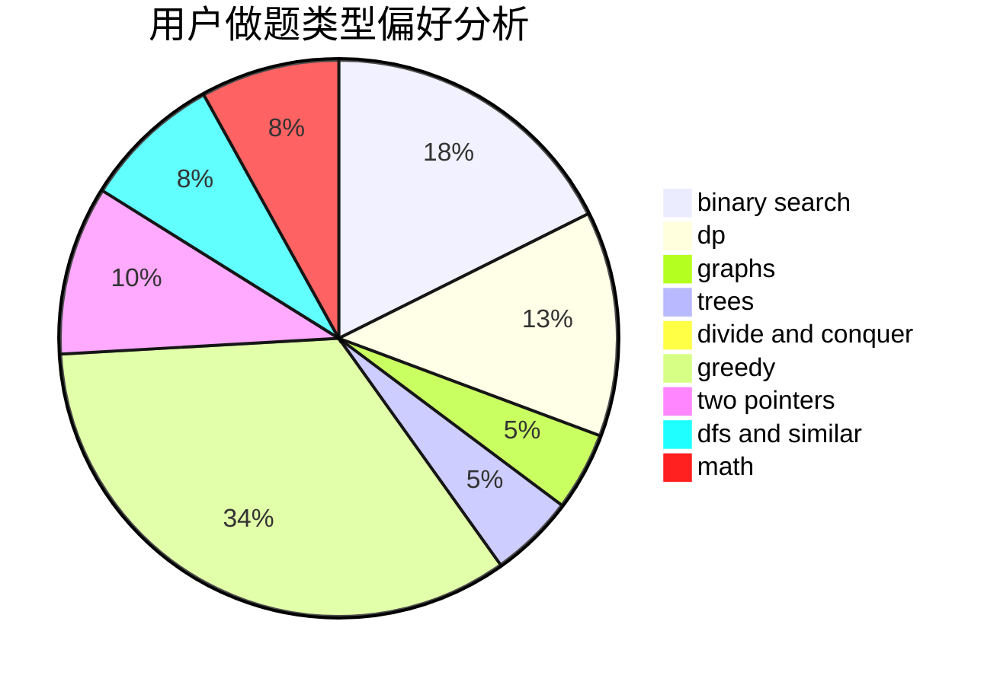

# SuperCGK

<!-- tabs:start -->

#### **用户提交结果分析**

#### **用户做题类型偏好分析**

<!-- tabs:end -->
# 推荐题目
[304D](https://codeforces.com/contest/304/problem/D)
[1442B](https://codeforces.com/contest/1442/problem/B)
[1119C](https://codeforces.com/contest/1119/problem/C)
[1312E](https://codeforces.com/contest/1312/problem/E)
[464E](https://codeforces.com/contest/464/problem/E)
[895B](https://codeforces.com/contest/895/problem/B)
[1290A](https://codeforces.com/contest/1290/problem/A)
[407B](https://codeforces.com/contest/407/problem/B)
[955B](https://codeforces.com/contest/955/problem/B)
[1164K](https://codeforces.com/contest/1164/problem/K)
