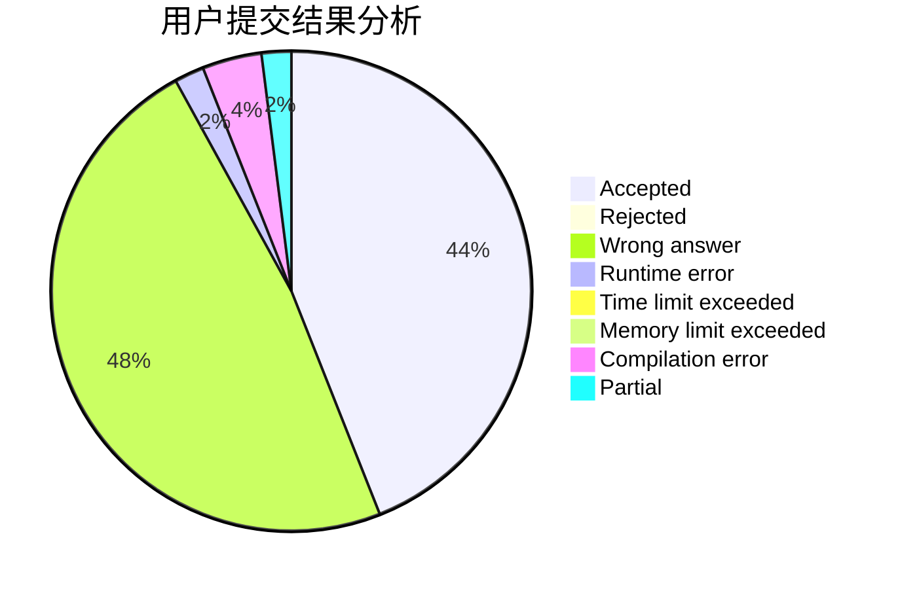
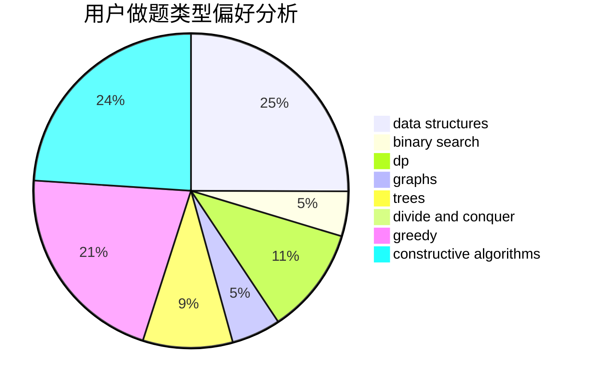

# SuperCGK

<!-- tabs:start -->

#### **用户提交结果分析**

#### **用户做题类型偏好分析**

#### **用户错题知识点分析**

<!-- tabs:end -->
# 推荐题目
[304D](https://codeforces.com/contest/304/problem/D)		dsu,graphs,sortings,trees		  
[1442B](https://codeforces.com/contest/1442/problem/B)		combinatorics,
                        data structures,
                        dsu,
                        greedy,
                        implementation		  
[1119C](https://codeforces.com/contest/1119/problem/C)		constructive algorithms,
                        greedy,
                        implementation,
                        math		  
[1312E](https://codeforces.com/contest/1312/problem/E)		dp,
                        greedy		  
[464E](https://codeforces.com/contest/464/problem/E)		data structures,
                        graphs,
                        shortest paths		  
[895B](https://codeforces.com/contest/895/problem/B)		binary search,
                        math,
                        sortings,
                        two pointers		  
[1290A](https://codeforces.com/contest/1290/problem/A)		brute force,
                        data structures,
                        implementation		  
[407B](https://codeforces.com/contest/407/problem/B)		dp,
                        implementation		  
[955B](https://codeforces.com/contest/955/problem/B)		implementation		  
[1164K](https://codeforces.com/contest/1164/problem/K)		dsu,graphs,sortings,trees		  
