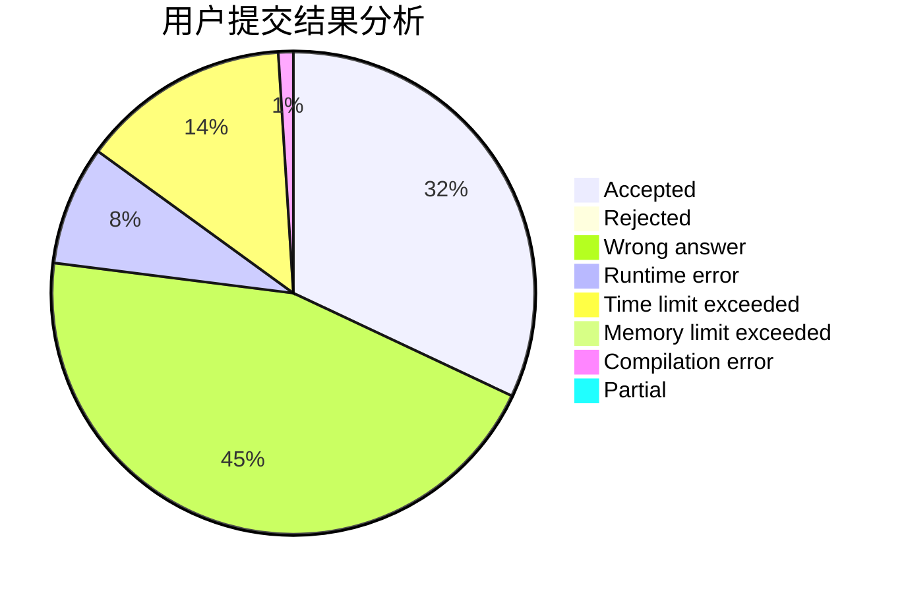
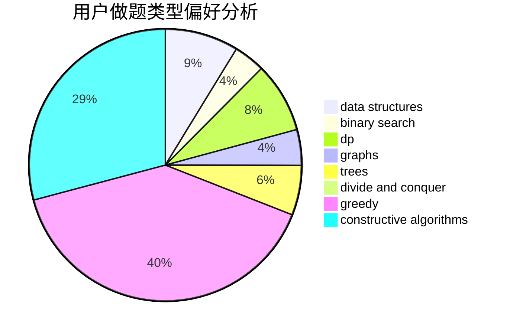
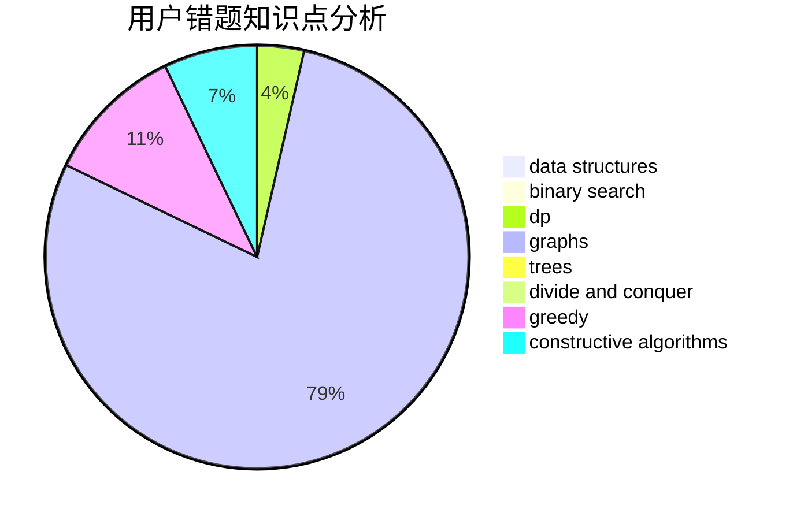

# SuperGCD

<!-- tabs:start -->

#### **用户提交结果分析**

#### **用户做题类型偏好分析**

#### **用户错题知识点分析**

<!-- tabs:end -->
# 推荐题目
[989C](https://codeforces.com/contest/989/problem/C)		constructive algorithms,
                        graphs		  
[1433C](https://codeforces.com/contest/1433/problem/C)		constructive algorithms,
                        greedy		  
[627E](https://codeforces.com/contest/627/problem/E)		two pointers		  
[1137A](https://codeforces.com/contest/1137/problem/A)		implementation,
                        sortings		  
[13573](https://codeforces.com/contest/1357/problem/3)		dsu,graphs,sortings,trees		  
[1307G](https://codeforces.com/contest/1307/problem/G)		flows,
                        graphs,
                        shortest paths		  
[1165C](https://codeforces.com/contest/1165/problem/C)		greedy		  
[894B](https://codeforces.com/contest/894/problem/B)		combinatorics,
                        constructive algorithms,
                        math,
                        number theory		  
[18E](https://codeforces.com/contest/18/problem/E)		dp		  
[1303F](https://codeforces.com/contest/1303/problem/F)		dsu,
                        implementation		  
