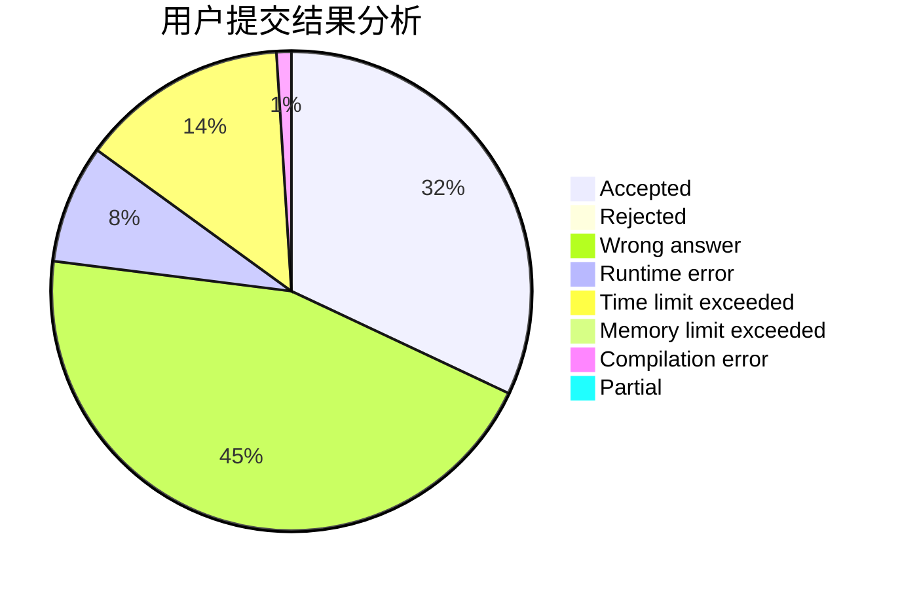
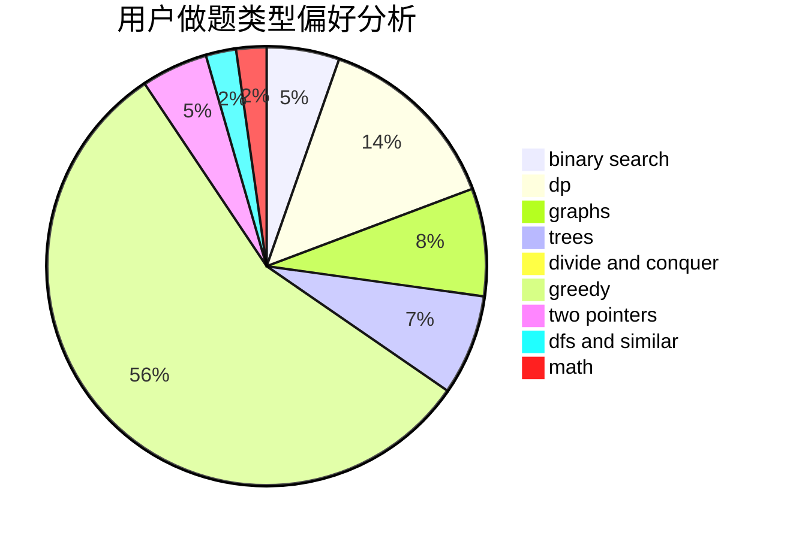

# SuperGCD

<!-- tabs:start -->

#### **用户提交结果分析**

#### **用户做题类型偏好分析**

<!-- tabs:end -->
# 推荐题目
[989C](https://codeforces.com/contest/989/problem/C)
[1433C](https://codeforces.com/contest/1433/problem/C)
[627E](https://codeforces.com/contest/627/problem/E)
[1137A](https://codeforces.com/contest/1137/problem/A)
[13573](https://codeforces.com/contest/1357/problem/3)
[1307G](https://codeforces.com/contest/1307/problem/G)
[1165C](https://codeforces.com/contest/1165/problem/C)
[894B](https://codeforces.com/contest/894/problem/B)
[18E](https://codeforces.com/contest/18/problem/E)
[1303F](https://codeforces.com/contest/1303/problem/F)
