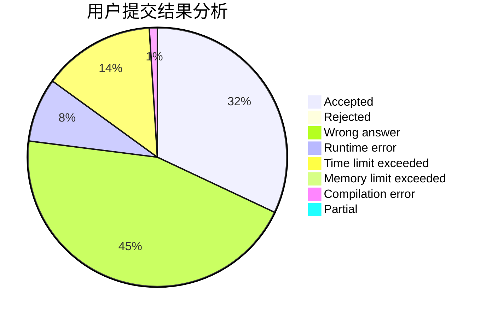
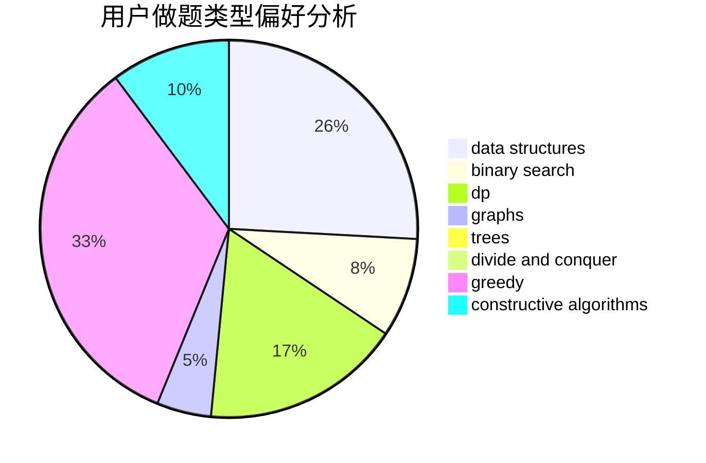
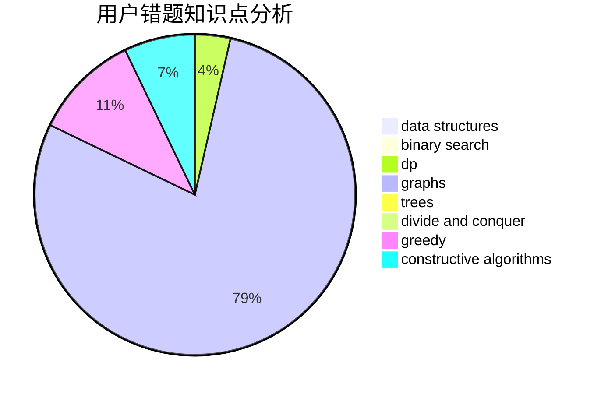

# SuperGCD

<!-- tabs:start -->

#### **用户提交结果分析**

#### **用户做题类型偏好分析**

#### **用户错题知识点分析**

<!-- tabs:end -->
# 推荐题目
[96A](https://codeforces.com/contest/96/problem/A)		implementation,
                        strings		  
[1424M](https://codeforces.com/contest/1424/problem/M)		graphs,
                        sortings		  
[608D](https://codeforces.com/contest/608/problem/D)		dsu,graphs,sortings,trees		  
[1132G](https://codeforces.com/contest/1132/problem/G)		data structures,
                        dp,
                        trees		  
[134B](https://codeforces.com/contest/134/problem/B)		brute force,
                        dfs and similar,
                        math,
                        number theory		  
[1300B](https://codeforces.com/contest/1300/problem/B)		greedy,
                        implementation,
                        sortings		  
[1164F](https://codeforces.com/contest/1164/problem/F)		dsu,graphs,sortings,trees		  
[873C](https://codeforces.com/contest/873/problem/C)		greedy,
                        two pointers		  
[165C](https://codeforces.com/contest/165/problem/C)		binary search,
                        brute force,
                        dp,
                        math,
                        strings,
                        two pointers		  
[1296D](https://codeforces.com/contest/1296/problem/D)		greedy,
                        sortings		  
