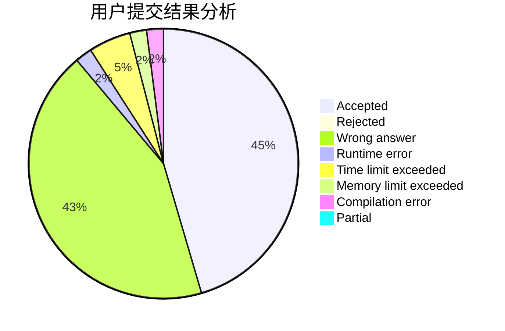
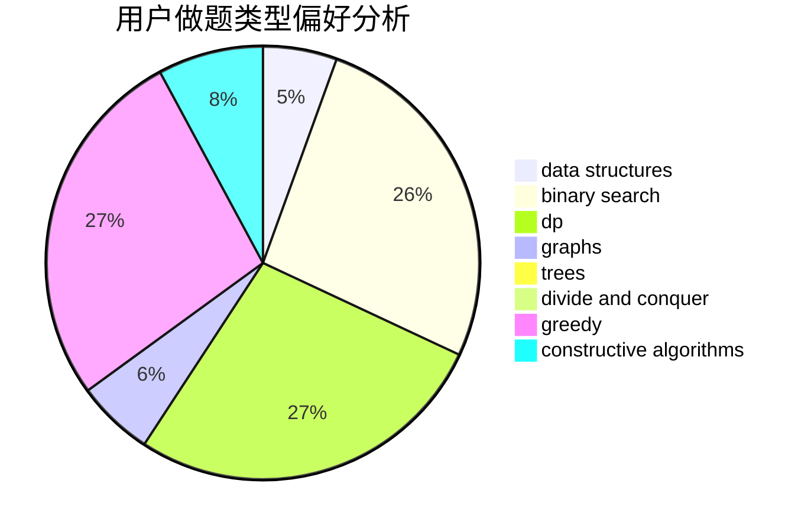

# SuperSodaSea

<!-- tabs:start -->

#### **用户提交结果分析**

#### **用户做题类型偏好分析**

#### **用户错题知识点分析**

<!-- tabs:end -->
# 推荐题目
[898F](https://codeforces.com/contest/898/problem/F)		brute force,
                        hashing,
                        math		  
[570A](https://codeforces.com/contest/570/problem/A)		implementation		  
[696B](https://codeforces.com/contest/696/problem/B)		dfs and similar,
                        math,
                        probabilities,
                        trees		  
[1034E](https://codeforces.com/contest/1034/problem/E)		bitmasks,
                        dp,
                        math		  
[987F](https://codeforces.com/contest/987/problem/F)		dsu,graphs,sortings,trees		  
[938A](https://codeforces.com/contest/938/problem/A)		implementation		  
[13783](https://codeforces.com/contest/1378/problem/3)		dsu,graphs,sortings,trees		  
[702C](https://codeforces.com/contest/702/problem/C)		binary search,
                        implementation,
                        two pointers		  
[650A](https://codeforces.com/contest/650/problem/A)		data structures,
                        geometry,
                        math		  
[592B](https://codeforces.com/contest/592/problem/B)		math		  
