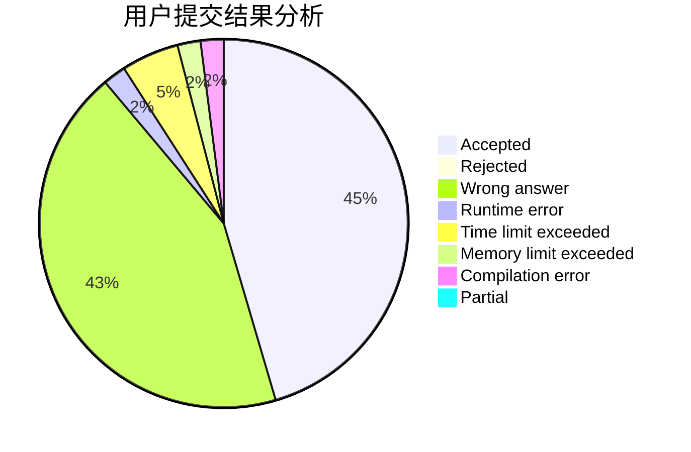
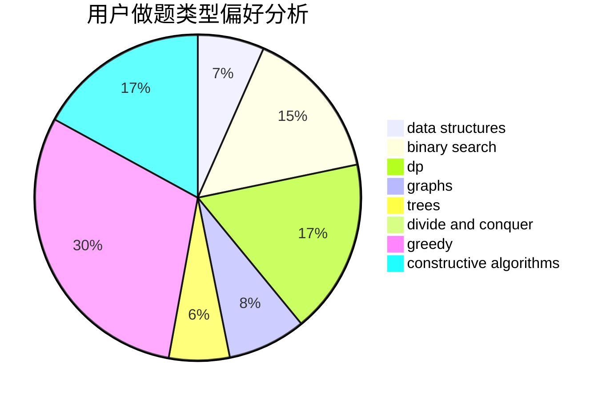

# SuperSodaSea

<!-- tabs:start -->

#### **用户提交结果分析**

#### **用户做题类型偏好分析**

#### **用户错题知识点分析**

<!-- tabs:end -->
# 推荐题目
[878A](https://codeforces.com/contest/878/problem/A)		bitmasks,
                        constructive algorithms		  
[545D](https://codeforces.com/contest/545/problem/D)		greedy,
                        implementation,
                        sortings		  
[670D1](https://codeforces.com/contest/670D/problem/1)		binary search,
                        brute force,
                        implementation		  
[1034B](https://codeforces.com/contest/1034/problem/B)		brute force,
                        constructive algorithms,
                        flows,
                        graph matchings		  
[966A](https://codeforces.com/contest/966/problem/A)		dsu,graphs,sortings,trees		  
[917C](https://codeforces.com/contest/917/problem/C)		combinatorics,
                        dp,
                        matrices		  
[1370A](https://codeforces.com/contest/1370/problem/A)		greedy,
                        implementation,
                        math,
                        number theory		  
[678E](https://codeforces.com/contest/678/problem/E)		bitmasks,
                        dp,
                        math,
                        probabilities		  
[622A](https://codeforces.com/contest/622/problem/A)		implementation,
                        math		  
[571E](https://codeforces.com/contest/571/problem/E)		math		  
