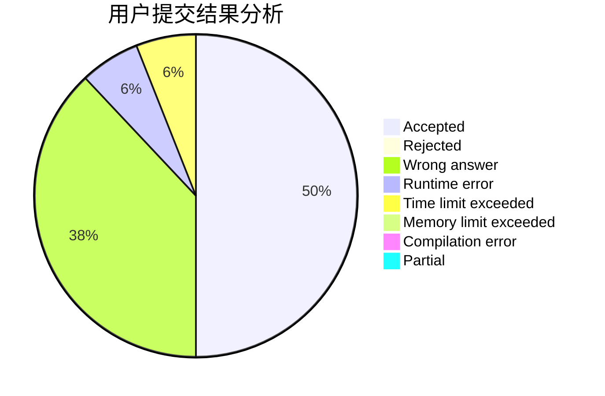
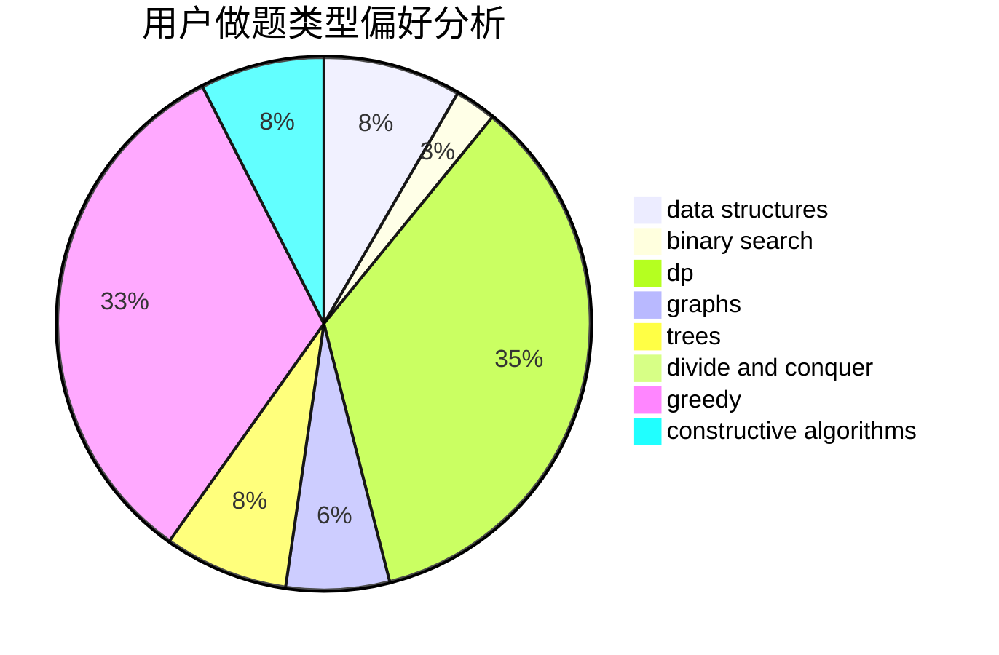
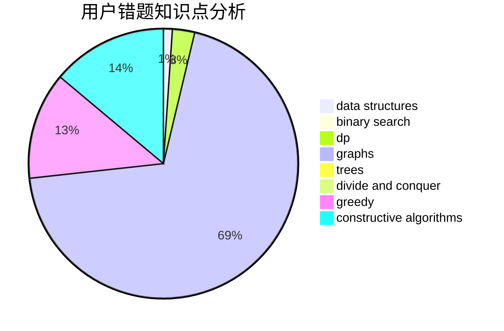

# SuperWhw

<!-- tabs:start -->

#### **用户提交结果分析**

#### **用户做题类型偏好分析**

#### **用户错题知识点分析**

<!-- tabs:end -->
# 推荐题目
[1342A](https://codeforces.com/contest/1342/problem/A)		greedy,
                        math		  
[671A](https://codeforces.com/contest/671/problem/A)		dp,
                        geometry,
                        greedy,
                        implementation		  
[224A](https://codeforces.com/contest/224/problem/A)		brute force,
                        geometry,
                        math		  
[938A](https://codeforces.com/contest/938/problem/A)		implementation		  
[932B](https://codeforces.com/contest/932/problem/B)		binary search,
                        data structures,
                        dfs and similar		  
[678F](https://codeforces.com/contest/678/problem/F)		data structures,
                        divide and conquer,
                        geometry		  
[4C](https://codeforces.com/contest/4/problem/C)		data structures,
                        hashing,
                        implementation		  
[46A](https://codeforces.com/contest/46/problem/A)		brute force,
                        implementation		  
[1011B](https://codeforces.com/contest/1011/problem/B)		binary search,
                        brute force,
                        implementation		  
[982C](https://codeforces.com/contest/982/problem/C)		dfs and similar,
                        dp,
                        graphs,
                        greedy,
                        trees		  
