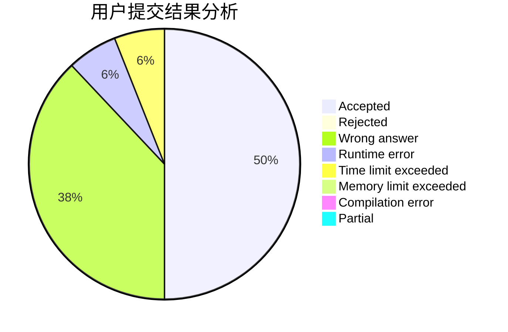
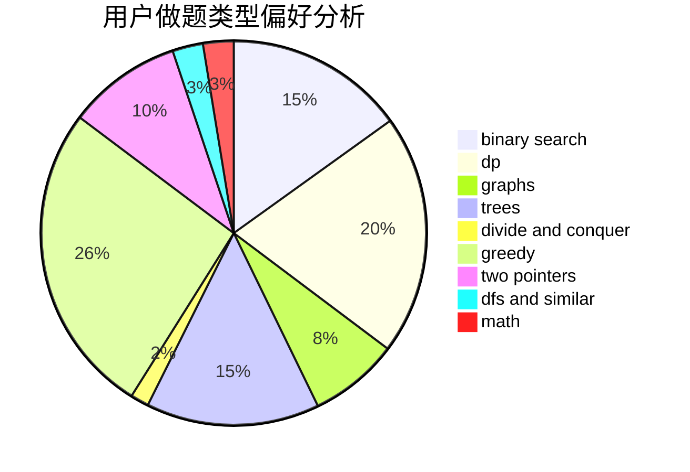

# SuperWhw

<!-- tabs:start -->

#### **用户提交结果分析**

#### **用户做题类型偏好分析**

<!-- tabs:end -->
# 推荐题目
[1342A](https://codeforces.com/contest/1342/problem/A)
[671A](https://codeforces.com/contest/671/problem/A)
[224A](https://codeforces.com/contest/224/problem/A)
[938A](https://codeforces.com/contest/938/problem/A)
[932B](https://codeforces.com/contest/932/problem/B)
[678F](https://codeforces.com/contest/678/problem/F)
[4C](https://codeforces.com/contest/4/problem/C)
[46A](https://codeforces.com/contest/46/problem/A)
[1011B](https://codeforces.com/contest/1011/problem/B)
[982C](https://codeforces.com/contest/982/problem/C)
