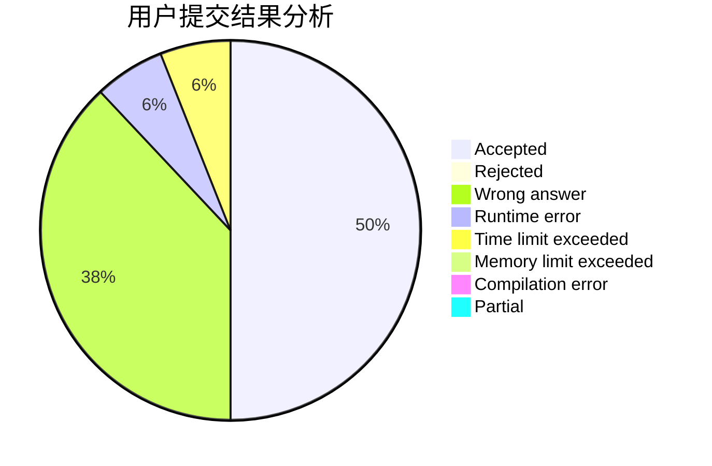
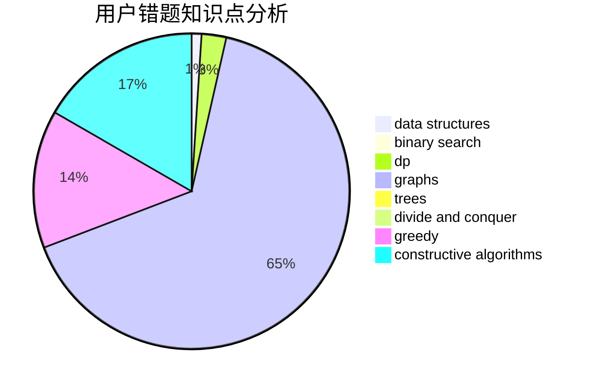

# SuperWhw

<!-- tabs:start -->

#### **用户提交结果分析**

#### **用户做题类型偏好分析**

#### **用户错题知识点分析**

<!-- tabs:end -->
# 推荐题目
[1335A](https://codeforces.com/contest/1335/problem/A)		math		  
[643G](https://codeforces.com/contest/643/problem/G)		data structures		  
[1B](https://codeforces.com/contest/1/problem/B)		implementation,
                        math		  
[917C](https://codeforces.com/contest/917/problem/C)		combinatorics,
                        dp,
                        matrices		  
[913D](https://codeforces.com/contest/913/problem/D)		binary search,
                        brute force,
                        data structures,
                        greedy,
                        sortings		  
[656F](https://codeforces.com/contest/656/problem/F)		*special problem		  
[47B](https://codeforces.com/contest/47/problem/B)		implementation		  
[449D](https://codeforces.com/contest/449/problem/D)		bitmasks,
                        combinatorics,
                        dp		  
[1010E](https://codeforces.com/contest/1010/problem/E)		data structures		  
[960D](https://codeforces.com/contest/960/problem/D)		brute force,
                        implementation,
                        trees		  
