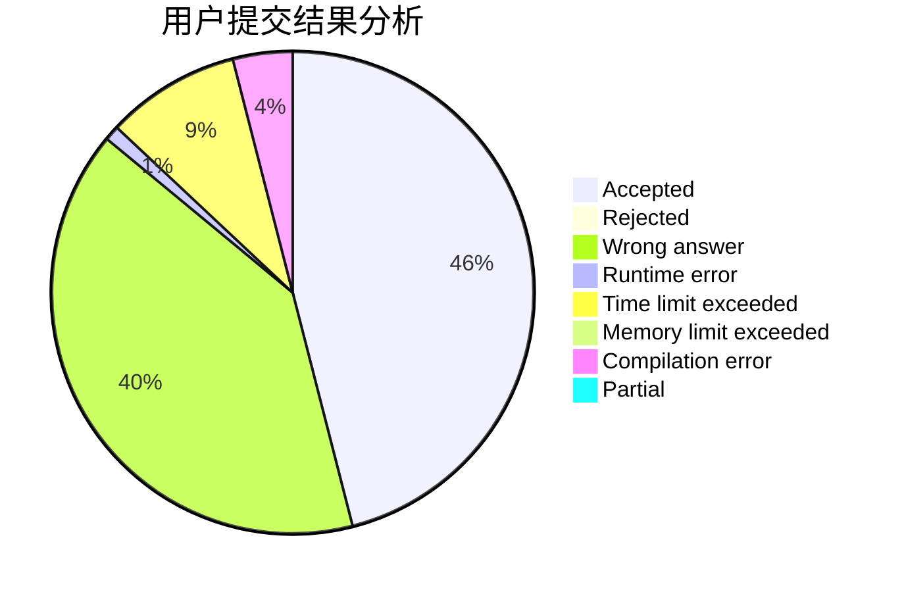
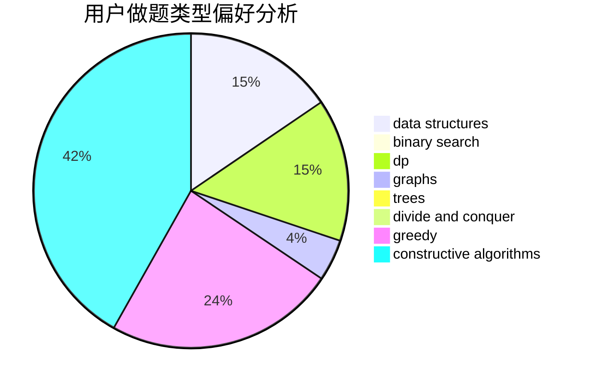
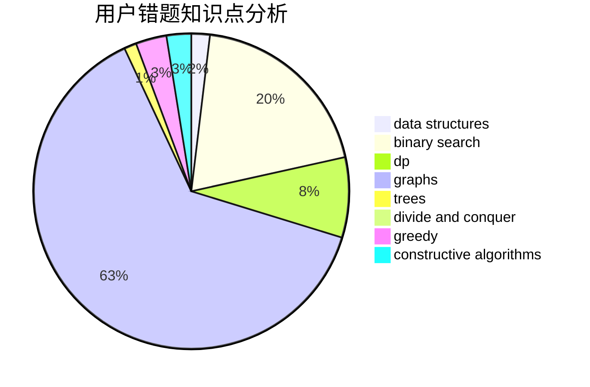

# SupermusicA

<!-- tabs:start -->

#### **用户提交结果分析**

#### **用户做题类型偏好分析**

#### **用户错题知识点分析**

<!-- tabs:end -->
# 推荐题目
[1445D](https://codeforces.com/contest/1445/problem/D)		dsu,graphs,sortings,trees		  
[540C](https://codeforces.com/contest/540/problem/C)		dfs and similar		  
[977A](https://codeforces.com/contest/977/problem/A)		implementation		  
[864F](https://codeforces.com/contest/864/problem/F)		dfs and similar,
                        graphs,
                        trees		  
[1265A](https://codeforces.com/contest/1265/problem/A)		constructive algorithms,
                        greedy		  
[639B](https://codeforces.com/contest/639/problem/B)		constructive algorithms,
                        graphs,
                        trees		  
[982E](https://codeforces.com/contest/982/problem/E)		geometry,
                        number theory		  
[398A](https://codeforces.com/contest/398/problem/A)		constructive algorithms,
                        implementation		  
[681B](https://codeforces.com/contest/681/problem/B)		brute force		  
[1245F](https://codeforces.com/contest/1245/problem/F)		bitmasks,
                        brute force,
                        combinatorics,
                        dp		  
