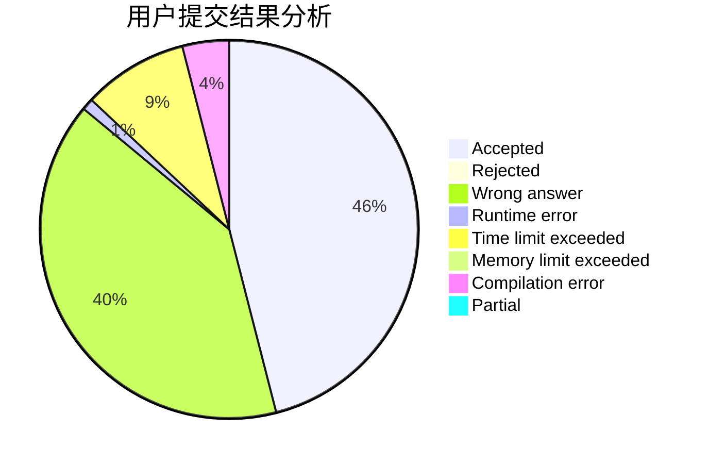
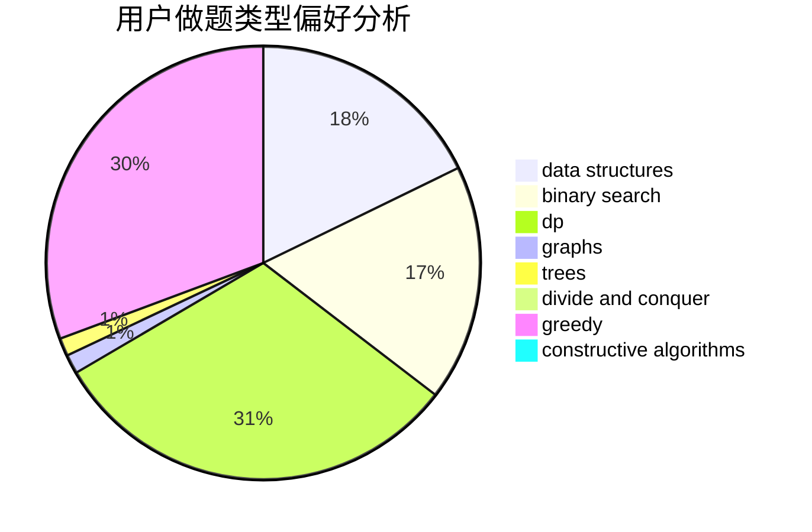
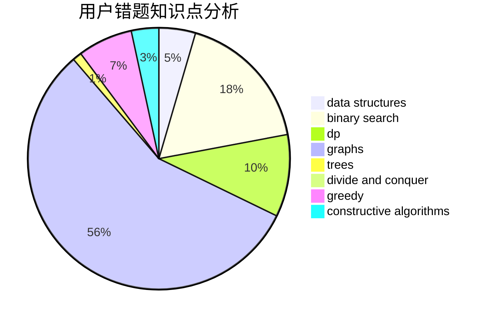

# SupermusicA

<!-- tabs:start -->

#### **用户提交结果分析**

#### **用户做题类型偏好分析**

#### **用户错题知识点分析**

<!-- tabs:end -->
# 推荐题目
[1435D](https://codeforces.com/contest/1435/problem/D)		dsu,graphs,sortings,trees		  
[514E](https://codeforces.com/contest/514/problem/E)		dp,
                        matrices		  
[955A](https://codeforces.com/contest/955/problem/A)		greedy,
                        math		  
[846E](https://codeforces.com/contest/846/problem/E)		dfs and similar,
                        greedy,
                        trees		  
[1257F](https://codeforces.com/contest/1257/problem/F)		bitmasks,
                        brute force,
                        hashing,
                        meet-in-the-middle		  
[618D](https://codeforces.com/contest/618/problem/D)		dfs and similar,
                        dp,
                        graph matchings,
                        greedy,
                        trees		  
[960F](https://codeforces.com/contest/960/problem/F)		data structures,
                        dp,
                        graphs		  
[367B](https://codeforces.com/contest/367/problem/B)		binary search,
                        data structures		  
[660D](https://codeforces.com/contest/660/problem/D)		geometry		  
[1240C](https://codeforces.com/contest/1240/problem/C)		dsu,graphs,sortings,trees		  
