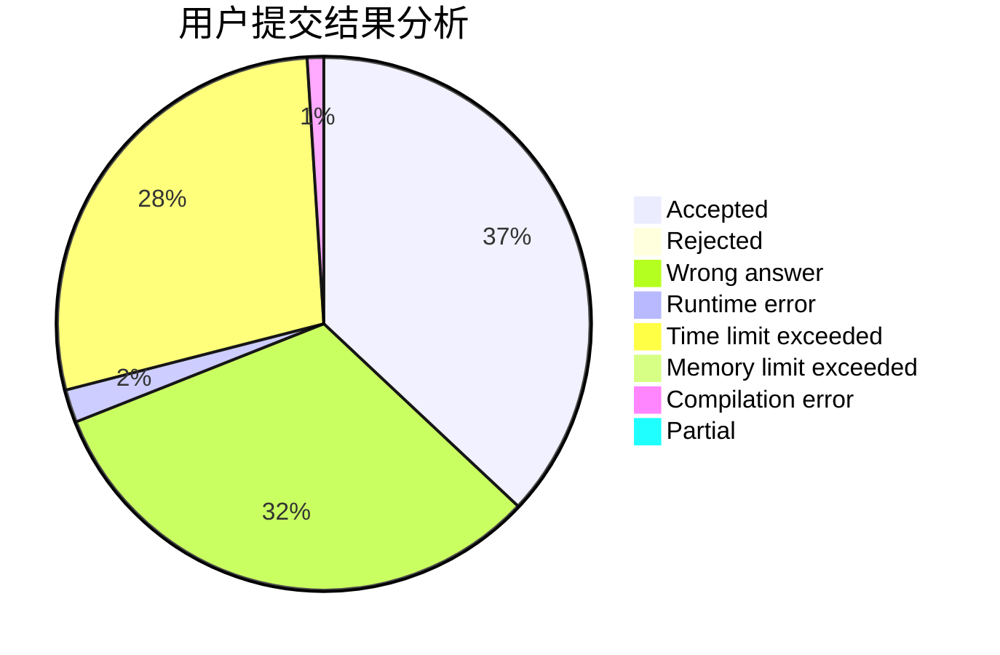
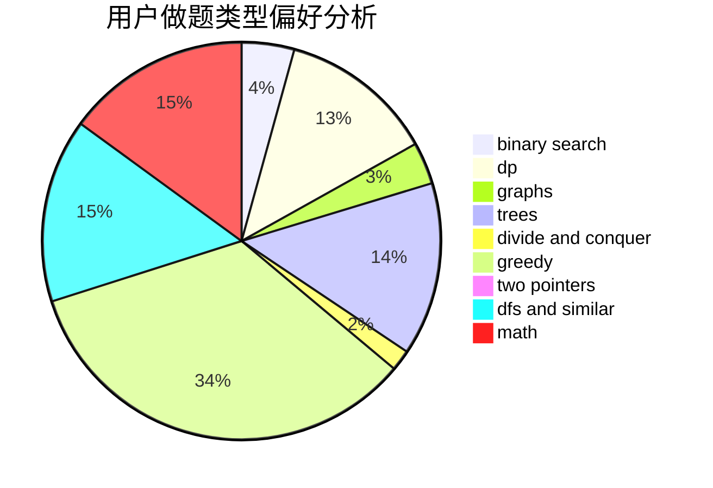

# Sympa

<!-- tabs:start -->

#### **用户提交结果分析**

#### **用户做题类型偏好分析**

<!-- tabs:end -->
# 推荐题目
[314C](https://codeforces.com/contest/314/problem/C)
[553C](https://codeforces.com/contest/553/problem/C)
[702C](https://codeforces.com/contest/702/problem/C)
[873A](https://codeforces.com/contest/873/problem/A)
[1510H](https://codeforces.com/contest/1510/problem/H)
[486A](https://codeforces.com/contest/486/problem/A)
[135B](https://codeforces.com/contest/135/problem/B)
[1255D](https://codeforces.com/contest/1255/problem/D)
[813C](https://codeforces.com/contest/813/problem/C)
[741D](https://codeforces.com/contest/741/problem/D)
