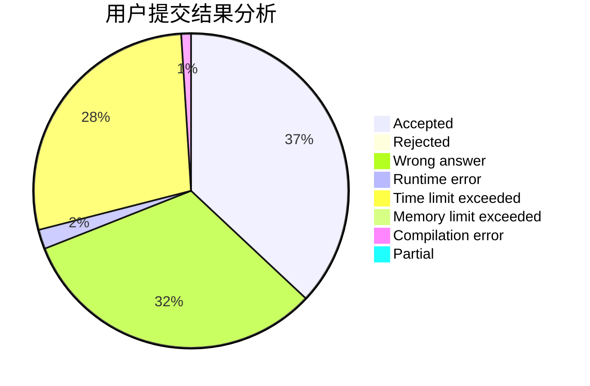
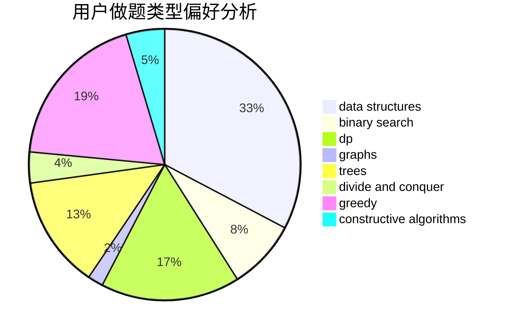
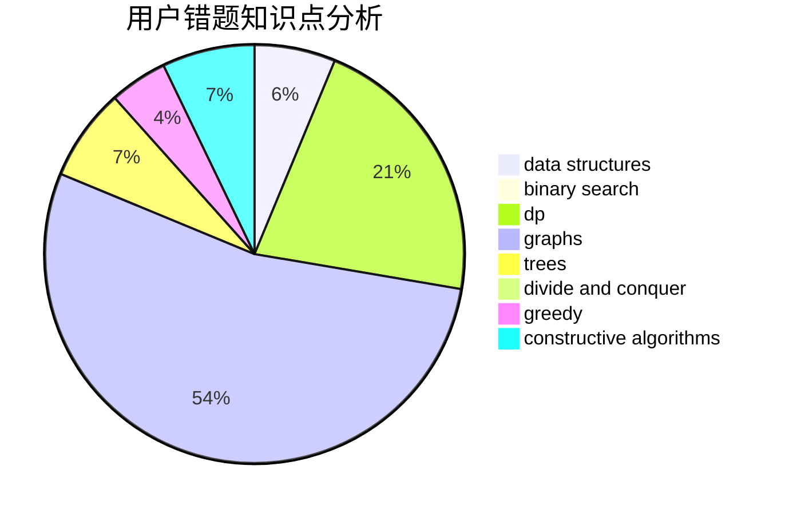

# Sympa

<!-- tabs:start -->

#### **用户提交结果分析**

#### **用户做题类型偏好分析**

#### **用户错题知识点分析**

<!-- tabs:end -->
# 推荐题目
[314C](https://codeforces.com/contest/314/problem/C)		data structures,
                        dp		  
[553C](https://codeforces.com/contest/553/problem/C)		dfs and similar,
                        dsu,
                        graphs		  
[702C](https://codeforces.com/contest/702/problem/C)		binary search,
                        implementation,
                        two pointers		  
[873A](https://codeforces.com/contest/873/problem/A)		implementation		  
[1510H](https://codeforces.com/contest/1510/problem/H)		dp		  
[486A](https://codeforces.com/contest/486/problem/A)		implementation,
                        math		  
[135B](https://codeforces.com/contest/135/problem/B)		brute force,
                        geometry,
                        math		  
[1255D](https://codeforces.com/contest/1255/problem/D)		dsu,graphs,sortings,trees		  
[813C](https://codeforces.com/contest/813/problem/C)		dfs and similar,
                        graphs		  
[741D](https://codeforces.com/contest/741/problem/D)		data structures,
                        dfs and similar,
                        trees		  
