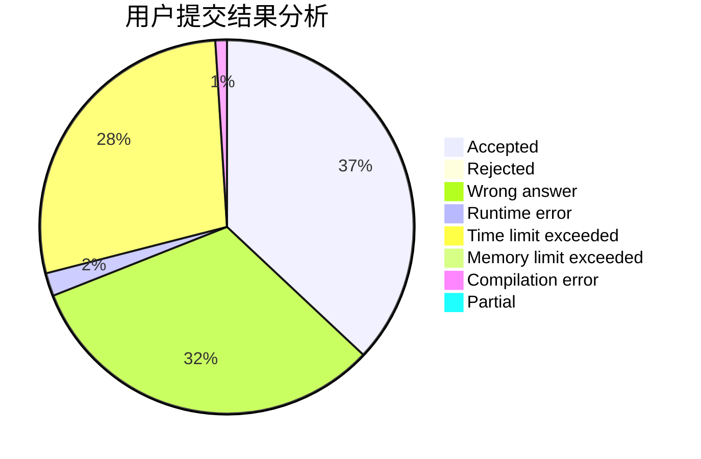
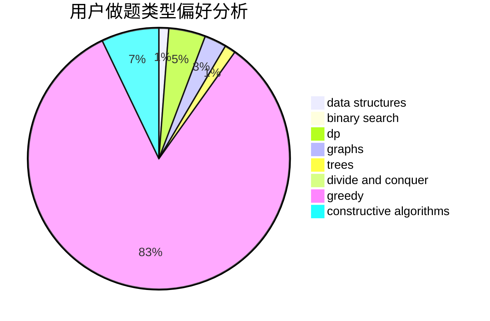
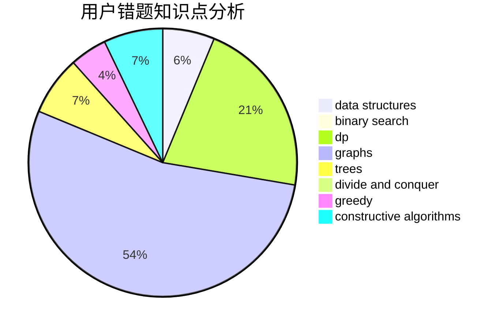

# Sympa

<!-- tabs:start -->

#### **用户提交结果分析**

#### **用户做题类型偏好分析**

#### **用户错题知识点分析**

<!-- tabs:end -->
# 推荐题目
[297D](https://codeforces.com/contest/297/problem/D)		constructive algorithms		  
[52B](https://codeforces.com/contest/52/problem/B)		combinatorics		  
[678E](https://codeforces.com/contest/678/problem/E)		bitmasks,
                        dp,
                        math,
                        probabilities		  
[854C](https://codeforces.com/contest/854/problem/C)		dsu,graphs,sortings,trees		  
[1500B](https://codeforces.com/contest/1500/problem/B)		binary search,
                        brute force,
                        chinese remainder theorem,
                        math,
                        number theory		  
[466C](https://codeforces.com/contest/466/problem/C)		binary search,
                        brute force,
                        data structures,
                        dp,
                        two pointers		  
[1353B](https://codeforces.com/contest/1353/problem/B)		greedy,
                        sortings		  
[1250M](https://codeforces.com/contest/1250/problem/M)		constructive algorithms,
                        divide and conquer		  
[799B](https://codeforces.com/contest/799/problem/B)		data structures,
                        implementation		  
[724C](https://codeforces.com/contest/724/problem/C)		greedy,
                        hashing,
                        implementation,
                        math,
                        number theory,
                        sortings		  
