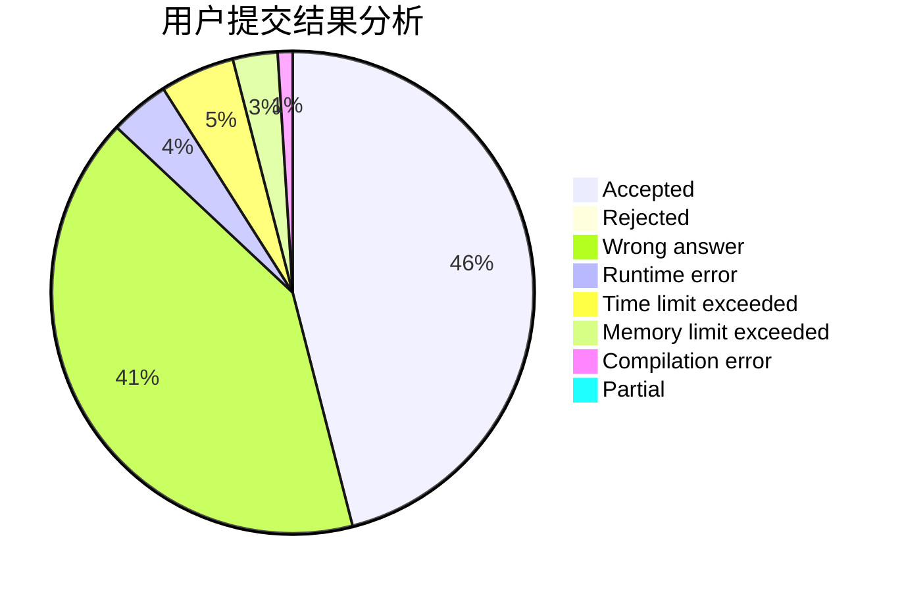
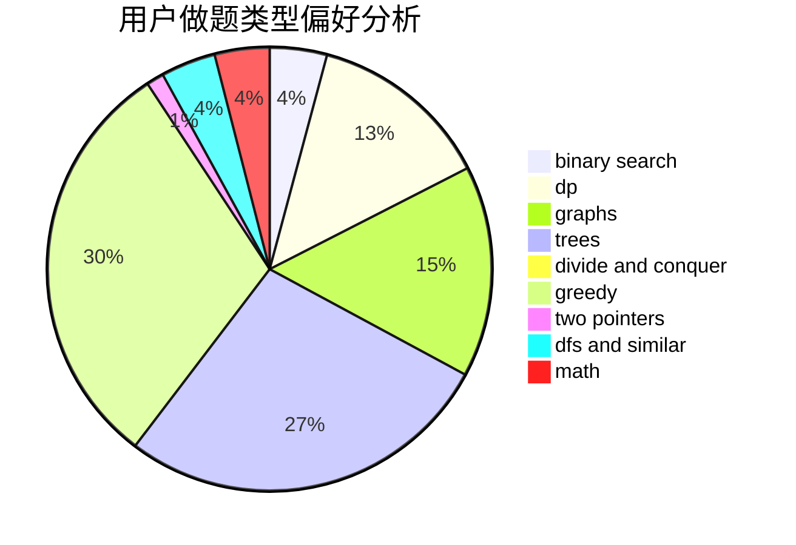

# Syzygy12

<!-- tabs:start -->

#### **用户提交结果分析**

#### **用户做题类型偏好分析**

<!-- tabs:end -->
# 推荐题目
[1454C](https://codeforces.com/contest/1454/problem/C)
[1093B](https://codeforces.com/contest/1093/problem/B)
[13681](https://codeforces.com/contest/1368/problem/1)
[13352](https://codeforces.com/contest/1335/problem/2)
[629E](https://codeforces.com/contest/629/problem/E)
[1375I](https://codeforces.com/contest/1375/problem/I)
[1365G](https://codeforces.com/contest/1365/problem/G)
[725C](https://codeforces.com/contest/725/problem/C)
[612A](https://codeforces.com/contest/612/problem/A)
[80B](https://codeforces.com/contest/80/problem/B)
