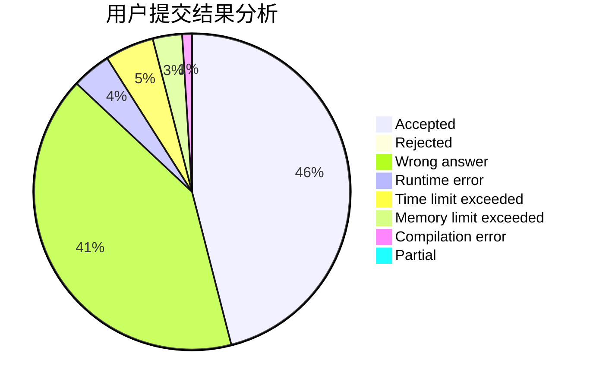
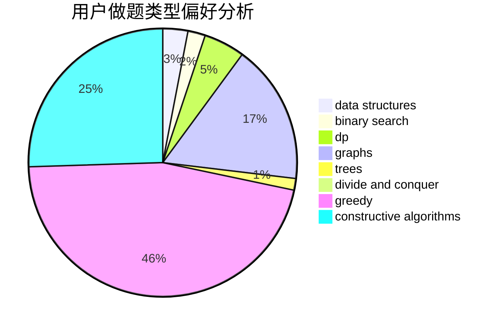
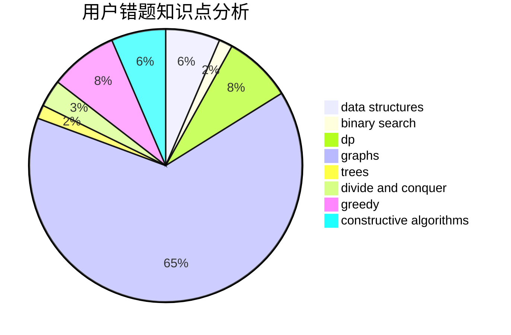

# Syzygy12

<!-- tabs:start -->

#### **用户提交结果分析**

#### **用户做题类型偏好分析**

#### **用户错题知识点分析**

<!-- tabs:end -->
# 推荐题目
[1444E](https://codeforces.com/contest/1444/problem/E)		brute force,
                        dfs and similar,
                        dp,
                        interactive,
                        trees		  
[1092E](https://codeforces.com/contest/1092/problem/E)		constructive algorithms,
                        dfs and similar,
                        greedy,
                        trees		  
[135B](https://codeforces.com/contest/135/problem/B)		brute force,
                        geometry,
                        math		  
[1328F](https://codeforces.com/contest/1328/problem/F)		greedy		  
[610C](https://codeforces.com/contest/610/problem/C)		constructive algorithms		  
[1369A](https://codeforces.com/contest/1369/problem/A)		geometry,
                        math		  
[1357D5](https://codeforces.com/contest/1357D/problem/5)		nan		  
[707A](https://codeforces.com/contest/707/problem/A)		implementation		  
[593D](https://codeforces.com/contest/593/problem/D)		data structures,
                        dfs and similar,
                        graphs,
                        math,
                        trees		  
[795D](https://codeforces.com/contest/795/problem/D)		dsu,graphs,sortings,trees		  
