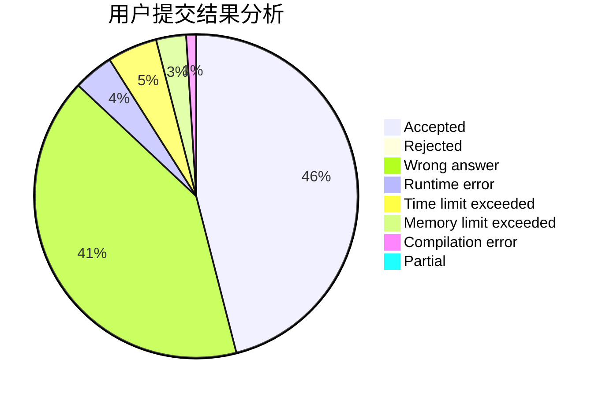
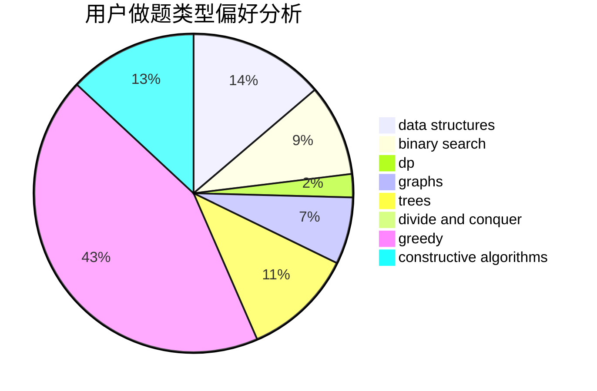
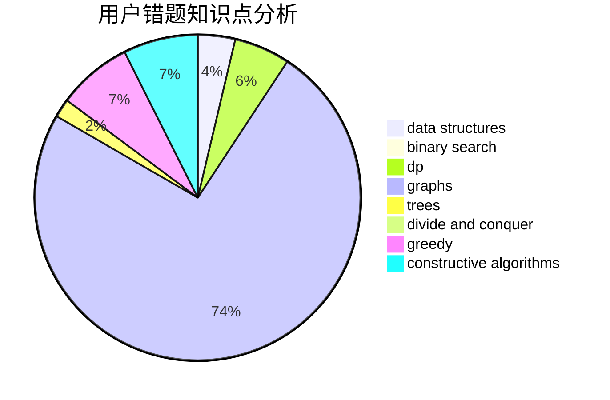

# Syzygy12

<!-- tabs:start -->

#### **用户提交结果分析**

#### **用户做题类型偏好分析**

#### **用户错题知识点分析**

<!-- tabs:end -->
# 推荐题目
[1454C](https://codeforces.com/contest/1454/problem/C)		greedy,
                        implementation		  
[1093B](https://codeforces.com/contest/1093/problem/B)		constructive algorithms,
                        greedy,
                        sortings,
                        strings		  
[13681](https://codeforces.com/contest/1368/problem/1)		dsu,graphs,sortings,trees		  
[13352](https://codeforces.com/contest/1335/problem/2)		dsu,graphs,sortings,trees		  
[629E](https://codeforces.com/contest/629/problem/E)		combinatorics,
                        data structures,
                        dfs and similar,
                        dp,
                        probabilities,
                        trees		  
[1375I](https://codeforces.com/contest/1375/problem/I)		geometry,
                        math,
                        matrices,
                        number theory		  
[1365G](https://codeforces.com/contest/1365/problem/G)		bitmasks,
                        combinatorics,
                        constructive algorithms,
                        interactive,
                        math		  
[725C](https://codeforces.com/contest/725/problem/C)		brute force,
                        constructive algorithms,
                        implementation,
                        strings		  
[612A](https://codeforces.com/contest/612/problem/A)		brute force,
                        implementation,
                        strings		  
[80B](https://codeforces.com/contest/80/problem/B)		geometry,
                        math		  
