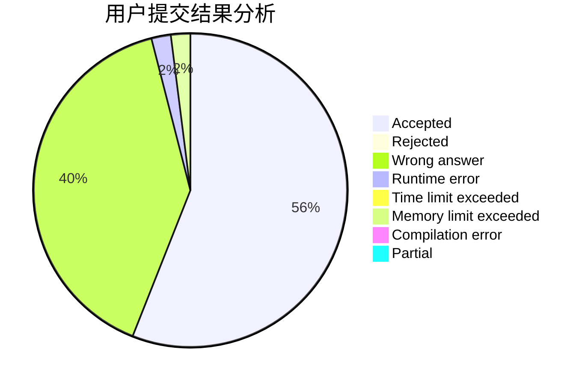
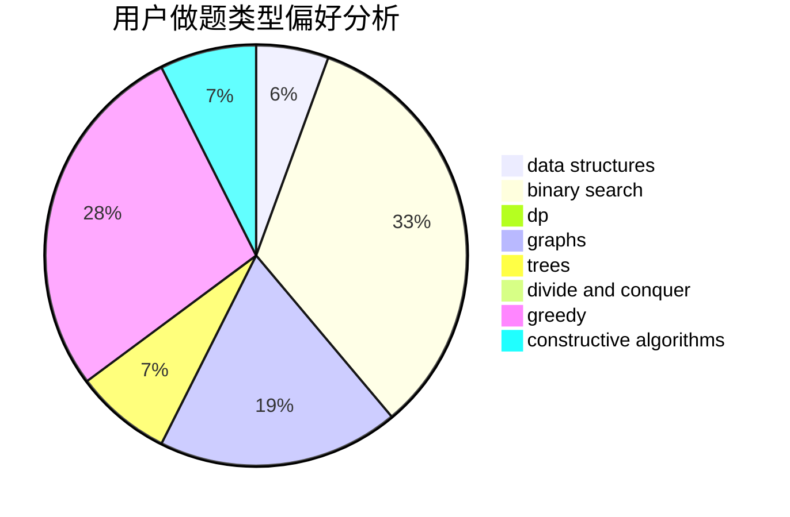

# Accadurosoce

<!-- tabs:start -->

#### **用户提交结果分析**

#### **用户做题类型偏好分析**

#### **用户错题知识点分析**

<!-- tabs:end -->
# 推荐题目
[1095F](https://codeforces.com/contest/1095/problem/F)		dsu,
                        graphs,
                        greedy		  
[1781](https://codeforces.com/contest/178/problem/1)		dsu,graphs,sortings,trees		  
[1078B](https://codeforces.com/contest/1078/problem/B)		dsu,graphs,sortings,trees		  
[1183G](https://codeforces.com/contest/1183/problem/G)		greedy,
                        implementation,
                        sortings		  
[1095D](https://codeforces.com/contest/1095/problem/D)		implementation		  
[1095C](https://codeforces.com/contest/1095/problem/C)		bitmasks,
                        greedy		  
[1205D](https://codeforces.com/contest/1205/problem/D)		constructive algorithms,
                        trees		  
[1490C](https://codeforces.com/contest/1490/problem/C)		binary search,
                        brute force,
                        brute force,
                        math		  
[1497B](https://codeforces.com/contest/1497/problem/B)		constructive algorithms,
                        greedy,
                        math		  
[1491C](https://codeforces.com/contest/1491/problem/C)		brute force,
                        data structures,
                        dp,
                        greedy,
                        implementation		  
