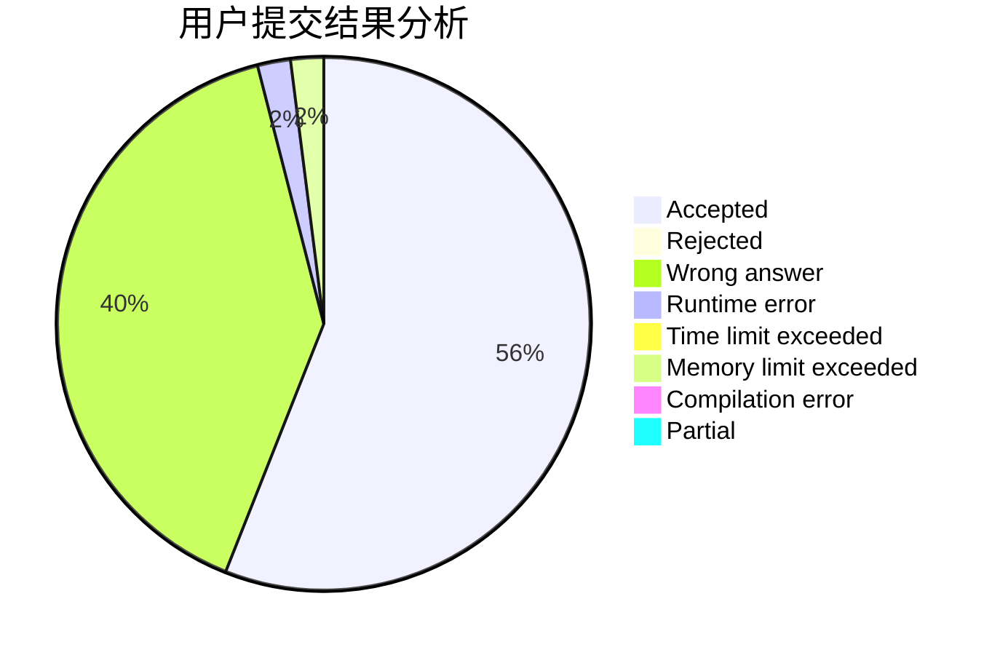
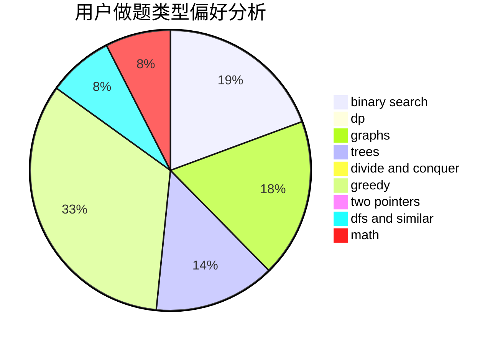

# Accadurosoce

<!-- tabs:start -->

#### **用户提交结果分析**

#### **用户做题类型偏好分析**

<!-- tabs:end -->
# 推荐题目
[1095F](https://codeforces.com/contest/1095/problem/F)
[1781](https://codeforces.com/contest/178/problem/1)
[1078B](https://codeforces.com/contest/1078/problem/B)
[1183G](https://codeforces.com/contest/1183/problem/G)
[1095D](https://codeforces.com/contest/1095/problem/D)
[1095C](https://codeforces.com/contest/1095/problem/C)
[1205D](https://codeforces.com/contest/1205/problem/D)
[1490C](https://codeforces.com/contest/1490/problem/C)
[1497B](https://codeforces.com/contest/1497/problem/B)
[1491C](https://codeforces.com/contest/1491/problem/C)
