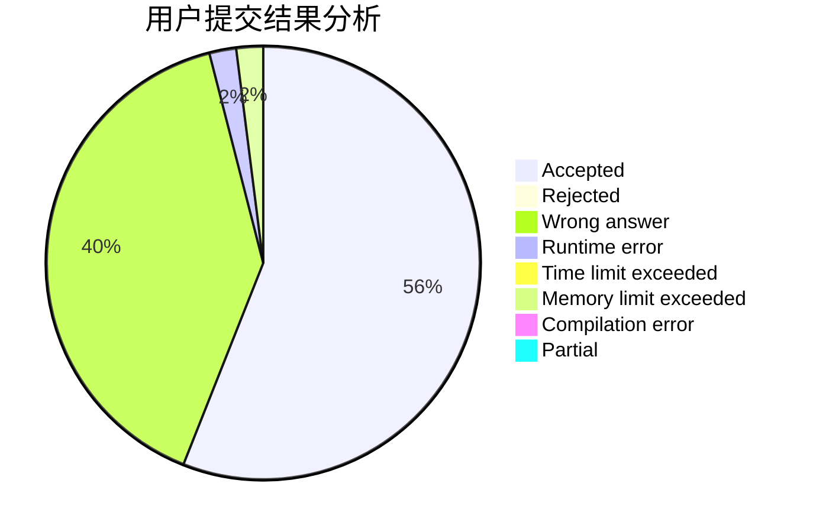
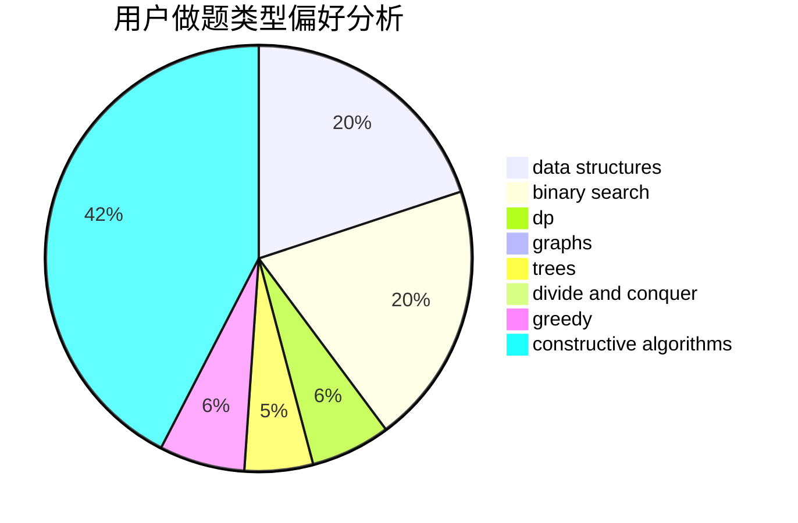

# Accadurosoce

<!-- tabs:start -->

#### **用户提交结果分析**

#### **用户做题类型偏好分析**

#### **用户错题知识点分析**

<!-- tabs:end -->
# 推荐题目
[1095C](https://codeforces.com/contest/1095/problem/C)		bitmasks,
                        greedy		  
[157B](https://codeforces.com/contest/157/problem/B)		geometry,
                        sortings		  
[1077F1](https://codeforces.com/contest/1077F/problem/1)		dp		  
[1181B](https://codeforces.com/contest/1181/problem/B)		greedy,
                        implementation,
                        strings		  
[1095A](https://codeforces.com/contest/1095/problem/A)		implementation		  
[1093G](https://codeforces.com/contest/1093/problem/G)		bitmasks,
                        data structures		  
[1200E](https://codeforces.com/contest/1200/problem/E)		brute force,
                        hashing,
                        implementation,
                        string suffix structures,
                        strings		  
[1482E](https://codeforces.com/contest/1482/problem/E)		data structures,
                        divide and conquer,
                        dp		  
[1489D](https://codeforces.com/contest/1489/problem/D)		dsu,graphs,sortings,trees		  
[1483E](https://codeforces.com/contest/1483/problem/E)		dsu,graphs,sortings,trees		  
