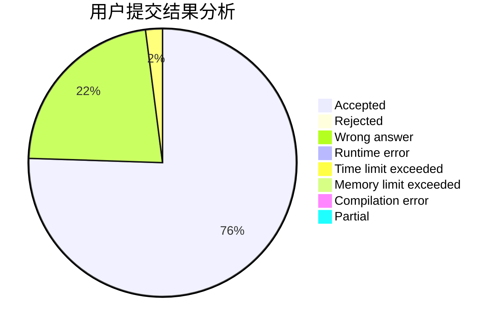
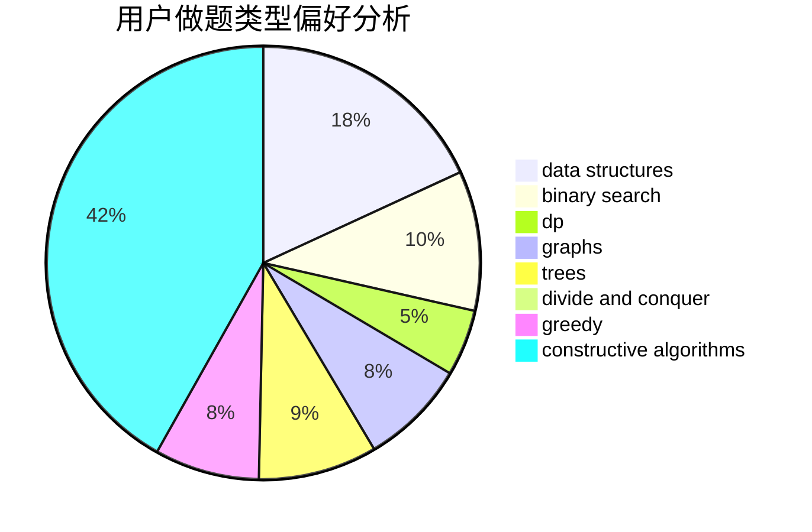

# THE_WEAKEST

<!-- tabs:start -->

#### **用户提交结果分析**

#### **用户做题类型偏好分析**

#### **用户错题知识点分析**

<!-- tabs:end -->
# 推荐题目
[1436F](https://codeforces.com/contest/1436/problem/F)		combinatorics,
                        math,
                        number theory		  
[1450H1](https://codeforces.com/contest/1450H/problem/1)		combinatorics,
                        fft,
                        math		  
[1358D](https://codeforces.com/contest/1358/problem/D)		binary search,
                        brute force,
                        greedy,
                        implementation,
                        two pointers		  
[316G1](https://codeforces.com/contest/316G/problem/1)		hashing,
                        strings		  
[319A](https://codeforces.com/contest/319/problem/A)		combinatorics,
                        math		  
[883C](https://codeforces.com/contest/883/problem/C)		binary search,
                        implementation		  
[1321E](https://codeforces.com/contest/1321/problem/E)		dsu,graphs,sortings,trees		  
[1054C](https://codeforces.com/contest/1054/problem/C)		constructive algorithms,
                        implementation		  
[960H](https://codeforces.com/contest/960/problem/H)		data structures,
                        trees		  
[805D](https://codeforces.com/contest/805/problem/D)		dsu,graphs,sortings,trees		  
