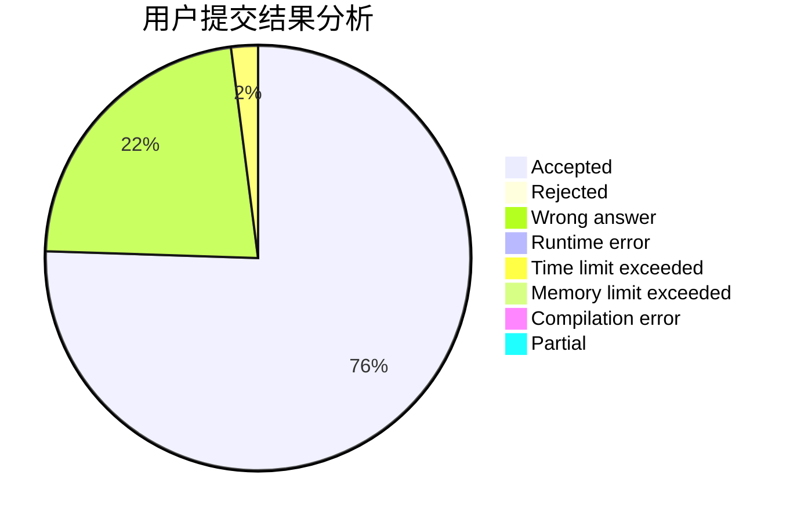
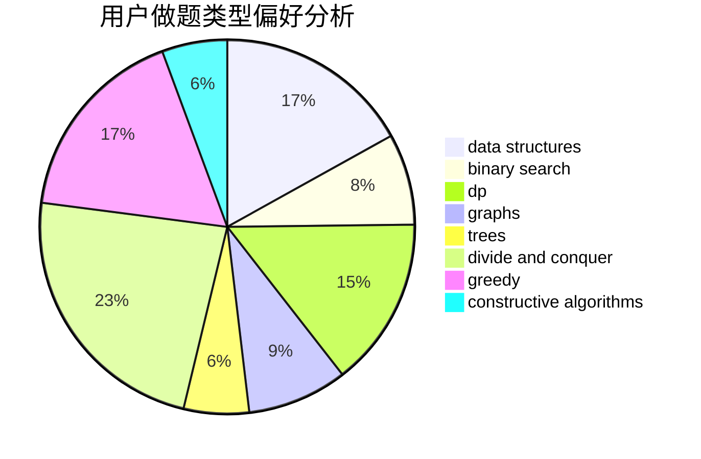

# THE_WEAKEST

<!-- tabs:start -->

#### **用户提交结果分析**

#### **用户做题类型偏好分析**

#### **用户错题知识点分析**

<!-- tabs:end -->
# 推荐题目
[1446E](https://codeforces.com/contest/1446/problem/E)		constructive algorithms,
                        dfs and similar		  
[1459E](https://codeforces.com/contest/1459/problem/E)		dsu,graphs,sortings,trees		  
[1366F](https://codeforces.com/contest/1366/problem/F)		binary search,
                        dp,
                        geometry,
                        graphs		  
[344A](https://codeforces.com/contest/344/problem/A)		implementation		  
[349B](https://codeforces.com/contest/349/problem/B)		data structures,
                        dp,
                        greedy,
                        implementation		  
[900B](https://codeforces.com/contest/900/problem/B)		math,
                        number theory		  
[1328D](https://codeforces.com/contest/1328/problem/D)		constructive algorithms,
                        dp,
                        graphs,
                        greedy,
                        math		  
[1054G](https://codeforces.com/contest/1054/problem/G)		constructive algorithms,
                        greedy,
                        math		  
[983A](https://codeforces.com/contest/983/problem/A)		implementation,
                        math		  
[822A](https://codeforces.com/contest/822/problem/A)		implementation,
                        math,
                        number theory		  
