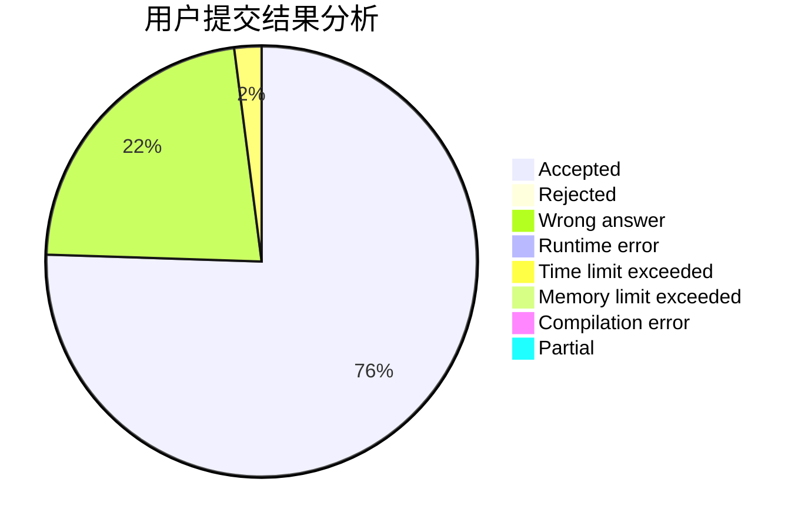
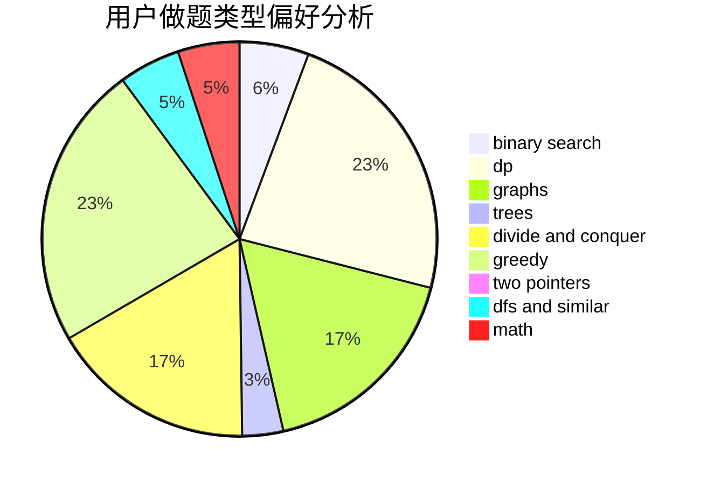

# THE_WEAKEST

<!-- tabs:start -->

#### **用户提交结果分析**

#### **用户做题类型偏好分析**

<!-- tabs:end -->
# 推荐题目
[1446E](https://codeforces.com/contest/1446/problem/E)
[1459E](https://codeforces.com/contest/1459/problem/E)
[1366F](https://codeforces.com/contest/1366/problem/F)
[344A](https://codeforces.com/contest/344/problem/A)
[349B](https://codeforces.com/contest/349/problem/B)
[900B](https://codeforces.com/contest/900/problem/B)
[1328D](https://codeforces.com/contest/1328/problem/D)
[1054G](https://codeforces.com/contest/1054/problem/G)
[983A](https://codeforces.com/contest/983/problem/A)
[822A](https://codeforces.com/contest/822/problem/A)
