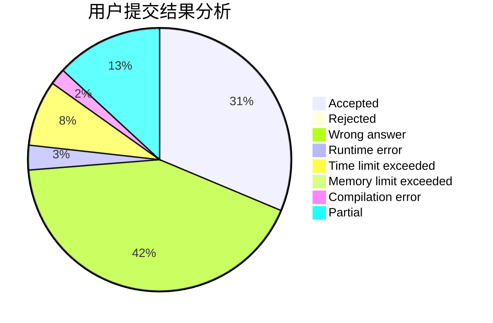
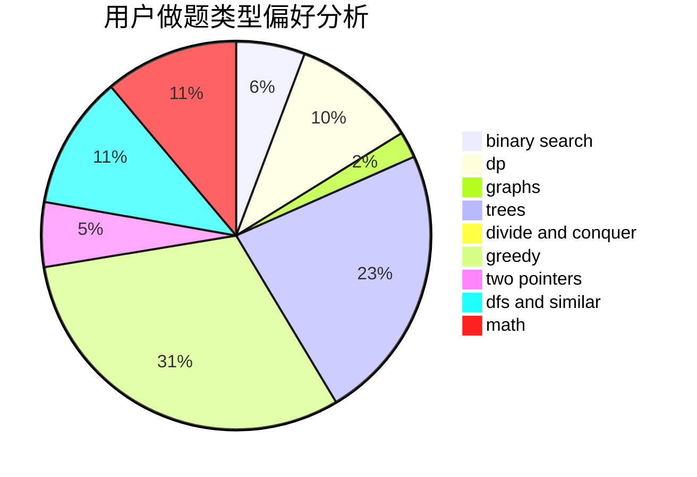

# TLE

<!-- tabs:start -->

#### **用户提交结果分析**

#### **用户做题类型偏好分析**

<!-- tabs:end -->
# 推荐题目
[771C](https://codeforces.com/contest/771/problem/C)
[494E](https://codeforces.com/contest/494/problem/E)
[1271A](https://codeforces.com/contest/1271/problem/A)
[23C](https://codeforces.com/contest/23/problem/C)
[274A](https://codeforces.com/contest/274/problem/A)
[527B](https://codeforces.com/contest/527/problem/B)
[1010F](https://codeforces.com/contest/1010/problem/F)
[598F](https://codeforces.com/contest/598/problem/F)
[956C](https://codeforces.com/contest/956/problem/C)
[431D](https://codeforces.com/contest/431/problem/D)
