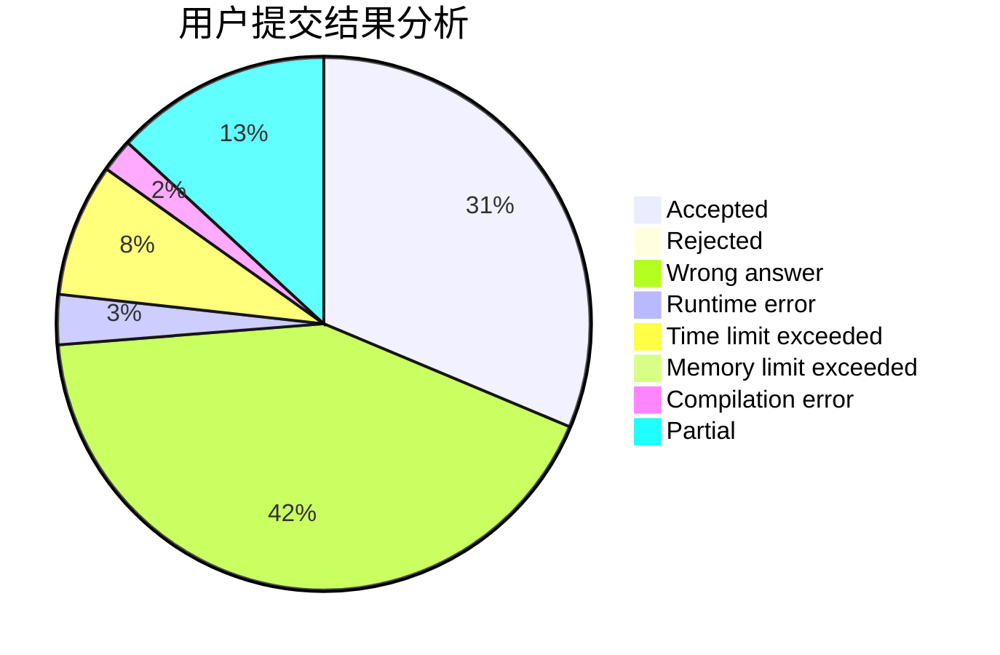
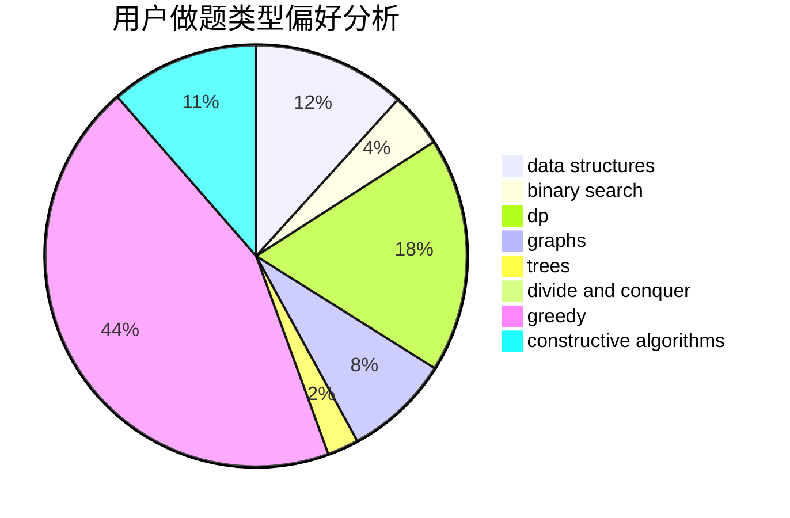
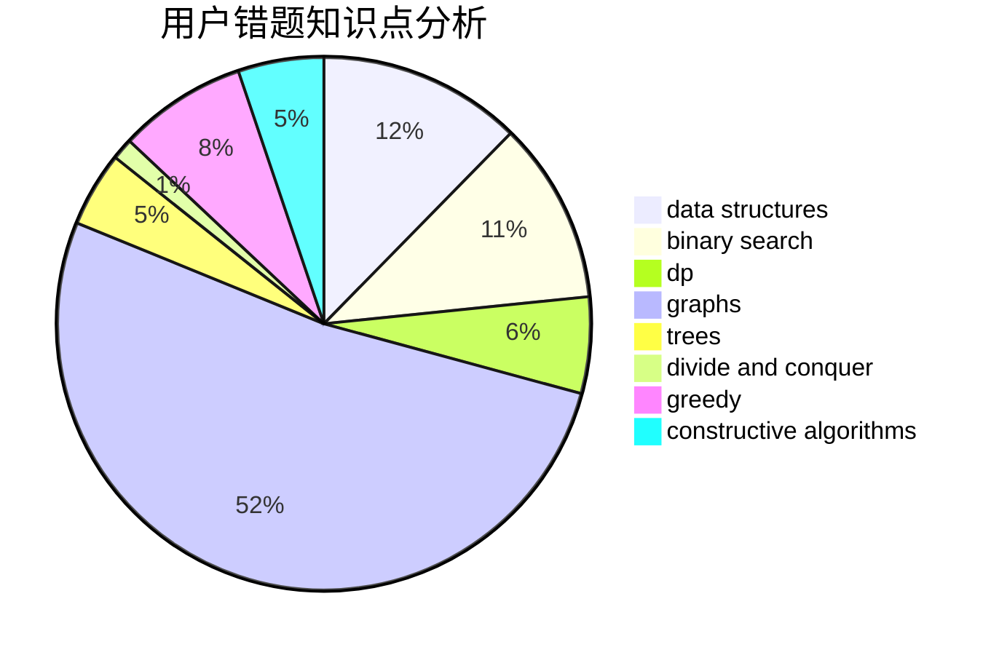

# TLE

<!-- tabs:start -->

#### **用户提交结果分析**

#### **用户做题类型偏好分析**

#### **用户错题知识点分析**

<!-- tabs:end -->
# 推荐题目
[750G](https://codeforces.com/contest/750/problem/G)		bitmasks,
                        brute force,
                        combinatorics,
                        dp		  
[476A](https://codeforces.com/contest/476/problem/A)		implementation,
                        math		  
[1265E](https://codeforces.com/contest/1265/problem/E)		data structures,
                        dp,
                        math,
                        probabilities		  
[220B](https://codeforces.com/contest/220/problem/B)		constructive algorithms,
                        data structures		  
[255D](https://codeforces.com/contest/255/problem/D)		binary search,
                        implementation,
                        math		  
[506E](https://codeforces.com/contest/506/problem/E)		combinatorics,
                        dp,
                        matrices,
                        strings		  
[1010C](https://codeforces.com/contest/1010/problem/C)		number theory		  
[577A](https://codeforces.com/contest/577/problem/A)		implementation,
                        number theory		  
[934D](https://codeforces.com/contest/934/problem/D)		dsu,graphs,sortings,trees		  
[403C](https://codeforces.com/contest/403/problem/C)		dsu,graphs,sortings,trees		  
