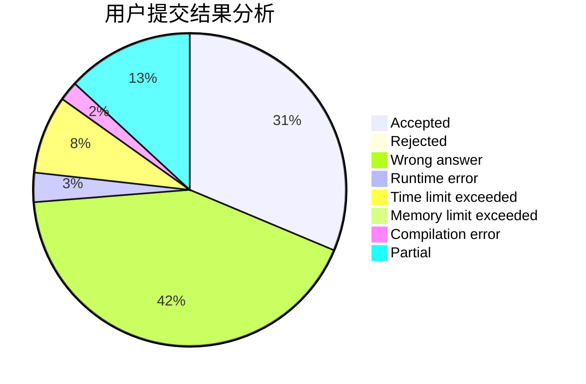
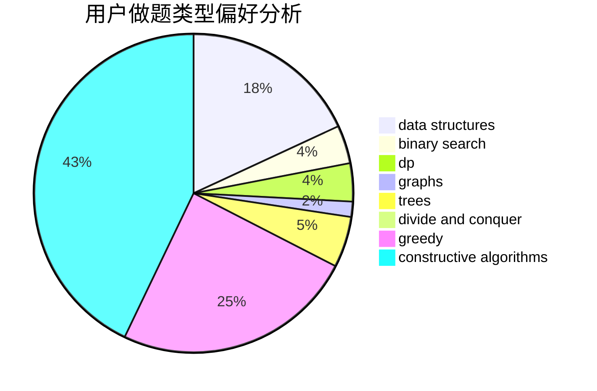
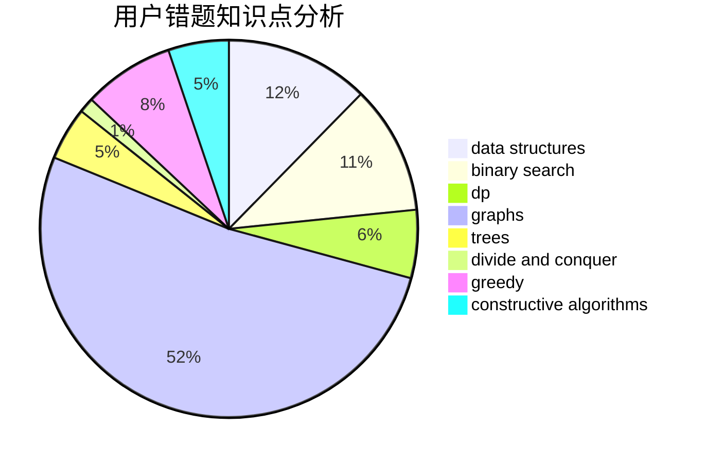

# TLE

<!-- tabs:start -->

#### **用户提交结果分析**

#### **用户做题类型偏好分析**

#### **用户错题知识点分析**

<!-- tabs:end -->
# 推荐题目
[771C](https://codeforces.com/contest/771/problem/C)		dfs and similar,
                        dp,
                        trees		  
[494E](https://codeforces.com/contest/494/problem/E)		data structures,
                        games		  
[1271A](https://codeforces.com/contest/1271/problem/A)		brute force,
                        greedy,
                        math		  
[23C](https://codeforces.com/contest/23/problem/C)		constructive algorithms,
                        sortings		  
[274A](https://codeforces.com/contest/274/problem/A)		binary search,
                        greedy,
                        sortings		  
[527B](https://codeforces.com/contest/527/problem/B)		greedy		  
[1010F](https://codeforces.com/contest/1010/problem/F)		fft,
                        graphs,
                        trees		  
[598F](https://codeforces.com/contest/598/problem/F)		geometry		  
[956C](https://codeforces.com/contest/956/problem/C)		dsu,graphs,sortings,trees		  
[431D](https://codeforces.com/contest/431/problem/D)		binary search,
                        bitmasks,
                        combinatorics,
                        dp,
                        math		  
