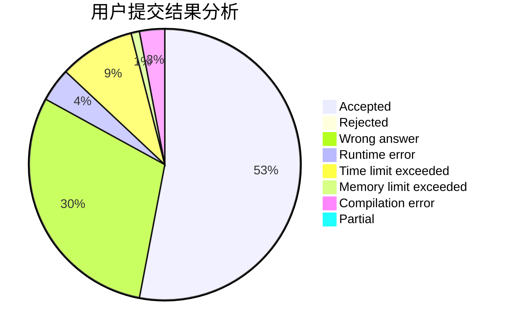
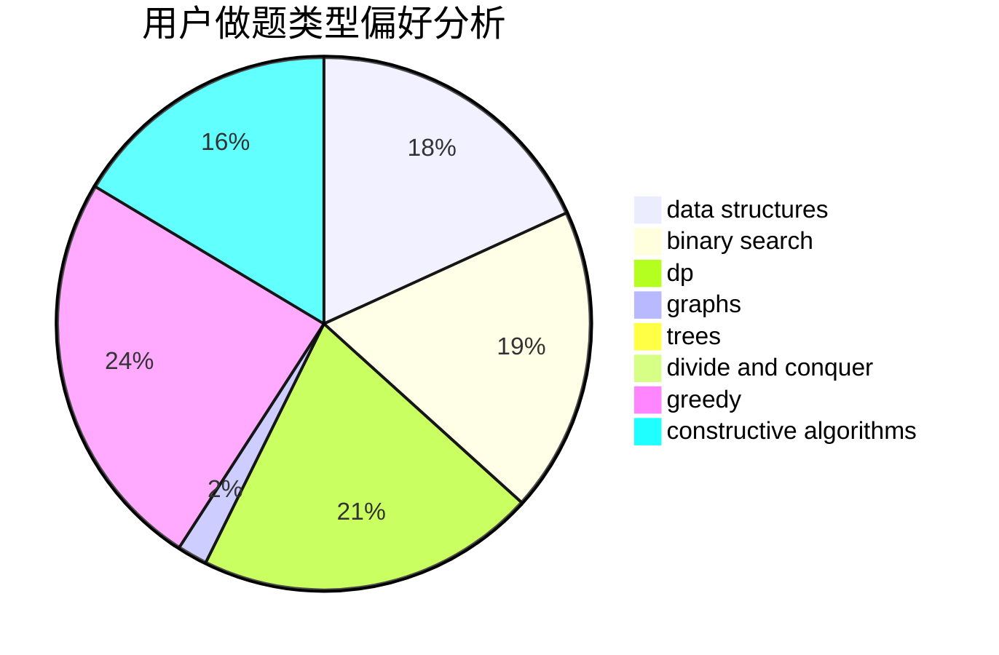
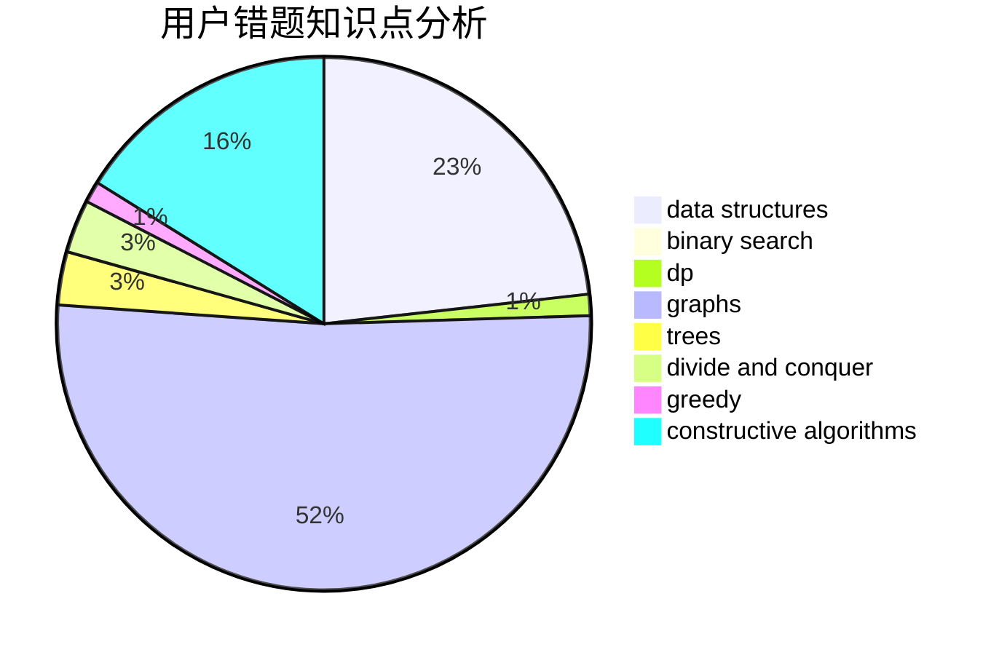

# TLE_Automat
<!-- tabs:start -->
#### **用户提交结果分析**

#### **用户做题类型偏好分析**

#### **用户错题知识点分析**

<!-- tabs:end -->
# 推荐题目
[Spoilt Permutation](http://codeforces.com/problemset/problem/56/B)		implementation		  
[The World Is Just a Programming Task (Hard Version)](https://codeforces.com/contest/1248/problem/D2)		implementation		  
[Wooden Raft](http://codeforces.com/problemset/problem/1223/G)		binary search,
                        math,
                        number theory		  
[Tree and XOR](http://codeforces.com/problemset/problem/1055/F)		strings,
                        trees		  
[Leaders](http://codeforces.com/problemset/problem/97/E)		dfs and similar,
                        dsu,
                        graphs,
                        trees		  
[Vasya and Chess](http://codeforces.com/problemset/problem/493/D)		constructive algorithms,
                        games,
                        math		  
[Duff and Meat](http://codeforces.com/problemset/problem/588/A)		greedy		  
[Geometric Progression](http://codeforces.com/problemset/problem/567/C)		binary search,
                        data structures,
                        dp		  
[Kefa and Dishes](http://codeforces.com/problemset/problem/580/D)		bitmasks,
                        dp		  
[Vova and Trophies](http://codeforces.com/problemset/problem/1082/B)		greedy		  
<!-- tabs:start -->
#### **data structures**
[Spoilt Permutation](http://codeforces.com/problemset/problem/567/C)		binary search,
                        data structures,
                        dp		  
[The World Is Just a Programming Task (Hard Version)](http://codeforces.com/problemset/problem/1313/E)		data structures,
                        hashing,
                        strings,
                        two pointers		  
[Wooden Raft](http://codeforces.com/problemset/problem/1464/F)		data structures,
                        trees		  
[Tree and XOR](http://codeforces.com/problemset/problem/1446/D1)		data structures,
                        greedy		  
[Leaders](http://codeforces.com/problemset/problem/605/D)		data structures,
                        dfs and similar		  
[Vasya and Chess](http://codeforces.com/problemset/problem/519/D)		data structures,
                        dp,
                        two pointers		  
[Duff and Meat](http://codeforces.com/problemset/problem/1474/D)		data structures,
                        dp,
                        greedy,
                        math		  
[Geometric Progression](http://codeforces.com/problemset/problem/1492/C)		binary search,
                        data structures,
                        dp,
                        greedy,
                        two pointers		  
[Kefa and Dishes](http://codeforces.com/problemset/problem/1490/G)		binary search,
                        data structures,
                        math		  
[Vova and Trophies](http://codeforces.com/problemset/problem/1479/D)		binary search,
                        bitmasks,
                        brute force,
                        data structures,
                        probabilities,
                        trees		  
#### **binary search**
[Spoilt Permutation](http://codeforces.com/problemset/problem/1223/G)		binary search,
                        math,
                        number theory		  
[The World Is Just a Programming Task (Hard Version)](http://codeforces.com/problemset/problem/567/C)		binary search,
                        data structures,
                        dp		  
[Wooden Raft](http://codeforces.com/problemset/problem/750/A)		binary search,
                        brute force,
                        implementation,
                        math		  
[Tree and XOR](http://codeforces.com/problemset/problem/1358/F)		binary search,
                        constructive algorithms,
                        greedy,
                        implementation		  
[Leaders](https://codeforces.com/contest/233/problem/C)		binary search,
                        constructive algorithms,
                        graphs,
                        greedy		  
[Vasya and Chess](http://codeforces.com/problemset/problem/1131/C)		binary search,
                        greedy,
                        sortings		  
[Duff and Meat](http://codeforces.com/problemset/problem/1492/C)		binary search,
                        data structures,
                        dp,
                        greedy,
                        two pointers		  
[Geometric Progression](http://codeforces.com/problemset/problem/1463/D)		binary search,
                        constructive algorithms,
                        greedy,
                        two pointers		  
[Kefa and Dishes](http://codeforces.com/problemset/problem/1490/G)		binary search,
                        data structures,
                        math		  
[Vova and Trophies](http://codeforces.com/problemset/problem/1479/D)		binary search,
                        bitmasks,
                        brute force,
                        data structures,
                        probabilities,
                        trees		  
#### **dp**
[Spoilt Permutation](http://codeforces.com/problemset/problem/567/C)		binary search,
                        data structures,
                        dp		  
[The World Is Just a Programming Task (Hard Version)](http://codeforces.com/problemset/problem/580/D)		bitmasks,
                        dp		  
[Wooden Raft](http://codeforces.com/problemset/problem/514/E)		dp,
                        matrices		  
[Tree and XOR](http://codeforces.com/problemset/problem/1512/F)		brute force,
                        dp,
                        greedy,
                        implementation		  
[Leaders](http://codeforces.com/problemset/problem/519/D)		data structures,
                        dp,
                        two pointers		  
[Vasya and Chess](http://codeforces.com/problemset/problem/1286/A)		dp,
                        greedy,
                        sortings		  
[Duff and Meat](http://codeforces.com/problemset/problem/1140/D)		dp,
                        greedy,
                        math		  
[Geometric Progression](http://codeforces.com/problemset/problem/1278/F)		combinatorics,
                        dp,
                        math,
                        number theory,
                        probabilities		  
[Kefa and Dishes](http://codeforces.com/problemset/problem/1326/F1)		bitmasks,
                        brute force,
                        dp,
                        meet-in-the-middle		  
[Vova and Trophies](https://codeforces.com/contest/1456/problem/D)		dp		  
#### **graph**
[Spoilt Permutation](http://codeforces.com/problemset/problem/97/E)		dfs and similar,
                        dsu,
                        graphs,
                        trees		  
[The World Is Just a Programming Task (Hard Version)](http://codeforces.com/problemset/problem/916/C)		constructive algorithms,
                        graphs,
                        shortest paths		  
[Wooden Raft](https://codeforces.com/contest/233/problem/C)		binary search,
                        constructive algorithms,
                        graphs,
                        greedy		  
[Tree and XOR](http://codeforces.com/problemset/problem/1487/C)		brute force,
                        constructive algorithms,
                        dfs and similar,
                        graphs,
                        greedy,
                        implementation,
                        math		  
[Leaders](http://codeforces.com/problemset/problem/1437/C)		dp,
                        flows,
                        graph matchings,
                        greedy,
                        math,
                        sortings		  
[Vasya and Chess](http://codeforces.com/problemset/problem/1470/D)		constructive algorithms,
                        dfs and similar,
                        graph matchings,
                        graphs,
                        greedy		  
[Duff and Meat](http://codeforces.com/problemset/problem/1476/C)		dp,
                        graphs,
                        greedy		  
[Geometric Progression](http://codeforces.com/problemset/problem/1304/D)		constructive algorithms,
                        graphs,
                        greedy,
                        two pointers		  
[Kefa and Dishes](http://codeforces.com/problemset/problem/1475/C)		combinatorics,
                        graphs,
                        math		  
[Vova and Trophies](http://codeforces.com/problemset/problem/553/E)		dp,
                        fft,
                        graphs,
                        math,
                        probabilities		  
#### **trees**
[Spoilt Permutation](http://codeforces.com/problemset/problem/1055/F)		strings,
                        trees		  
[The World Is Just a Programming Task (Hard Version)](http://codeforces.com/problemset/problem/97/E)		dfs and similar,
                        dsu,
                        graphs,
                        trees		  
[Wooden Raft](http://codeforces.com/problemset/problem/1464/F)		data structures,
                        trees		  
[Tree and XOR](http://codeforces.com/problemset/problem/1479/D)		binary search,
                        bitmasks,
                        brute force,
                        data structures,
                        probabilities,
                        trees		  
[Leaders](http://codeforces.com/problemset/problem/1511/C)		brute force,
                        data structures,
                        implementation,
                        trees		  
[Vasya and Chess](http://codeforces.com/problemset/problem/1499/F)		combinatorics,
                        dfs and similar,
                        dp,
                        trees		  
[Duff and Meat](http://codeforces.com/problemset/problem/1491/E)		brute force,
                        dfs and similar,
                        divide and conquer,
                        number theory,
                        trees		  
[Geometric Progression](http://codeforces.com/problemset/problem/1466/D)		data structures,
                        greedy,
                        sortings,
                        trees		  
[Kefa and Dishes](http://codeforces.com/problemset/problem/1495/D)		combinatorics,
                        dfs and similar,
                        graphs,
                        math,
                        shortest paths,
                        trees		  
[Vova and Trophies](http://codeforces.com/problemset/problem/1303/G)		data structures,
                        divide and conquer,
                        geometry,
                        trees		  
#### **divide and conquer**
[Spoilt Permutation](http://codeforces.com/problemset/problem/1461/D)		binary search,
                        brute force,
                        data structures,
                        divide and conquer,
                        implementation,
                        sortings		  
[The World Is Just a Programming Task (Hard Version)](http://codeforces.com/problemset/problem/1466/G)		combinatorics,
                        divide and conquer,
                        hashing,
                        math,
                        string suffix structures,
                        strings		  
[Wooden Raft](http://codeforces.com/problemset/problem/1490/D)		dfs and similar,
                        divide and conquer,
                        implementation		  
[Tree and XOR](https://codeforces.com/contest/1483/problem/C)		data structures,
                        divide and conquer,
                        dp		  
[Leaders](http://codeforces.com/problemset/problem/1491/E)		brute force,
                        dfs and similar,
                        divide and conquer,
                        number theory,
                        trees		  
[Vasya and Chess](http://codeforces.com/problemset/problem/1303/G)		data structures,
                        divide and conquer,
                        geometry,
                        trees		  
[Duff and Meat](http://codeforces.com/problemset/problem/1494/D)		constructive algorithms,
                        data structures,
                        dfs and similar,
                        divide and conquer,
                        dsu,
                        greedy,
                        sortings,
                        trees		  
[Geometric Progression](http://codeforces.com/problemset/problem/1482/E)		data structures,
                        divide and conquer,
                        dp		  
[Kefa and Dishes](http://codeforces.com/problemset/problem/566/C)		dfs and similar,
                        divide and conquer,
                        trees		  
[Vova and Trophies](http://codeforces.com/problemset/problem/1428/F)		binary search,
                        data structures,
                        divide and conquer,
                        dp,
                        two pointers		  
#### **greedy**
[Spoilt Permutation](http://codeforces.com/problemset/problem/588/A)		greedy		  
[The World Is Just a Programming Task (Hard Version)](http://codeforces.com/problemset/problem/1082/B)		greedy		  
[Wooden Raft](http://codeforces.com/problemset/problem/1370/A)		greedy,
                        implementation,
                        math,
                        number theory		  
[Tree and XOR](http://codeforces.com/problemset/problem/1217/B)		greedy,
                        math		  
[Leaders](http://codeforces.com/problemset/problem/931/A)		brute force,
                        greedy,
                        implementation,
                        math		  
[Vasya and Chess](http://codeforces.com/problemset/problem/1358/F)		binary search,
                        constructive algorithms,
                        greedy,
                        implementation		  
[Duff and Meat](http://codeforces.com/problemset/problem/254/C)		greedy,
                        strings		  
[Geometric Progression](http://codeforces.com/problemset/problem/67/B)		greedy		  
[Kefa and Dishes](http://codeforces.com/problemset/problem/1512/F)		brute force,
                        dp,
                        greedy,
                        implementation		  
[Vova and Trophies](https://codeforces.com/contest/233/problem/C)		binary search,
                        constructive algorithms,
                        graphs,
                        greedy		  
#### **constructive algorithms**
[Spoilt Permutation](http://codeforces.com/problemset/problem/493/D)		constructive algorithms,
                        games,
                        math		  
[The World Is Just a Programming Task (Hard Version)](http://codeforces.com/problemset/problem/916/C)		constructive algorithms,
                        graphs,
                        shortest paths		  
[Wooden Raft](http://codeforces.com/problemset/problem/1358/F)		binary search,
                        constructive algorithms,
                        greedy,
                        implementation		  
[Tree and XOR](https://codeforces.com/contest/233/problem/C)		binary search,
                        constructive algorithms,
                        graphs,
                        greedy		  
[Leaders](http://codeforces.com/problemset/problem/1500/C)		bitmasks,
                        brute force,
                        constructive algorithms,
                        greedy,
                        two pointers		  
[Vasya and Chess](http://codeforces.com/problemset/problem/1493/A)		constructive algorithms,
                        greedy		  
[Duff and Meat](http://codeforces.com/problemset/problem/1463/D)		binary search,
                        constructive algorithms,
                        greedy,
                        two pointers		  
[Geometric Progression](https://codeforces.com/contest/1456/problem/B)		bitmasks,
                        brute force,
                        constructive algorithms		  
[Kefa and Dishes](http://codeforces.com/problemset/problem/1492/D)		bitmasks,
                        constructive algorithms,
                        greedy,
                        math		  
[Vova and Trophies](https://codeforces.com/contest/1504/problem/D)		constructive algorithms,
                        games,
                        interactive		  
#### **sortings**
[Spoilt Permutation](http://codeforces.com/problemset/problem/1107/C)		greedy,
                        sortings,
                        two pointers		  
[The World Is Just a Programming Task (Hard Version)](http://codeforces.com/problemset/problem/1148/D)		greedy,
                        sortings		  
[Wooden Raft](http://codeforces.com/problemset/problem/1286/A)		dp,
                        greedy,
                        sortings		  
[Tree and XOR](http://codeforces.com/problemset/problem/1131/C)		binary search,
                        greedy,
                        sortings		  
[Leaders](https://codeforces.com/contest/1496/problem/C)		geometry,
                        greedy,
                        math,
                        sortings		  
[Vasya and Chess](http://codeforces.com/problemset/problem/1495/A)		geometry,
                        greedy,
                        math,
                        sortings		  
[Duff and Meat](http://codeforces.com/problemset/problem/1497/A)		brute force,
                        data structures,
                        greedy,
                        sortings		  
[Geometric Progression](http://codeforces.com/problemset/problem/1427/A)		math,
                        sortings		  
[Kefa and Dishes](http://codeforces.com/problemset/problem/1461/D)		binary search,
                        brute force,
                        data structures,
                        divide and conquer,
                        implementation,
                        sortings		  
[Vova and Trophies](http://codeforces.com/problemset/problem/1437/C)		dp,
                        flows,
                        graph matchings,
                        greedy,
                        math,
                        sortings		  
<!-- tabs:end -->
