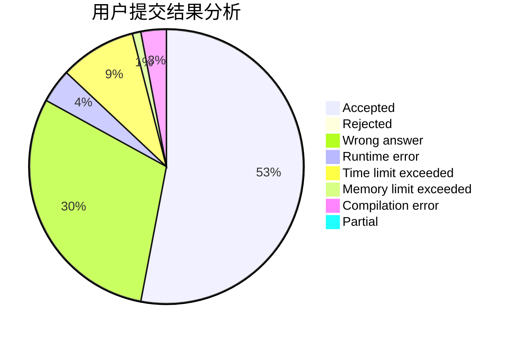
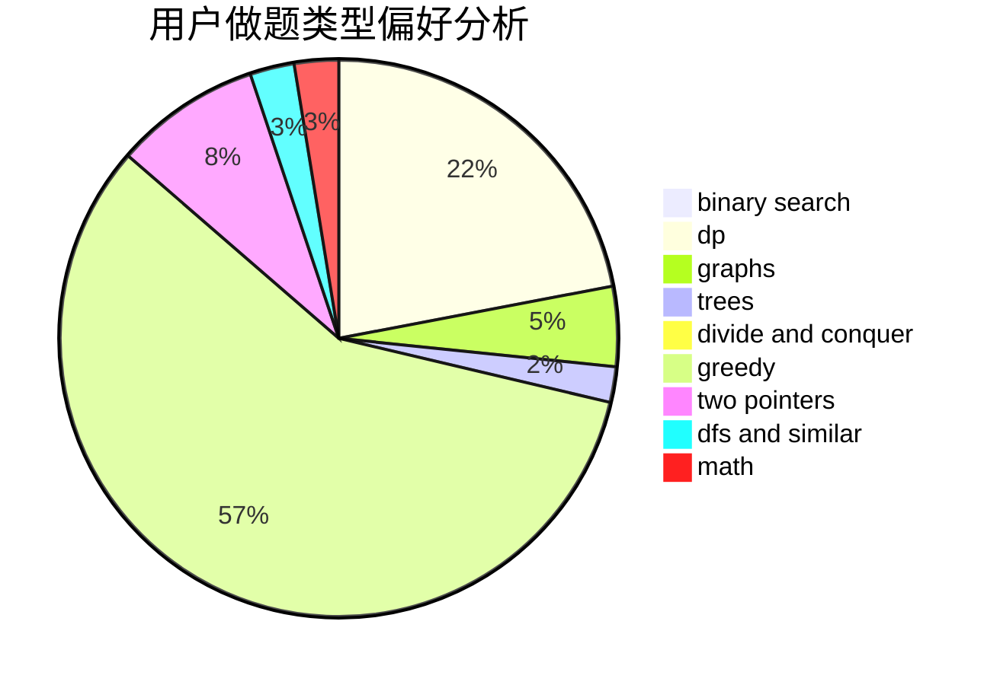

# TLE_Automat

<!-- tabs:start -->

#### **用户提交结果分析**

#### **用户做题类型偏好分析**

<!-- tabs:end -->
# 推荐题目
[1285A](https://codeforces.com/contest/1285/problem/A)
[58E](https://codeforces.com/contest/58/problem/E)
[936D](https://codeforces.com/contest/936/problem/D)
[703E](https://codeforces.com/contest/703/problem/E)
[13671](https://codeforces.com/contest/1367/problem/1)
[1230F](https://codeforces.com/contest/1230/problem/F)
[513A](https://codeforces.com/contest/513/problem/A)
[540C](https://codeforces.com/contest/540/problem/C)
[1056C](https://codeforces.com/contest/1056/problem/C)
[13783](https://codeforces.com/contest/1378/problem/3)
