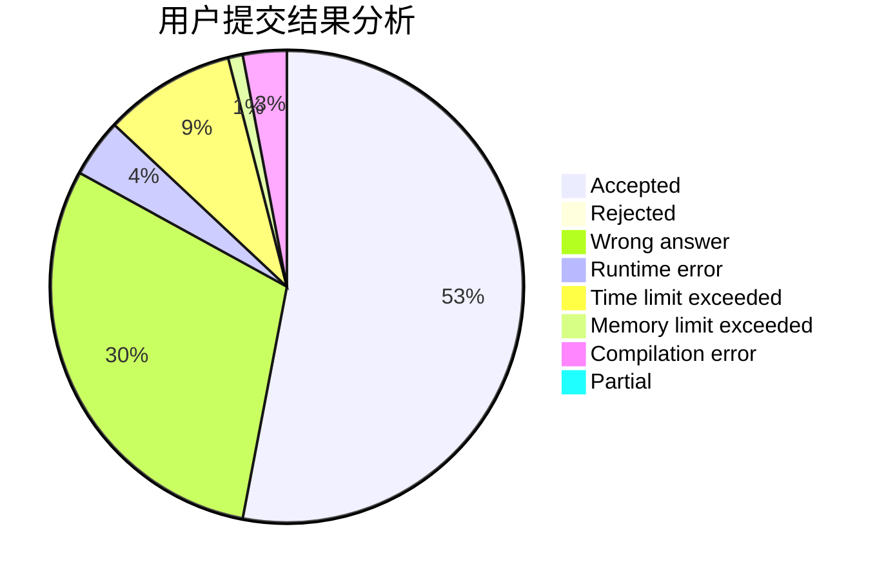
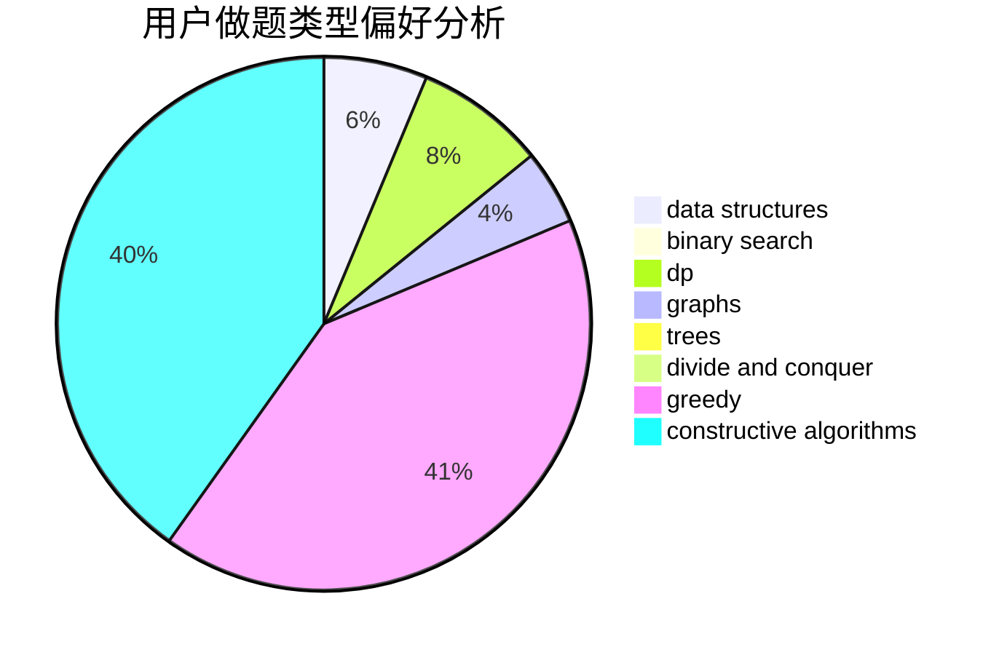
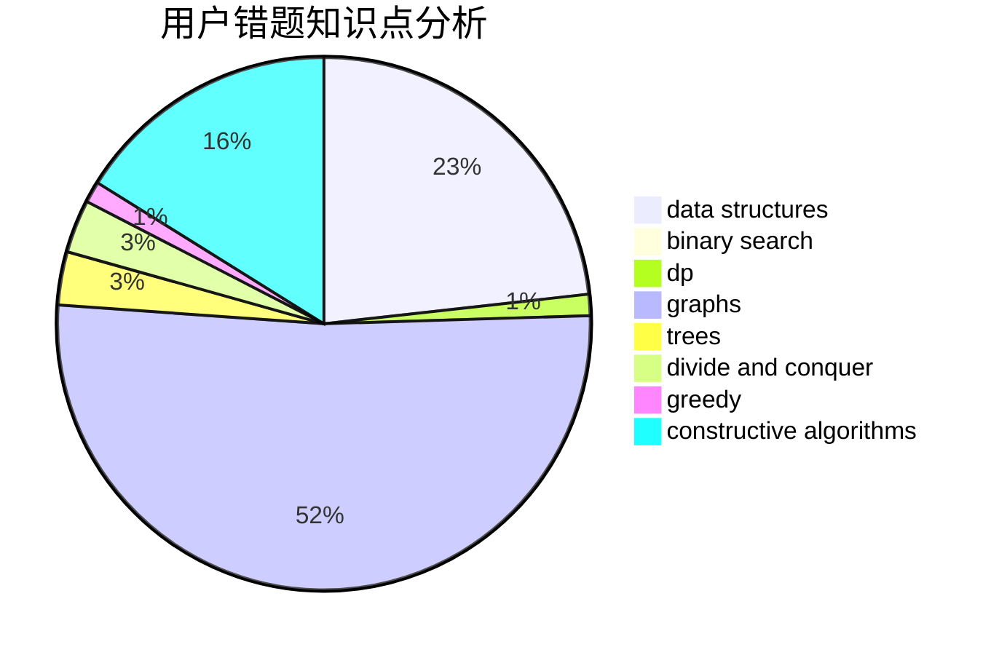

# TLE_Automat

<!-- tabs:start -->

#### **用户提交结果分析**

#### **用户做题类型偏好分析**

#### **用户错题知识点分析**

<!-- tabs:end -->
# 推荐题目
[1285A](https://codeforces.com/contest/1285/problem/A)		math		  
[58E](https://codeforces.com/contest/58/problem/E)		dp		  
[936D](https://codeforces.com/contest/936/problem/D)		dp,
                        greedy		  
[703E](https://codeforces.com/contest/703/problem/E)		dp,
                        number theory		  
[13671](https://codeforces.com/contest/1367/problem/1)		dsu,graphs,sortings,trees		  
[1230F](https://codeforces.com/contest/1230/problem/F)		dsu,graphs,sortings,trees		  
[513A](https://codeforces.com/contest/513/problem/A)		constructive algorithms,
                        math		  
[540C](https://codeforces.com/contest/540/problem/C)		dfs and similar		  
[1056C](https://codeforces.com/contest/1056/problem/C)		greedy,
                        implementation,
                        interactive,
                        sortings		  
[13783](https://codeforces.com/contest/1378/problem/3)		dsu,graphs,sortings,trees		  
