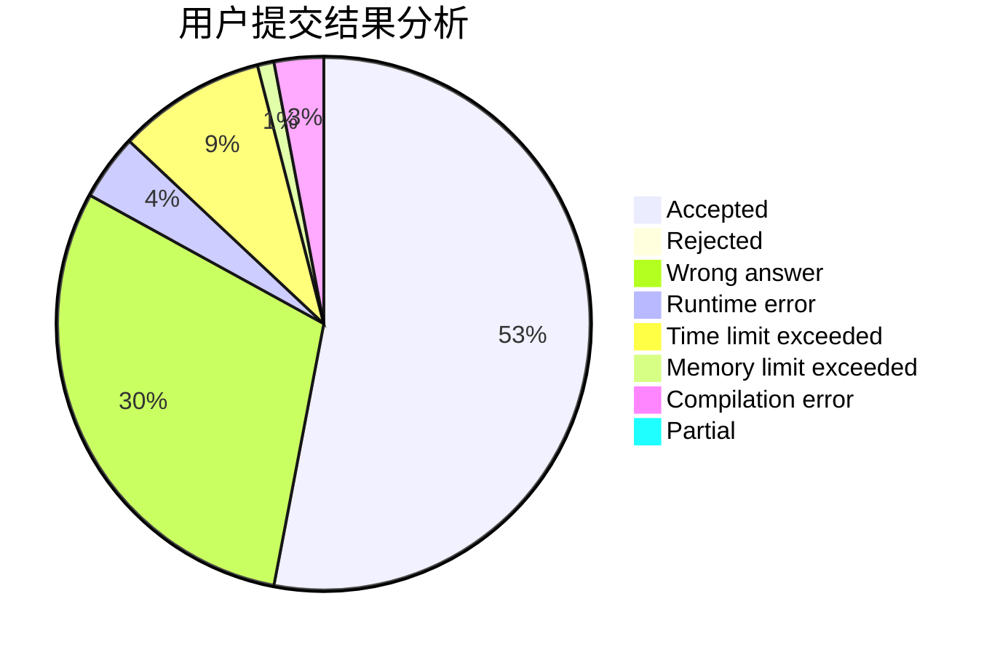
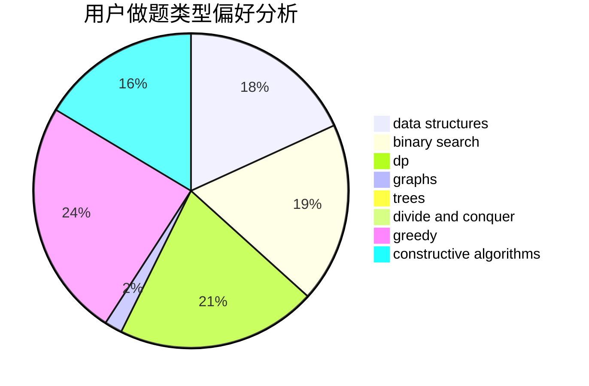
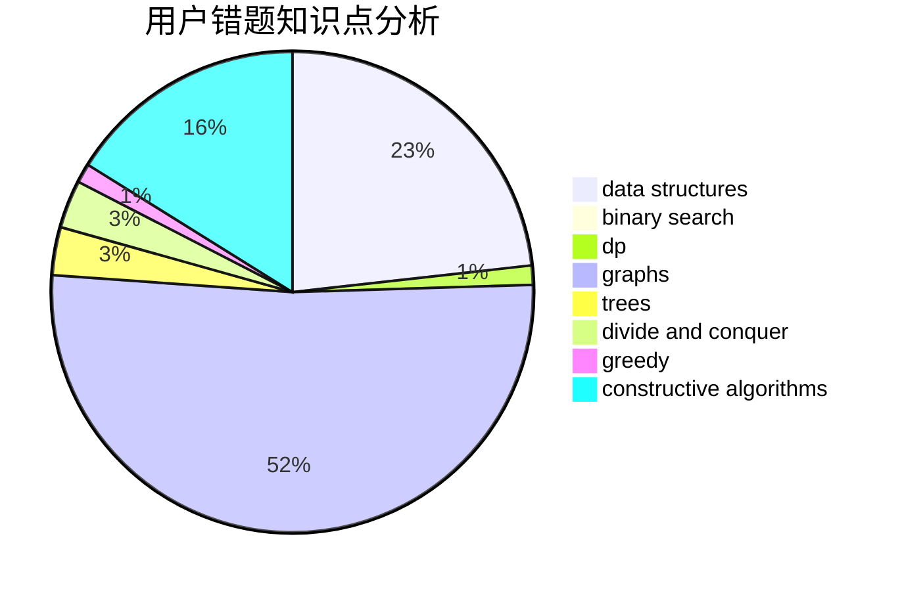

# TLE_Automat

<!-- tabs:start -->

#### **用户提交结果分析**

#### **用户做题类型偏好分析**

#### **用户错题知识点分析**

<!-- tabs:end -->
# 推荐题目
[1278F](https://codeforces.com/contest/1278/problem/F)		combinatorics,
                        dp,
                        math,
                        number theory,
                        probabilities		  
[56B](https://codeforces.com/contest/56/problem/B)		implementation		  
[916C](https://codeforces.com/contest/916/problem/C)		constructive algorithms,
                        graphs,
                        shortest paths		  
[67B](https://codeforces.com/contest/67/problem/B)		greedy		  
[1358F](https://codeforces.com/contest/1358/problem/F)		binary search,
                        constructive algorithms,
                        greedy,
                        implementation		  
[1223G](https://codeforces.com/contest/1223/problem/G)		binary search,
                        math,
                        number theory		  
[493D](https://codeforces.com/contest/493/problem/D)		constructive algorithms,
                        games,
                        math		  
[514E](https://codeforces.com/contest/514/problem/E)		dp,
                        matrices		  
[1055F](https://codeforces.com/contest/1055/problem/F)		strings,
                        trees		  
[1370A](https://codeforces.com/contest/1370/problem/A)		greedy,
                        implementation,
                        math,
                        number theory		  
