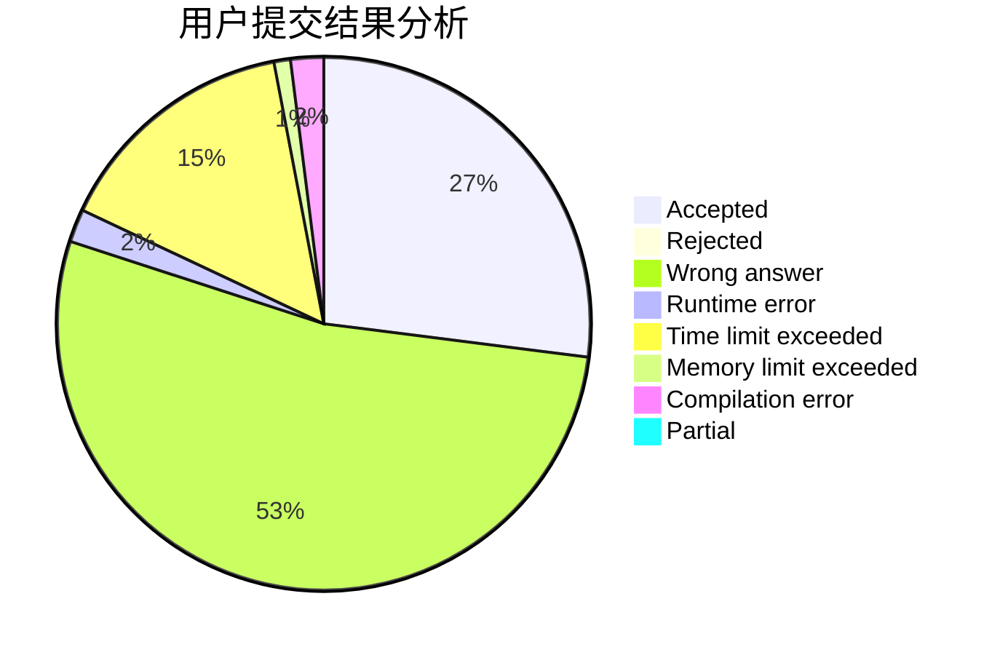
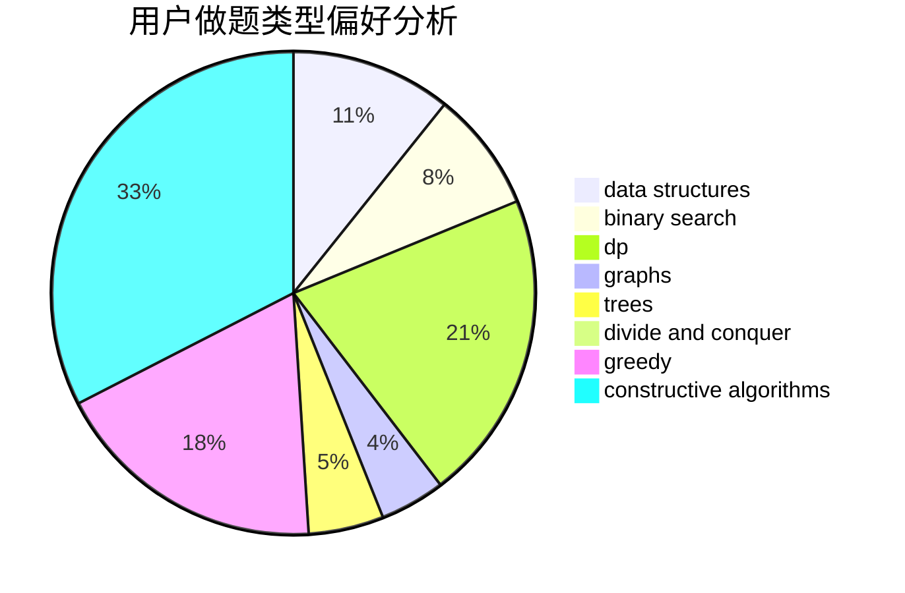
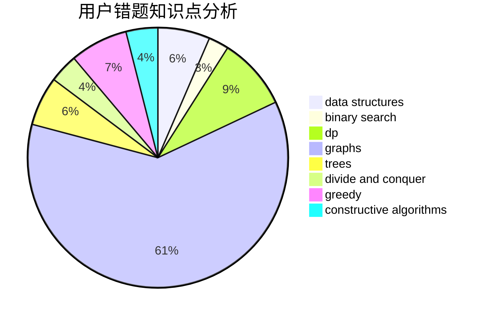

# TQX

<!-- tabs:start -->

#### **用户提交结果分析**

#### **用户做题类型偏好分析**

#### **用户错题知识点分析**

<!-- tabs:end -->
# 推荐题目
[627E](https://codeforces.com/contest/627/problem/E)		two pointers		  
[1322C](https://codeforces.com/contest/1322/problem/C)		graphs,
                        hashing,
                        math,
                        number theory		  
[1029C](https://codeforces.com/contest/1029/problem/C)		greedy,
                        math,
                        sortings		  
[1203A](https://codeforces.com/contest/1203/problem/A)		implementation		  
[1250B](https://codeforces.com/contest/1250/problem/B)		brute force,
                        constructive algorithms,
                        greedy,
                        math		  
[1217E](https://codeforces.com/contest/1217/problem/E)		data structures,
                        greedy,
                        implementation,
                        math		  
[748C](https://codeforces.com/contest/748/problem/C)		constructive algorithms,
                        math		  
[376B](https://codeforces.com/contest/376/problem/B)		implementation		  
[122B](https://codeforces.com/contest/122/problem/B)		brute force,
                        implementation		  
[852D](https://codeforces.com/contest/852/problem/D)		binary search,
                        flows,
                        graph matchings,
                        shortest paths		  
