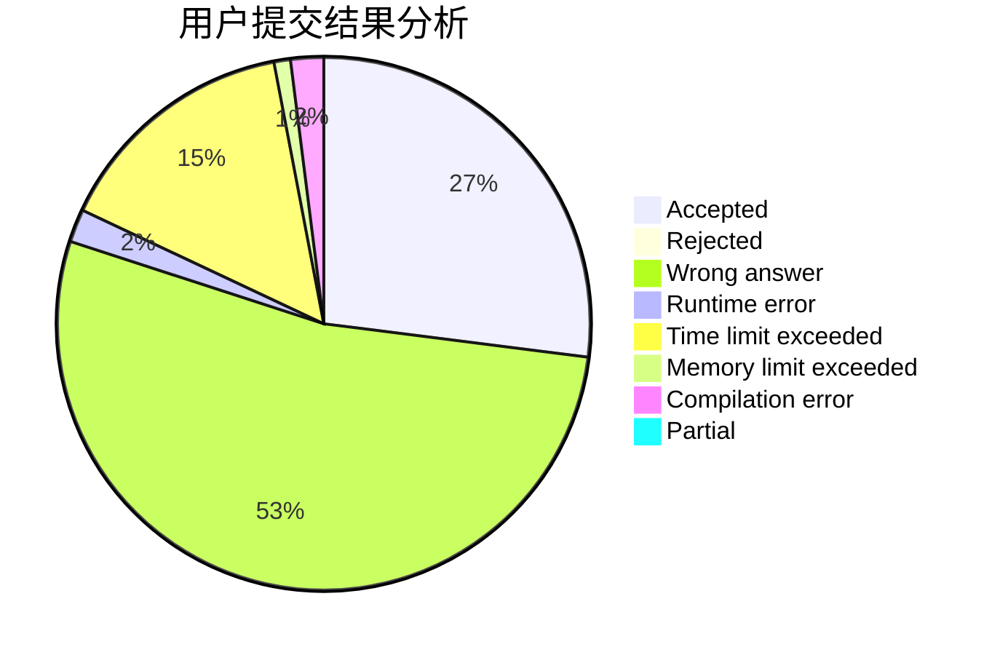
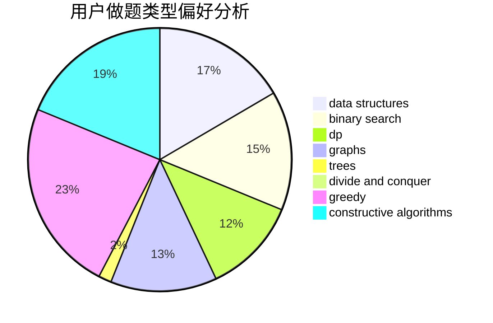
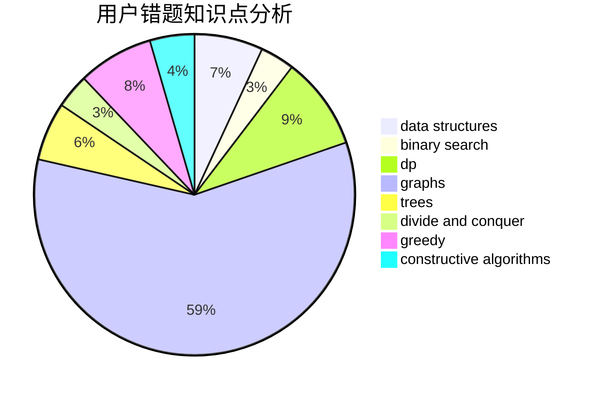

# TQX

<!-- tabs:start -->

#### **用户提交结果分析**

#### **用户做题类型偏好分析**

#### **用户错题知识点分析**

<!-- tabs:end -->
# 推荐题目
[608D](https://codeforces.com/contest/608/problem/D)		dsu,graphs,sortings,trees		  
[1312G](https://codeforces.com/contest/1312/problem/G)		data structures,
                        dfs and similar,
                        dp		  
[1028H](https://codeforces.com/contest/1028/problem/H)		math		  
[1199E](https://codeforces.com/contest/1199/problem/E)		dsu,graphs,sortings,trees		  
[1244G](https://codeforces.com/contest/1244/problem/G)		constructive algorithms,
                        greedy,
                        math		  
[1213C](https://codeforces.com/contest/1213/problem/C)		math		  
[730H](https://codeforces.com/contest/730/problem/H)		constructive algorithms,
                        implementation		  
[34A](https://codeforces.com/contest/34/problem/A)		implementation		  
[1221F](https://codeforces.com/contest/1221/problem/F)		binary search,
                        data structures,
                        sortings		  
[834C](https://codeforces.com/contest/834/problem/C)		dsu,graphs,sortings,trees		  
