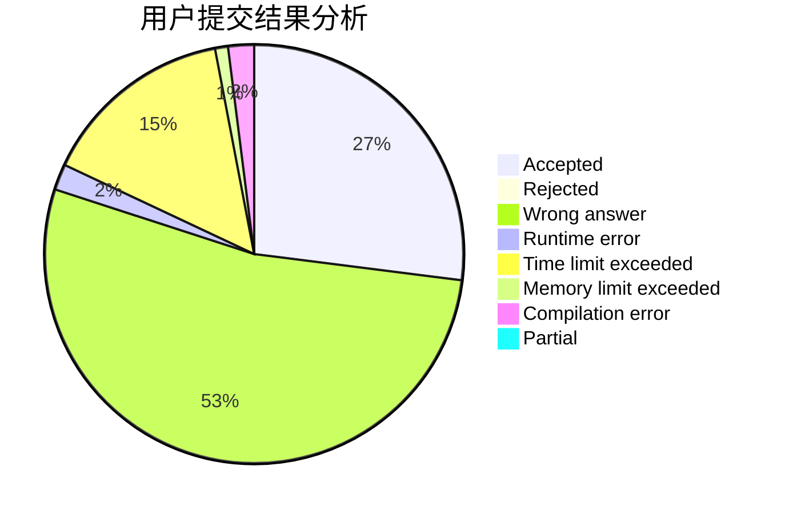
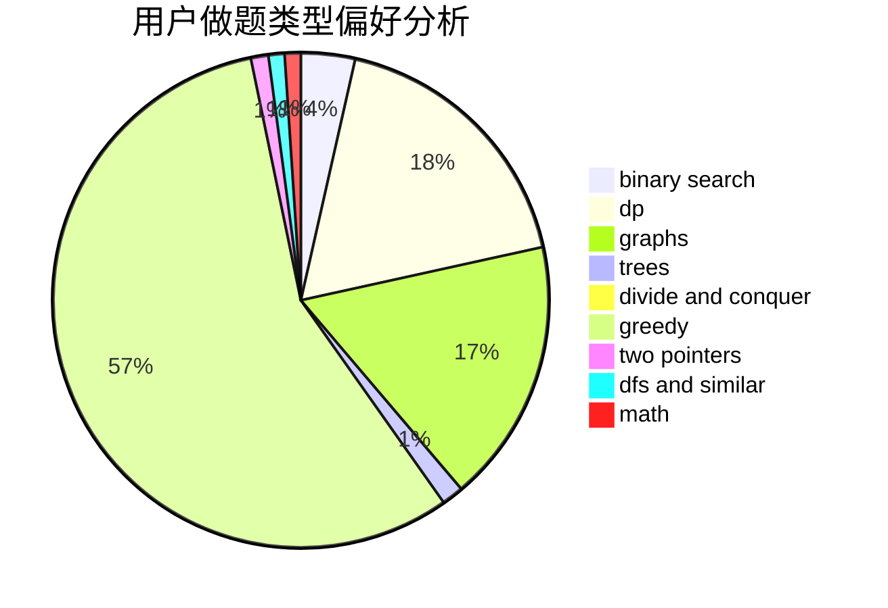

# TQX

<!-- tabs:start -->

#### **用户提交结果分析**

#### **用户做题类型偏好分析**

<!-- tabs:end -->
# 推荐题目
[627E](https://codeforces.com/contest/627/problem/E)
[1322C](https://codeforces.com/contest/1322/problem/C)
[1029C](https://codeforces.com/contest/1029/problem/C)
[1203A](https://codeforces.com/contest/1203/problem/A)
[1250B](https://codeforces.com/contest/1250/problem/B)
[1217E](https://codeforces.com/contest/1217/problem/E)
[748C](https://codeforces.com/contest/748/problem/C)
[376B](https://codeforces.com/contest/376/problem/B)
[122B](https://codeforces.com/contest/122/problem/B)
[852D](https://codeforces.com/contest/852/problem/D)
