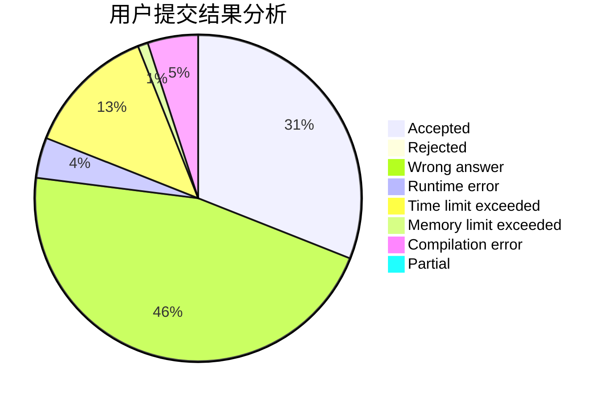
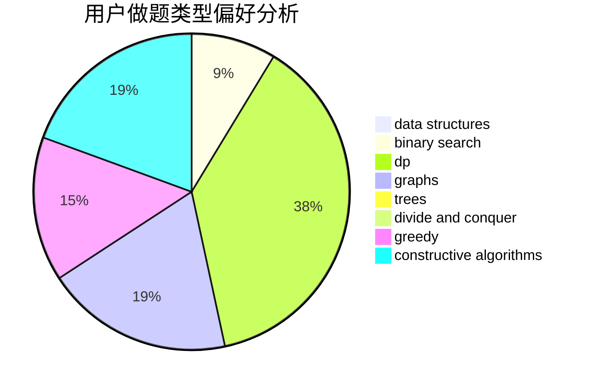
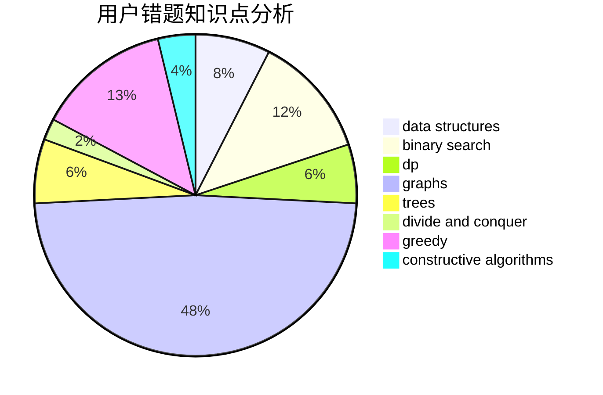

# TYGL

<!-- tabs:start -->

#### **用户提交结果分析**

#### **用户做题类型偏好分析**

#### **用户错题知识点分析**

<!-- tabs:end -->
# 推荐题目
[1266F](https://codeforces.com/contest/1266/problem/F)		dfs and similar,
                        graphs		  
[1164P](https://codeforces.com/contest/1164/problem/P)		dsu,graphs,sortings,trees		  
[1364A](https://codeforces.com/contest/1364/problem/A)		brute force,
                        data structures,
                        number theory,
                        two pointers		  
[816B](https://codeforces.com/contest/816/problem/B)		binary search,
                        data structures,
                        implementation		  
[923E](https://codeforces.com/contest/923/problem/E)		fft,
                        math,
                        matrices		  
[84A](https://codeforces.com/contest/84/problem/A)		math,
                        number theory		  
[1221G](https://codeforces.com/contest/1221/problem/G)		bitmasks,
                        brute force,
                        combinatorics,
                        dp,
                        meet-in-the-middle		  
[1077C](https://codeforces.com/contest/1077/problem/C)		nan		  
[1512F](https://codeforces.com/contest/1512/problem/F)		brute force,
                        dp,
                        greedy,
                        implementation		  
[770B](https://codeforces.com/contest/770/problem/B)		*special problem,
                        implementation,
                        math		  
