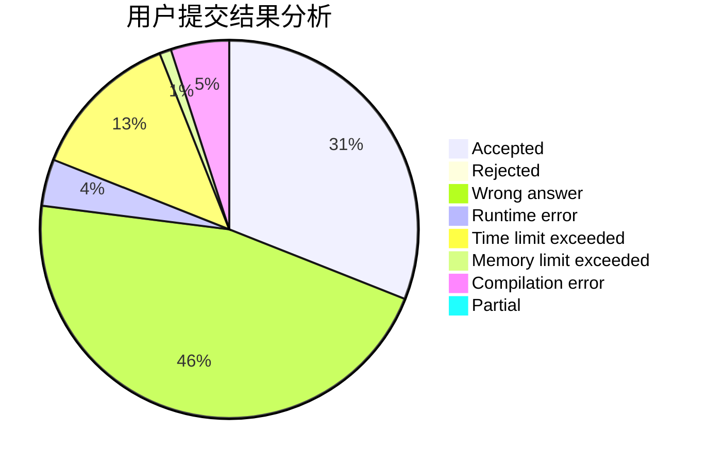
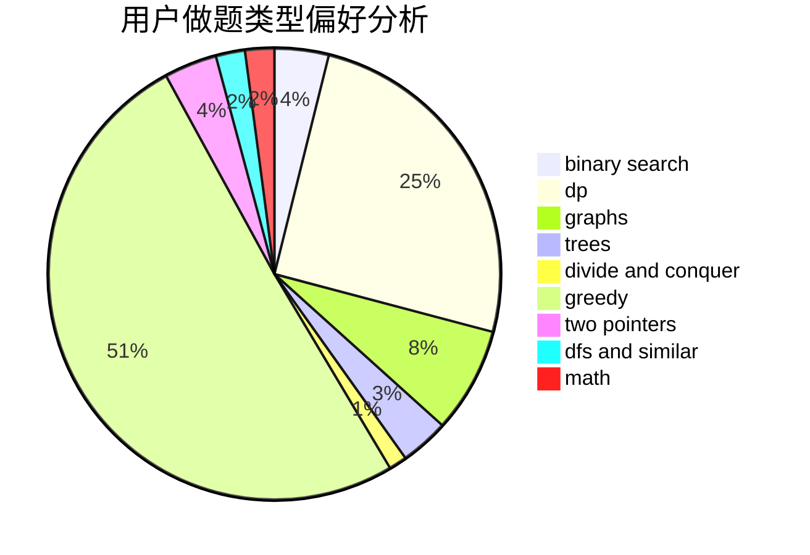

# TYGL

<!-- tabs:start -->

#### **用户提交结果分析**

#### **用户做题类型偏好分析**

<!-- tabs:end -->
# 推荐题目
[1272A](https://codeforces.com/contest/1272/problem/A)
[1166F](https://codeforces.com/contest/1166/problem/F)
[13711](https://codeforces.com/contest/1371/problem/1)
[835C](https://codeforces.com/contest/835/problem/C)
[947C](https://codeforces.com/contest/947/problem/C)
[868E](https://codeforces.com/contest/868/problem/E)
[122C](https://codeforces.com/contest/122/problem/C)
[1077D](https://codeforces.com/contest/1077/problem/D)
[171F](https://codeforces.com/contest/171/problem/F)
[790A](https://codeforces.com/contest/790/problem/A)
