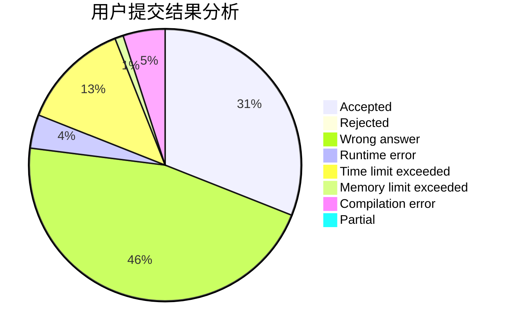
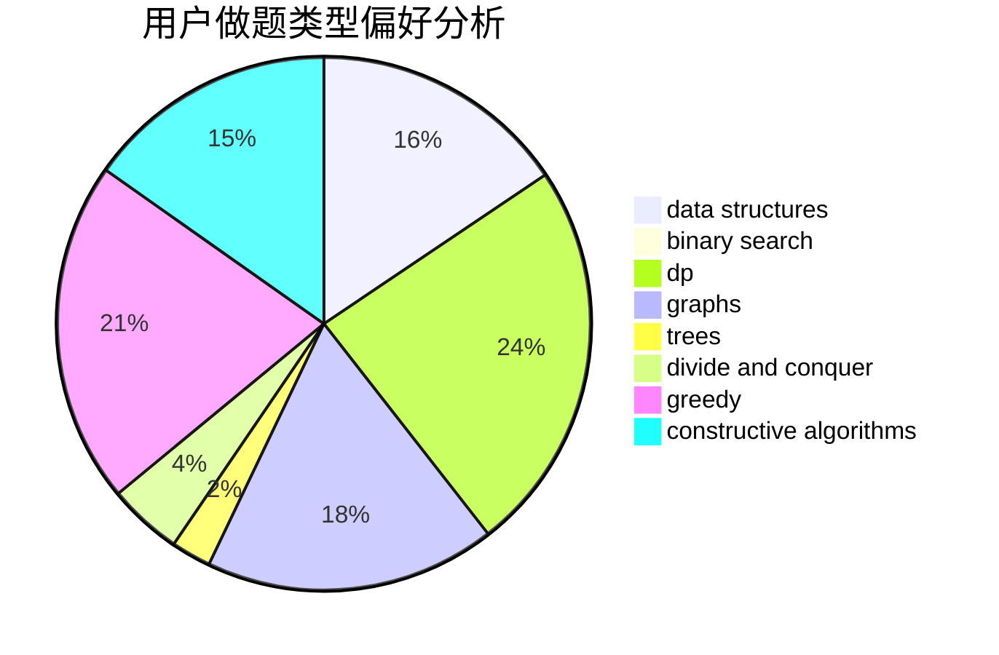
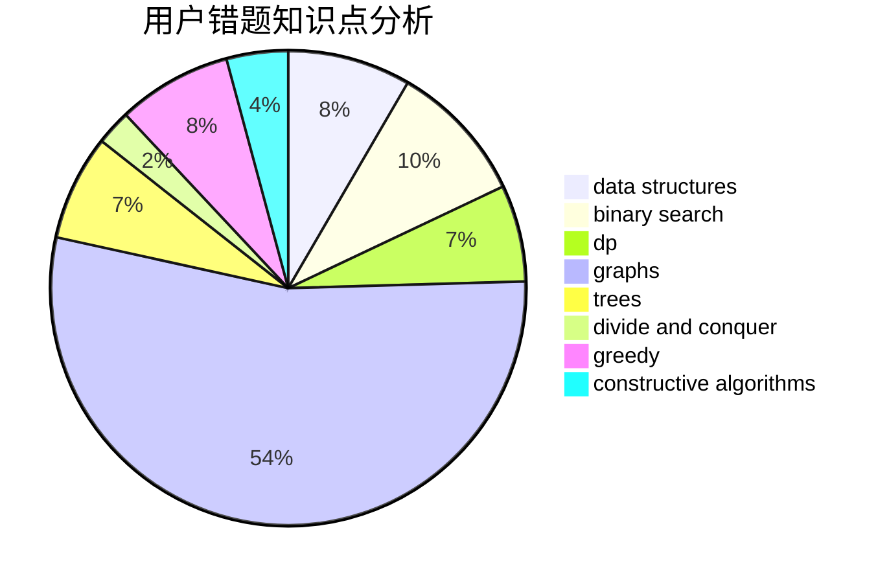

# TYGL

<!-- tabs:start -->

#### **用户提交结果分析**

#### **用户做题类型偏好分析**

#### **用户错题知识点分析**

<!-- tabs:end -->
# 推荐题目
[1272A](https://codeforces.com/contest/1272/problem/A)		brute force,
                        greedy,
                        math,
                        sortings		  
[1166F](https://codeforces.com/contest/1166/problem/F)		data structures,
                        dsu,
                        graphs,
                        hashing		  
[13711](https://codeforces.com/contest/1371/problem/1)		dsu,graphs,sortings,trees		  
[835C](https://codeforces.com/contest/835/problem/C)		dp,
                        implementation		  
[947C](https://codeforces.com/contest/947/problem/C)		dsu,graphs,sortings,trees		  
[868E](https://codeforces.com/contest/868/problem/E)		dp,
                        graphs,
                        trees		  
[122C](https://codeforces.com/contest/122/problem/C)		dsu,graphs,sortings,trees		  
[1077D](https://codeforces.com/contest/1077/problem/D)		binary search,
                        sortings		  
[171F](https://codeforces.com/contest/171/problem/F)		*special problem,
                        brute force,
                        implementation,
                        number theory		  
[790A](https://codeforces.com/contest/790/problem/A)		dsu,graphs,sortings,trees		  
