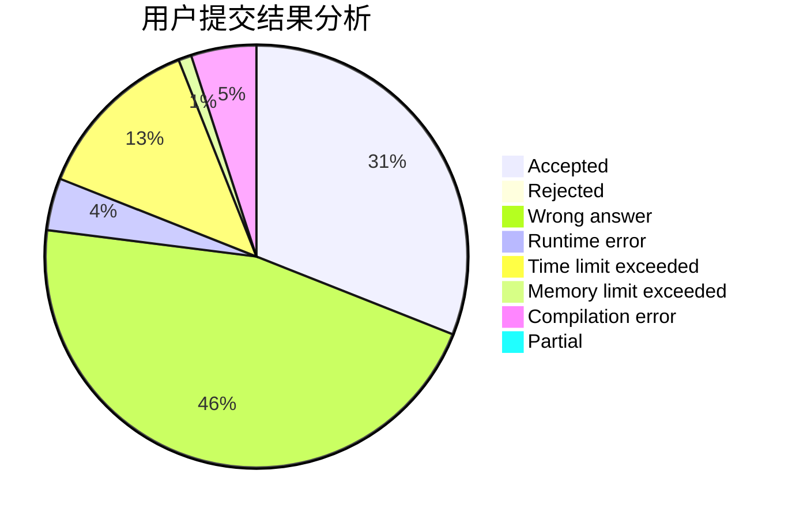
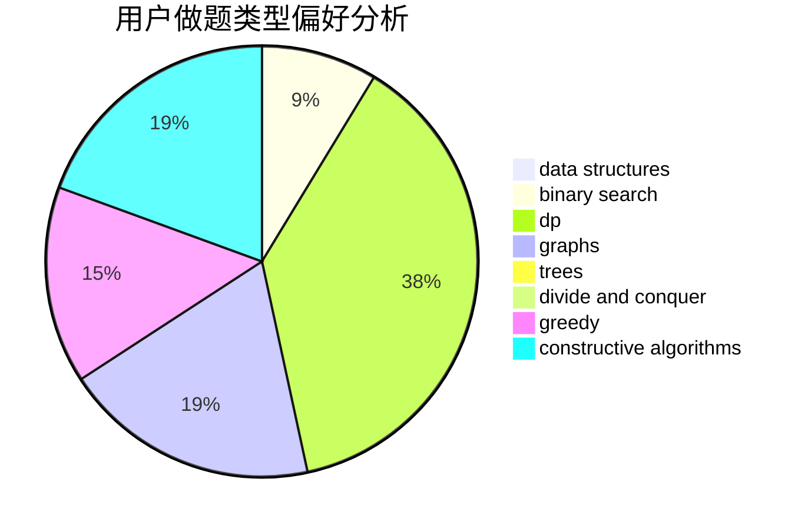
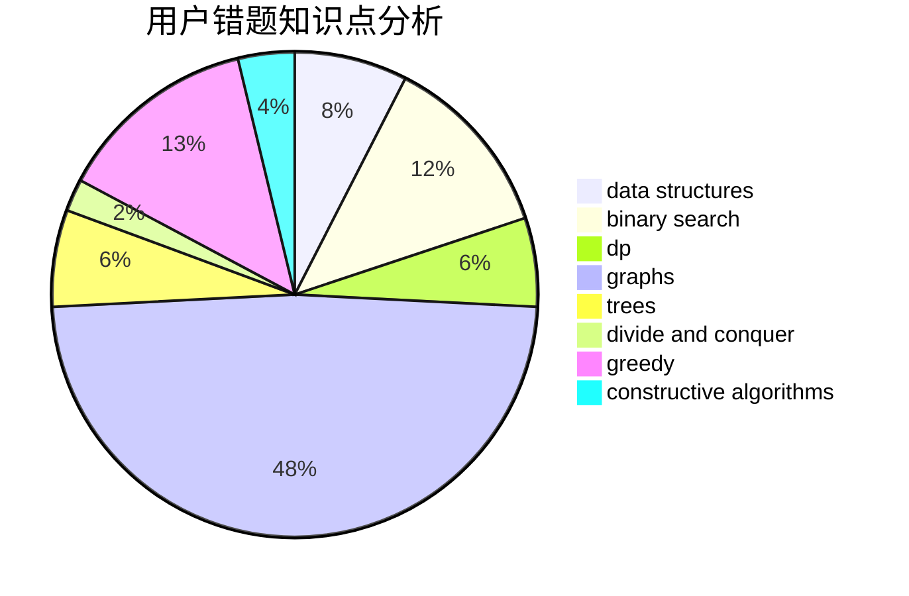

# TYGL
<!-- tabs:start -->
#### **用户提交结果分析**

#### **用户做题类型偏好分析**

#### **用户错题知识点分析**

<!-- tabs:end -->
# 推荐题目
[Equilateral Triangles (2 points)](https://codeforces.com/contest/1164/problem/P)		nan		  
[Kaavi and Magic Spell](http://codeforces.com/problemset/problem/1336/C)		dp,
                        strings		  
[Till I Collapse](http://codeforces.com/problemset/problem/786/C)		data structures,
                        divide and conquer		  
[Karen and Coffee](http://codeforces.com/problemset/problem/816/B)		binary search,
                        data structures,
                        implementation		  
[Not Afraid](http://codeforces.com/problemset/problem/787/B)		greedy,
                        implementation,
                        math		  
[Almost Same Distance](http://codeforces.com/problemset/problem/1266/F)		dfs and similar,
                        graphs		  
[Tournament Construction](http://codeforces.com/problemset/problem/850/D)		constructive algorithms,
                        dp,
                        graphs,
                        greedy,
                        math		  
[Toy Army](http://codeforces.com/problemset/problem/84/A)		math,
                        number theory		  
[Little Artem and Presents](http://codeforces.com/problemset/problem/669/A)		math		  
[Andryusha and Nervous Barriers](http://codeforces.com/problemset/problem/780/G)		data structures,
                        dp		  
<!-- tabs:start -->
#### **data structures**
[Equilateral Triangles (2 points)](http://codeforces.com/problemset/problem/786/C)		data structures,
                        divide and conquer		  
[Kaavi and Magic Spell](http://codeforces.com/problemset/problem/816/B)		binary search,
                        data structures,
                        implementation		  
[Till I Collapse](http://codeforces.com/problemset/problem/780/G)		data structures,
                        dp		  
[Karen and Coffee](http://codeforces.com/problemset/problem/1195/F)		data structures,
                        geometry,
                        math,
                        sortings		  
[Not Afraid](http://codeforces.com/problemset/problem/1364/A)		brute force,
                        data structures,
                        number theory,
                        two pointers		  
[Almost Same Distance](http://codeforces.com/problemset/problem/1492/C)		binary search,
                        data structures,
                        dp,
                        greedy,
                        two pointers		  
[Tournament Construction](http://codeforces.com/problemset/problem/1490/G)		binary search,
                        data structures,
                        math		  
[Toy Army](http://codeforces.com/problemset/problem/1479/D)		binary search,
                        bitmasks,
                        brute force,
                        data structures,
                        probabilities,
                        trees		  
[Little Artem and Presents](http://codeforces.com/problemset/problem/1497/A)		brute force,
                        data structures,
                        greedy,
                        sortings		  
[Andryusha and Nervous Barriers](http://codeforces.com/problemset/problem/1491/C)		brute force,
                        data structures,
                        dp,
                        greedy,
                        implementation		  
#### **binary search**
[Equilateral Triangles (2 points)](http://codeforces.com/problemset/problem/816/B)		binary search,
                        data structures,
                        implementation		  
[Kaavi and Magic Spell](http://codeforces.com/problemset/problem/609/D)		binary search,
                        greedy,
                        two pointers		  
[Till I Collapse](http://codeforces.com/problemset/problem/1492/C)		binary search,
                        data structures,
                        dp,
                        greedy,
                        two pointers		  
[Karen and Coffee](http://codeforces.com/problemset/problem/1463/D)		binary search,
                        constructive algorithms,
                        greedy,
                        two pointers		  
[Not Afraid](http://codeforces.com/problemset/problem/1490/G)		binary search,
                        data structures,
                        math		  
[Almost Same Distance](http://codeforces.com/problemset/problem/1479/D)		binary search,
                        bitmasks,
                        brute force,
                        data structures,
                        probabilities,
                        trees		  
[Tournament Construction](http://codeforces.com/problemset/problem/1436/E)		binary search,
                        data structures,
                        two pointers		  
[Toy Army](http://codeforces.com/problemset/problem/1461/D)		binary search,
                        brute force,
                        data structures,
                        divide and conquer,
                        implementation,
                        sortings		  
[Little Artem and Presents](http://codeforces.com/problemset/problem/1493/C)		binary search,
                        brute force,
                        constructive algorithms,
                        greedy,
                        strings		  
[Andryusha and Nervous Barriers](http://codeforces.com/problemset/problem/1487/D)		binary search,
                        brute force,
                        math,
                        number theory		  
#### **dp**
[Equilateral Triangles (2 points)](http://codeforces.com/problemset/problem/1336/C)		dp,
                        strings		  
[Kaavi and Magic Spell](http://codeforces.com/problemset/problem/850/D)		constructive algorithms,
                        dp,
                        graphs,
                        greedy,
                        math		  
[Till I Collapse](http://codeforces.com/problemset/problem/780/G)		data structures,
                        dp		  
[Karen and Coffee](http://codeforces.com/problemset/problem/1221/G)		bitmasks,
                        brute force,
                        combinatorics,
                        dp,
                        meet-in-the-middle		  
[Not Afraid](http://codeforces.com/problemset/problem/1238/F)		dfs and similar,
                        dp,
                        graphs,
                        trees		  
[Almost Same Distance](http://codeforces.com/problemset/problem/1512/F)		brute force,
                        dp,
                        greedy,
                        implementation		  
[Tournament Construction](http://codeforces.com/problemset/problem/467/C)		dp,
                        implementation		  
[Toy Army](http://codeforces.com/problemset/problem/1369/D)		dp,
                        graphs,
                        greedy,
                        math,
                        trees		  
[Little Artem and Presents](http://codeforces.com/problemset/problem/613/E)		dp,
                        hashing,
                        strings		  
[Andryusha and Nervous Barriers](http://codeforces.com/problemset/problem/1343/C)		dp,
                        greedy,
                        two pointers		  
#### **graph**
[Equilateral Triangles (2 points)](http://codeforces.com/problemset/problem/1266/F)		dfs and similar,
                        graphs		  
[Kaavi and Magic Spell](http://codeforces.com/problemset/problem/850/D)		constructive algorithms,
                        dp,
                        graphs,
                        greedy,
                        math		  
[Till I Collapse](https://codeforces.com/contest/745/problem/C)		dfs and similar,
                        graphs		  
[Karen and Coffee](http://codeforces.com/problemset/problem/1067/B)		dfs and similar,
                        graphs,
                        shortest paths		  
[Not Afraid](http://codeforces.com/problemset/problem/1238/F)		dfs and similar,
                        dp,
                        graphs,
                        trees		  
[Almost Same Distance](http://codeforces.com/problemset/problem/1133/F1)		graphs		  
[Tournament Construction](http://codeforces.com/problemset/problem/1369/D)		dp,
                        graphs,
                        greedy,
                        math,
                        trees		  
[Toy Army](http://codeforces.com/problemset/problem/1394/B)		brute force,
                        dfs and similar,
                        graphs,
                        hashing		  
[Little Artem and Presents](http://codeforces.com/problemset/problem/1510/B)		flows,
                        graph matchings,
                        graphs		  
[Andryusha and Nervous Barriers](http://codeforces.com/problemset/problem/1487/C)		brute force,
                        constructive algorithms,
                        dfs and similar,
                        graphs,
                        greedy,
                        implementation,
                        math		  
#### **trees**
[Equilateral Triangles (2 points)](http://codeforces.com/problemset/problem/1210/C)		math,
                        number theory,
                        trees		  
[Kaavi and Magic Spell](http://codeforces.com/problemset/problem/1238/F)		dfs and similar,
                        dp,
                        graphs,
                        trees		  
[Till I Collapse](http://codeforces.com/problemset/problem/1369/D)		dp,
                        graphs,
                        greedy,
                        math,
                        trees		  
[Karen and Coffee](http://codeforces.com/problemset/problem/1479/D)		binary search,
                        bitmasks,
                        brute force,
                        data structures,
                        probabilities,
                        trees		  
[Not Afraid](http://codeforces.com/problemset/problem/1511/C)		brute force,
                        data structures,
                        implementation,
                        trees		  
[Almost Same Distance](http://codeforces.com/problemset/problem/1499/F)		combinatorics,
                        dfs and similar,
                        dp,
                        trees		  
[Tournament Construction](http://codeforces.com/problemset/problem/1491/E)		brute force,
                        dfs and similar,
                        divide and conquer,
                        number theory,
                        trees		  
[Toy Army](http://codeforces.com/problemset/problem/1466/D)		data structures,
                        greedy,
                        sortings,
                        trees		  
[Little Artem and Presents](http://codeforces.com/problemset/problem/1495/D)		combinatorics,
                        dfs and similar,
                        graphs,
                        math,
                        shortest paths,
                        trees		  
[Andryusha and Nervous Barriers](http://codeforces.com/problemset/problem/1303/G)		data structures,
                        divide and conquer,
                        geometry,
                        trees		  
#### **divide and conquer**
[Equilateral Triangles (2 points)](http://codeforces.com/problemset/problem/786/C)		data structures,
                        divide and conquer		  
[Kaavi and Magic Spell](http://codeforces.com/problemset/problem/1461/D)		binary search,
                        brute force,
                        data structures,
                        divide and conquer,
                        implementation,
                        sortings		  
[Till I Collapse](http://codeforces.com/problemset/problem/1466/G)		combinatorics,
                        divide and conquer,
                        hashing,
                        math,
                        string suffix structures,
                        strings		  
[Karen and Coffee](http://codeforces.com/problemset/problem/1490/D)		dfs and similar,
                        divide and conquer,
                        implementation		  
[Not Afraid](https://codeforces.com/contest/1483/problem/C)		data structures,
                        divide and conquer,
                        dp		  
[Almost Same Distance](http://codeforces.com/problemset/problem/1491/E)		brute force,
                        dfs and similar,
                        divide and conquer,
                        number theory,
                        trees		  
[Tournament Construction](http://codeforces.com/problemset/problem/1303/G)		data structures,
                        divide and conquer,
                        geometry,
                        trees		  
[Toy Army](http://codeforces.com/problemset/problem/1494/D)		constructive algorithms,
                        data structures,
                        dfs and similar,
                        divide and conquer,
                        dsu,
                        greedy,
                        sortings,
                        trees		  
[Little Artem and Presents](http://codeforces.com/problemset/problem/1482/E)		data structures,
                        divide and conquer,
                        dp		  
[Andryusha and Nervous Barriers](http://codeforces.com/problemset/problem/566/C)		dfs and similar,
                        divide and conquer,
                        trees		  
#### **greedy**
[Equilateral Triangles (2 points)](http://codeforces.com/problemset/problem/787/B)		greedy,
                        implementation,
                        math		  
[Kaavi and Magic Spell](http://codeforces.com/problemset/problem/850/D)		constructive algorithms,
                        dp,
                        graphs,
                        greedy,
                        math		  
[Till I Collapse](http://codeforces.com/problemset/problem/468/A)		constructive algorithms,
                        greedy,
                        math		  
[Karen and Coffee](http://codeforces.com/problemset/problem/57/A)		dfs and similar,
                        greedy,
                        implementation		  
[Not Afraid](http://codeforces.com/problemset/problem/899/A)		constructive algorithms,
                        greedy,
                        math		  
[Almost Same Distance](http://codeforces.com/problemset/problem/1358/B)		greedy,
                        sortings		  
[Tournament Construction](http://codeforces.com/problemset/problem/1512/F)		brute force,
                        dp,
                        greedy,
                        implementation		  
[Toy Army](http://codeforces.com/problemset/problem/609/D)		binary search,
                        greedy,
                        two pointers		  
[Little Artem and Presents](http://codeforces.com/problemset/problem/1369/D)		dp,
                        graphs,
                        greedy,
                        math,
                        trees		  
[Andryusha and Nervous Barriers](http://codeforces.com/problemset/problem/1511/A)		greedy		  
#### **constructive algorithms**
[Equilateral Triangles (2 points)](http://codeforces.com/problemset/problem/850/D)		constructive algorithms,
                        dp,
                        graphs,
                        greedy,
                        math		  
[Kaavi and Magic Spell](http://codeforces.com/problemset/problem/468/A)		constructive algorithms,
                        greedy,
                        math		  
[Till I Collapse](http://codeforces.com/problemset/problem/1276/E)		constructive algorithms		  
[Karen and Coffee](http://codeforces.com/problemset/problem/357/B)		constructive algorithms,
                        implementation		  
[Not Afraid](http://codeforces.com/problemset/problem/899/A)		constructive algorithms,
                        greedy,
                        math		  
[Almost Same Distance](http://codeforces.com/problemset/problem/1451/F)		constructive algorithms,
                        games		  
[Tournament Construction](http://codeforces.com/problemset/problem/1504/B)		constructive algorithms,
                        greedy,
                        implementation,
                        math		  
[Toy Army](http://codeforces.com/problemset/problem/1067/C)		constructive algorithms		  
[Little Artem and Presents](http://codeforces.com/problemset/problem/1493/A)		constructive algorithms,
                        greedy		  
[Andryusha and Nervous Barriers](http://codeforces.com/problemset/problem/1463/D)		binary search,
                        constructive algorithms,
                        greedy,
                        two pointers		  
#### **sortings**
[Equilateral Triangles (2 points)](http://codeforces.com/problemset/problem/1195/F)		data structures,
                        geometry,
                        math,
                        sortings		  
[Kaavi and Magic Spell](http://codeforces.com/problemset/problem/1358/B)		greedy,
                        sortings		  
[Till I Collapse](https://codeforces.com/contest/1496/problem/C)		geometry,
                        greedy,
                        math,
                        sortings		  
[Karen and Coffee](http://codeforces.com/problemset/problem/1495/A)		geometry,
                        greedy,
                        math,
                        sortings		  
[Not Afraid](http://codeforces.com/problemset/problem/1497/A)		brute force,
                        data structures,
                        greedy,
                        sortings		  
[Almost Same Distance](http://codeforces.com/problemset/problem/1427/A)		math,
                        sortings		  
[Tournament Construction](http://codeforces.com/problemset/problem/1461/D)		binary search,
                        brute force,
                        data structures,
                        divide and conquer,
                        implementation,
                        sortings		  
[Toy Army](http://codeforces.com/problemset/problem/1437/C)		dp,
                        flows,
                        graph matchings,
                        greedy,
                        math,
                        sortings		  
[Little Artem and Presents](http://codeforces.com/problemset/problem/1473/A)		greedy,
                        implementation,
                        math,
                        sortings		  
[Andryusha and Nervous Barriers](http://codeforces.com/problemset/problem/1486/B)		binary search,
                        geometry,
                        shortest paths,
                        sortings		  
<!-- tabs:end -->
