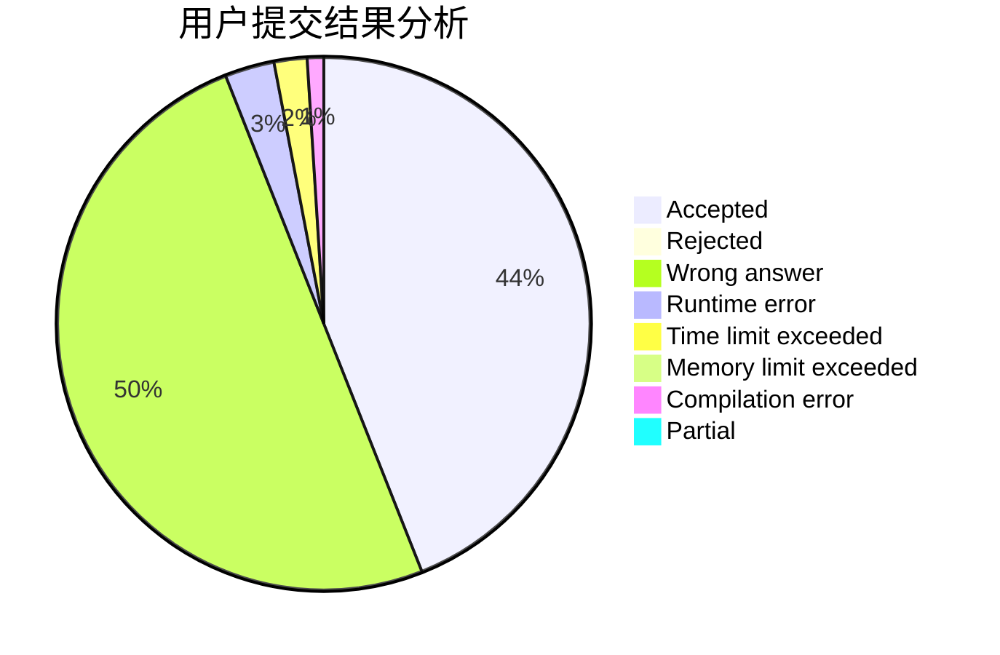
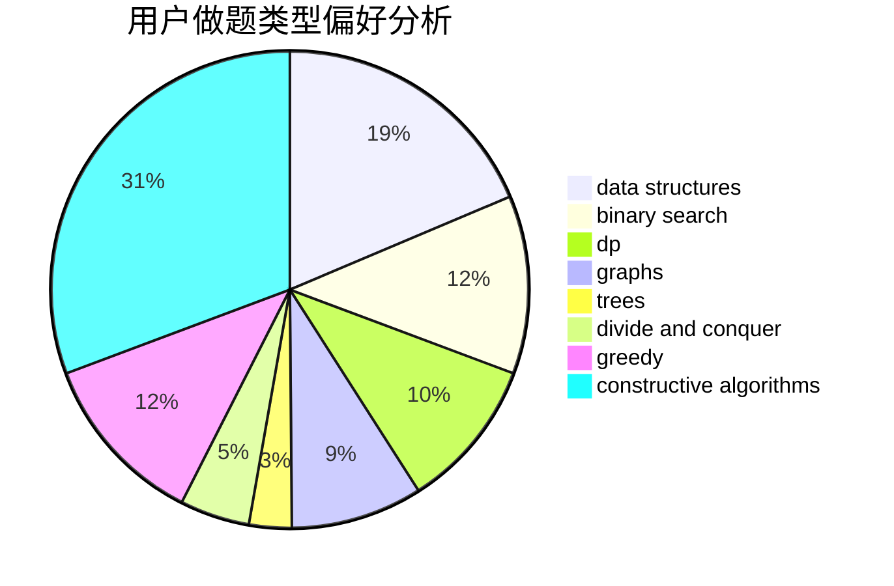
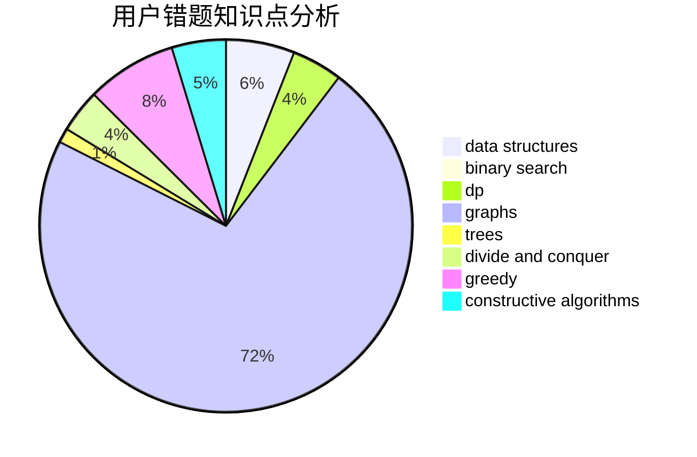

# TYGZ

<!-- tabs:start -->

#### **用户提交结果分析**

#### **用户做题类型偏好分析**

#### **用户错题知识点分析**

<!-- tabs:end -->
# 推荐题目
[878E](https://codeforces.com/contest/878/problem/E)		combinatorics,
                        dp		  
[306D](https://codeforces.com/contest/306/problem/D)		constructive algorithms,
                        geometry		  
[276C](https://codeforces.com/contest/276/problem/C)		data structures,
                        greedy,
                        implementation,
                        sortings		  
[737B](https://codeforces.com/contest/737/problem/B)		dsu,graphs,sortings,trees		  
[1047A](https://codeforces.com/contest/1047/problem/A)		math		  
[813C](https://codeforces.com/contest/813/problem/C)		dfs and similar,
                        graphs		  
[1286C2](https://codeforces.com/contest/1286C/problem/2)		brute force,
                        constructive algorithms,
                        hashing,
                        interactive,
                        math		  
[1312A](https://codeforces.com/contest/1312/problem/A)		geometry,
                        greedy,
                        math,
                        number theory		  
[266A](https://codeforces.com/contest/266/problem/A)		implementation		  
[1181C](https://codeforces.com/contest/1181/problem/C)		brute force,
                        combinatorics,
                        dp,
                        implementation		  
