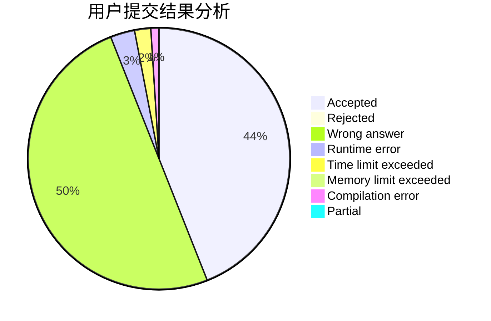
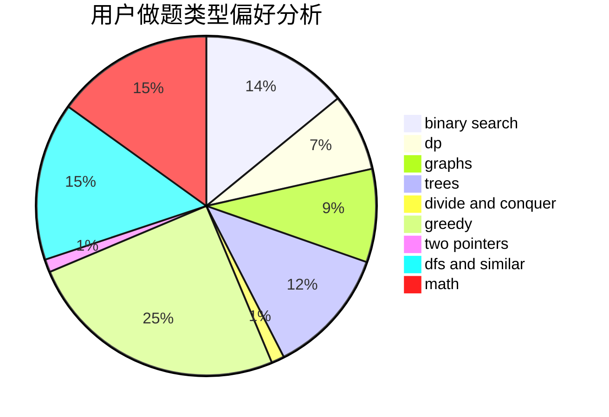

# TYGZ

<!-- tabs:start -->

#### **用户提交结果分析**

#### **用户做题类型偏好分析**

<!-- tabs:end -->
# 推荐题目
[899D](https://codeforces.com/contest/899/problem/D)
[329B](https://codeforces.com/contest/329/problem/B)
[290C](https://codeforces.com/contest/290/problem/C)
[758F](https://codeforces.com/contest/758/problem/F)
[1047D](https://codeforces.com/contest/1047/problem/D)
[831E](https://codeforces.com/contest/831/problem/E)
[1293E](https://codeforces.com/contest/1293/problem/E)
[1321C](https://codeforces.com/contest/1321/problem/C)
[281D](https://codeforces.com/contest/281/problem/D)
[1183H](https://codeforces.com/contest/1183/problem/H)
