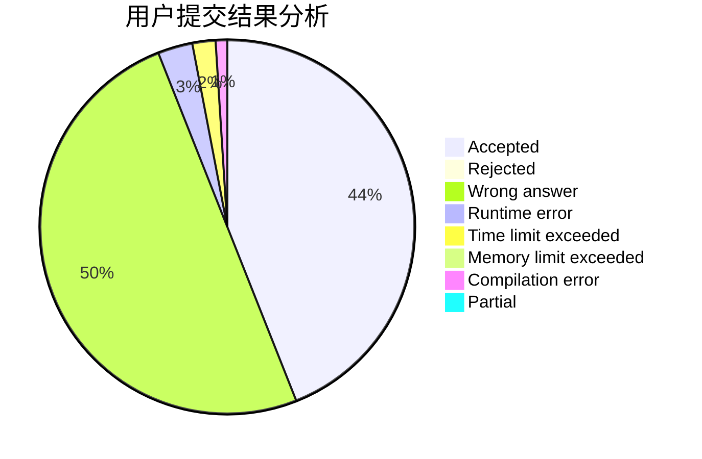
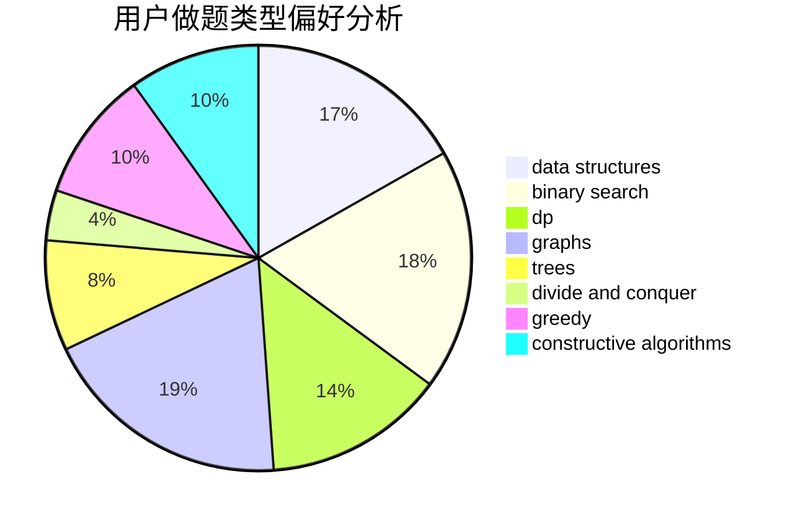
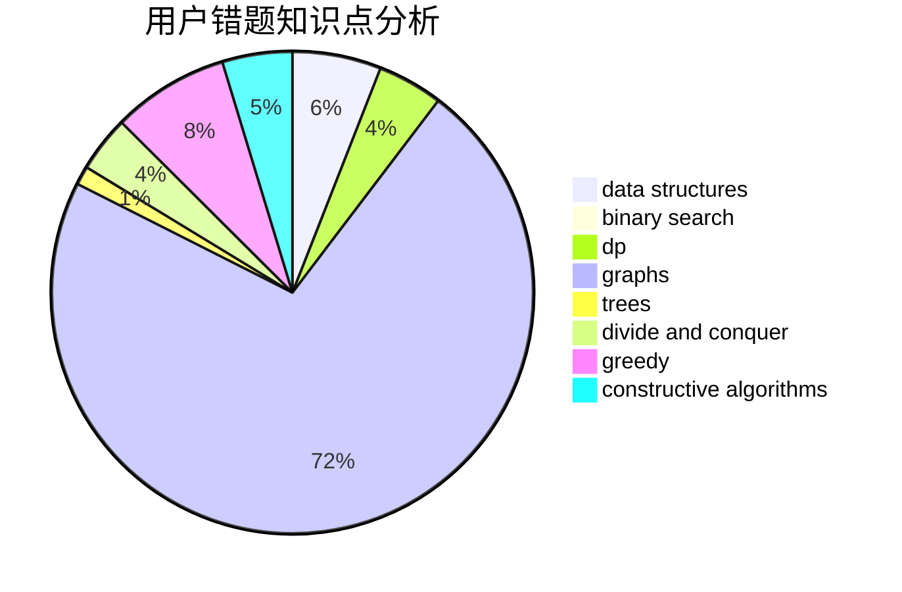

# TYGZ

<!-- tabs:start -->

#### **用户提交结果分析**

#### **用户做题类型偏好分析**

#### **用户错题知识点分析**

<!-- tabs:end -->
# 推荐题目
[899D](https://codeforces.com/contest/899/problem/D)		constructive algorithms,
                        math		  
[329B](https://codeforces.com/contest/329/problem/B)		dfs and similar,
                        shortest paths		  
[290C](https://codeforces.com/contest/290/problem/C)		*special problem,
                        graph matchings,
                        implementation,
                        trees		  
[758F](https://codeforces.com/contest/758/problem/F)		brute force,
                        math,
                        number theory		  
[1047D](https://codeforces.com/contest/1047/problem/D)		dsu,graphs,sortings,trees		  
[831E](https://codeforces.com/contest/831/problem/E)		dsu,graphs,sortings,trees		  
[1293E](https://codeforces.com/contest/1293/problem/E)		dsu,graphs,sortings,trees		  
[1321C](https://codeforces.com/contest/1321/problem/C)		brute force,
                        constructive algorithms,
                        greedy,
                        strings		  
[281D](https://codeforces.com/contest/281/problem/D)		dsu,graphs,sortings,trees		  
[1183H](https://codeforces.com/contest/1183/problem/H)		dp,
                        strings		  
