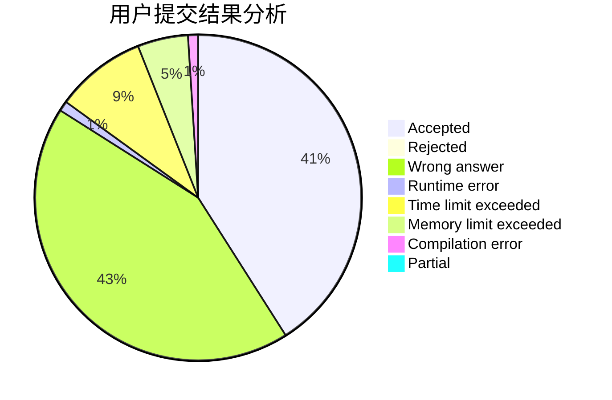
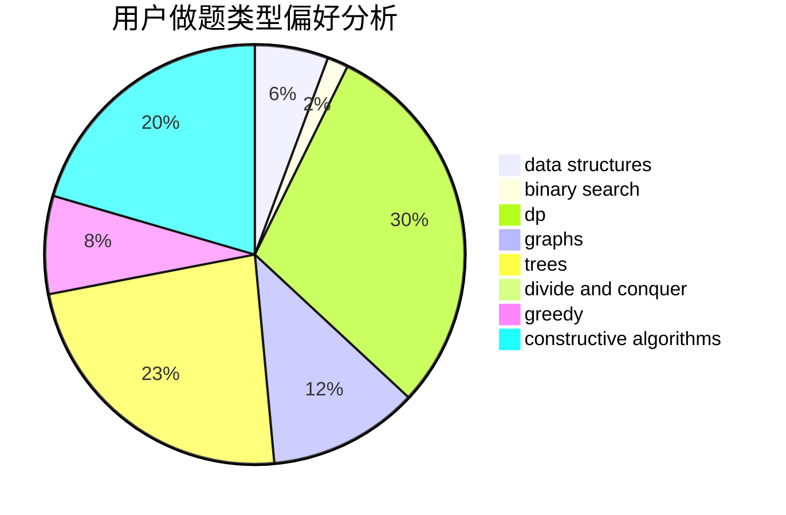

# Taday

<!-- tabs:start -->

#### **用户提交结果分析**

#### **用户做题类型偏好分析**

#### **用户错题知识点分析**

<!-- tabs:end -->
# 推荐题目
[933B](https://codeforces.com/contest/933/problem/B)		math		  
[464E](https://codeforces.com/contest/464/problem/E)		data structures,
                        graphs,
                        shortest paths		  
[497D](https://codeforces.com/contest/497/problem/D)		brute force,
                        geometry,
                        math		  
[1280A](https://codeforces.com/contest/1280/problem/A)		implementation,
                        math		  
[1382B](https://codeforces.com/contest/1382/problem/B)		dp,
                        games		  
[1117G](https://codeforces.com/contest/1117/problem/G)		data structures		  
[434C](https://codeforces.com/contest/434/problem/C)		dsu,graphs,sortings,trees		  
[12092](https://codeforces.com/contest/1209/problem/2)		dsu,graphs,sortings,trees		  
[1004F](https://codeforces.com/contest/1004/problem/F)		bitmasks,
                        data structures,
                        divide and conquer		  
[325E](https://codeforces.com/contest/325/problem/E)		combinatorics,
                        dfs and similar,
                        dsu,
                        graphs,
                        greedy		  
